<div align="center">


**A TUI framework for bash: build terminal UIs in pure bash, no ncurses required.**
Declarative XML pages + CSS-like themes + bash callbacks, with mouse support, live process panes and a built-in app manager (`dabt`) to install, update and security-scan apps.
Pure bash + POSIX utilities. No Python, no Node, no ncurses. A zero-dependency ncurses alternative for shell scripts.

[](https://github.com/DinosaursAreCute/DinosAmazingBashTui/releases)
[](https://github.com/DinosaursAreCute/DinosAmazingBashTui/actions/workflows/build.yml)
[](#requirements)
[](#requirements)
[](tests/)
[](LICENSE)

[](https://github.com/DinosaursAreCute/DinosAmazingBashTui/actions/workflows/build.yml)
[](https://github.com/DinosaursAreCute/DinosAmazingBashTui/commits/main)
[](https://github.com/DinosaursAreCute/DinosAmazingBashTui/stargazers)
[](https://github.com/DinosaursAreCute/DinosAmazingBashTui/issues)
[](https://github.com/DinosaursAreCute/DinosAmazingBashTui)
[](https://www.gnu.org/software/bash/)

[**Quick start**](#quick-start) · [**Features**](#features) · [**The `dabt` command**](#the-dabt-command) · [**Apps & security scan**](#security-scan) · [**Plugins**](#plugins) · [**Docs**](#documentation) · [**Changelog**](CHANGELOG.md)

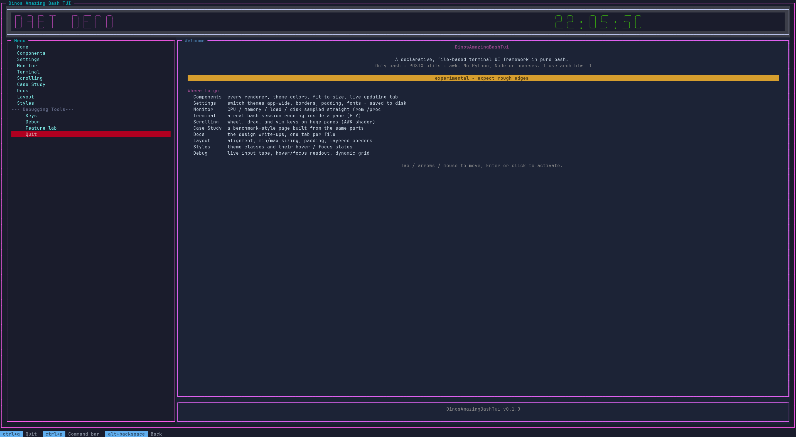

</div>

---

<br/>
<br/>
<h2 id="what-is-this"></h2>

D.A.B.T (DinosAmazingBashTui) is a bash TUI framework and application manager in one.

**An application manager.** `dabt` installs apps built on it from a folder or git URL, updates them, uninstalls them (settings kept unless you `--purge`), runs install / uninstall hooks, and security-scans every app and plugin before it is installed. It also updates and uninstalls itself. See [The `dabt` command](#the-dabt-command) and [Security scan](#security-scan).

**A TUI framework.** It lets you build multi-page terminal interfaces the way you build a website: write markup, point at a stylesheet, wire up callbacks. The framework handles layout, rendering, focus, mouse support and live background processes, all in bash.

```xml
<tui>
  <script src="callbacks.sh"/>
  <theme src="theme.css"/>

  <pane id="root" split="h">
    <pane id="sidebar" weight="25" title="Menu" border="single" class="sidebar"/>
    <pane id="main"    weight="75" title="Welcome"/>
  </pane>

  <label  id="greeting" pane="main" row="0" text="Hello from DABT!" align="center"/>
  <button id="btn_quit" pane="sidebar" row="5" text="Quit" action="tui.stop" class="danger_button"/>
</tui>
```

```css
.sidebar              { fg: #88c0d0; bg: #2e3440; }
.sidebar:border       { fg: #4c566a; }
.danger_button        { fg: white; bg: #b00020; mods: bold; }
.danger_button:focus  { fg: white; bg: #ff3333; mods: bold; }
```

```bash
#!/usr/bin/env bash
source lib/tui.sh
tui.start "share/demo/home.xml"
```
<br/>
<br/>

<h2 id="vs-code-extension"></h2>


**[DABT Tools](https://github.com/DinosaursAreCute/DinosAmazingDabtPlugin)** is a companion VS Code extension for writing DABT apps: inlay hints and signature help for `dabt` function arguments, `class=` completion with live theme-aware color swatches, and required-attribute markers on your XML markup — all inferred straight from your app's own source, not a hardcoded schema.


Grab the `.vsix` from [the latest release](https://github.com/DinosaursAreCute/DinosAmazingDabtPlugin/releases/latest) and install it with `code --install-extension dabt-tools-*.vsix`.
<br/>
<br/>
<h2 id="quick-start"></h2>

**Install** (downloads the repo and installs it, no clone needed):


```bash
curl -fsSL https://raw.githubusercontent.com/DinosaursAreCute/DinosAmazingBashTui/main/install.sh | bash
# pass options after -s --:  ... | bash -s -- --yes --prefix ~/apps/dabt
```

**Or from a checkout** (to hack on it or try the demo first):

```bash
git clone https://github.com/DinosaursAreCute/DinosAmazingBashTui.git
cd DinosAmazingBashTui

bin/dabt demo        # run the demo straight from the checkout, no install needed
./install.sh         # optional: install the program and config home
```

After installing, everything goes through the `dabt` command:

```bash
dabt update          # update to the latest release
dabt update --dev    # update to the current state of main
dabt doctor          # where everything lives, what version is installed
```

No package manager, no build step. Installing copies the program to `~/.local/share/dabt`, the defaults and plugins to `~/.config/DABT` (yours to edit) and links `~/.local/bin/dabt`. Details: [docs/guide/install-and-update.md](docs/guide/install-and-update.md).
<br/>
<br/>
<h2 id="the-dabt-command"></h2>

| Command | What it does |
|---|---|
| `dabt` / `dabt --help` | show help |
| `dabt --demo` | run the demo application |
| `dabt -d` / `doctor` | installed version, locations, install metadata |
| `dabt -v` | print the version |
| `dabt install [opts]` | install this copy (`--prefix`, `--config`, `--bindir`, `--policy`, `--dry-run`, `--yes`) |
| `dabt update` | update to the **latest release** |
| `dabt update --dev` | update to the **current `main`**, even at the same version |
| `dabt update --check` | only check; exit code 10 when an update is available |
| `dabt update --yes --policy override\|skip\|new` | non-interactive; settle conflicts by policy |
| `dabt scan PATH... [--deep] [--strict]` | security-scan scripts (apps, plugins) - see [Security scan](#security-scan) |
| `dabt scan --tools` / `--install shellcheck\|semgrep` | show / install the optional scanners |
| `dabt app install SRC [--strict] [--no-scan]` | install an app (scanned first) |
| `dabt app list\|info\|run\|update\|remove` | manage installed apps (`dabt app help`) |
| `dabt clear-cache` | delete the page cache in `~/.config/DABT/cache` |
| `dabt reinstall [--yes]` | reinstall from the install source, overriding local changes |
| `dabt uninstall [--yes] [--keep-config]` | remove the program, config home and the `dabt` link |

**Safe updates.** The updater and installer use a three-way file sync (checksum manifest). Before anything is written you see every added, changed and removed file. Files you edited are never overwritten silently: for each conflict choose *override*, *skip*, *write a `.new` file* or *show the differences*. Replaced files are backed up in `~/.config/DABT/backups/`. The same flow is available in the app's command bar (`ctrl+p` → "DABT: Update DABT").
<br/>
<br/>
<h2 id="features"></h2>

| | |
|---|---|
| **Declarative XML markup** | Panes, buttons, inputs and labels in config files, not imperative code |
| **Multi-page navigation** | Link pages like HTML anchors with `page="other.xml"`; pages are cached for instant switching |
| **CSS-like theming** | Reusable `.class` styles with `fg`, `bg`, `mods` and `:focus` / `:border` / `:title` pseudo-states; five built-in themes |
| **Rich widgets** | label, button, checkbox, input, password, multi-line textarea, list, table, select, progress |
| **Text editing engine** | Selection, word jumps, cut / copy / paste, undo / redo, click and drag, double / triple-click |
| **Dialogs & toasts** | `tui.confirm`, `tui.message`, `tui.prompt`, `tui.choose`, `tui.view`, `tui.notify` with six toast positions |
| **Command bar & keybinds** | Searchable command palette, rebindable keys saved per app, footer key bar |
| **Plugin system** | Drop-in `*.plugin.sh` files with hooks, enable / disable / reload at runtime |
| **High-performance scrolling** | Batched AWK-shader viewports: jump-to-click scrollbars, wheel, Vim keys |
| **Live terminal execution** | Stream a real PTY process into a pane with stdin piping, cancel, save, retry |
| **Layout engine** | hsplit / vsplit / grid / tabs, alignment, min / max sizing, `${command}` runtime templates |
| **Terminal renderers** | Standalone `box`, `table`, `gauge`, `hbar`, `tree`, `banner`, CSV charts and more, usable without the TUI |
| **Mouse + keyboard** | Click routing, hover feedback, Tab focus cycling, the app owns every key (ctrl+c copies) |
| **Installer & updater** | Release / dev channels, conflict resolution, backups, reinstall and clean uninstall |
| **App manager** | `dabt app install/update/remove` for third-party apps, install / uninstall hooks, built-in demo app |
| **Security scan** | `dabt scan` and scan-gated installs: built-in rules, optional ShellCheck / Semgrep |
<br/>
<br/>
<h2 id="security-scan"></h2>

Apps and plugins are shell code that runs with your permissions. DABT scans them before you install them (`dabt app install`, `tui.plugin.install`) and on demand with `dabt scan PATH`. By default findings only warn; `--strict` refuses to install on HIGH findings (`--force` overrides, `--no-scan` skips).

**Built-in scanner (always on, no dependencies).** A set of `grep` rules, pure bash + POSIX utilities, that flags the obvious red flags. Comment lines are ignored.

| Severity | Examples |
|---|---|
| **HIGH** | `curl ... \| sh`, `eval "$(curl ...)"`, `base64 -d \| sh`, reverse shells (`/dev/tcp`, `nc -e`), `rm -rf /` or `~`, `dd of=/dev/...`, `mkfs`, setuid bits, edits to `/etc/passwd` / `sudoers` / `authorized_keys`, embedded private or AWS keys |
| **WARN** | network downloads, `eval` of variables, `sudo`, world-writable `chmod`, persistence (cron, `.bashrc`, `systemctl enable`), hardcoded passwords/tokens, `LD_PRELOAD`, writes to `/etc` `/usr` `/opt` `/var` |

It matches text patterns only. It cannot follow variables, spot obfuscation (`eval "$(echo ... | rev)"`) or tell a legitimate `curl` from a malicious one, so it has false positives and false negatives. **A clean report is not a guarantee.**

**Optional scanners (recommended).** They go much deeper than a pattern list:

- **[ShellCheck](https://www.shellcheck.net)** parses the script like a real shell parser. It finds the bugs that become injection holes: unquoted variables, `rm -rf $var/` with an empty `$var`, unsafe `eval`, bad `cd` handling, word-splitting on user input. It is the industry-standard shell linter and catches what a grep rule can't. Used automatically when installed.
- **[Semgrep](https://semgrep.dev)** (`--deep`, or `DABT_SCAN_SEMGREP=1`) does structural pattern matching with maintained community rules, so it sees code shapes rather than text and its rules improve without a DABT release. Heavier (Python), so it is opt-in.

Install either with `dabt scan --install shellcheck|semgrep`. DABT finds a known package manager (apt, dnf, pacman, zypper, apk, brew, nix, pipx/pip), **shows the exact command and asks before running it**. If no package manager is found, it tells you to install the tool yourself. Check what is available with `dabt scan --tools`.

**Why non-POSIX tools are allowed here.** DABT's rule is *no dependencies* (see [Requirements](#requirements)), and that still holds: the framework, the built-in scanner and every scan-gated install work with nothing extra, and a missing tool is a one-line note, never an error. The exception exists because the built-in rules are the ceiling of what pure POSIX text tools can do, and security checking is where that ceiling matters. A real shell parser (ShellCheck) or a maintained rule engine (Semgrep) can't be reimplemented in `grep`/`awk` without being worse and unmaintained, and a hand-rolled scanner people trust too much is worse than none. So the extra tools are:

- **optional**: never required to install, run or update anything;
- **opt-in to install**: nothing is installed without your confirmation;
- **used only by `dabt scan`**: they are not loaded by the TUI framework and add no runtime dependency to any app.
<br/>
<br/>
<h2 id="plugins"></h2>

A plugin is one bash file that adds commands, keys, hooks, timers or overlays to any DABT app. Plugins live in `~/.config/DABT/plugins/`, are shared by every app, and can be enabled, disabled, reloaded, installed and removed while the app runs (Settings → Plugins, the command bar, or `tui.plugin.*`). Everything a plugin registered is cleaned up automatically when it is removed.

Ships with **`terminal_shortcuts`**: detects your terminal (kitty, GNOME Terminal, tmux, alacritty, wezterm, ghostty, Windows Terminal ...), lists the keys it swallows, temporarily frees them while DABT runs and restores them on exit or after a crash.

See [docs/guide/plugins.md](docs/guide/plugins.md) and [examples/plugins/](examples/plugins/).
<br/>
<br/>
<h2 id="screenshots"></h2>

Default theme, generated with `tools/debug/screenshot_all.sh`.

<details open>
<summary><b>Components: every terminal renderer, with fit-to-pane and live tabs</b></summary>

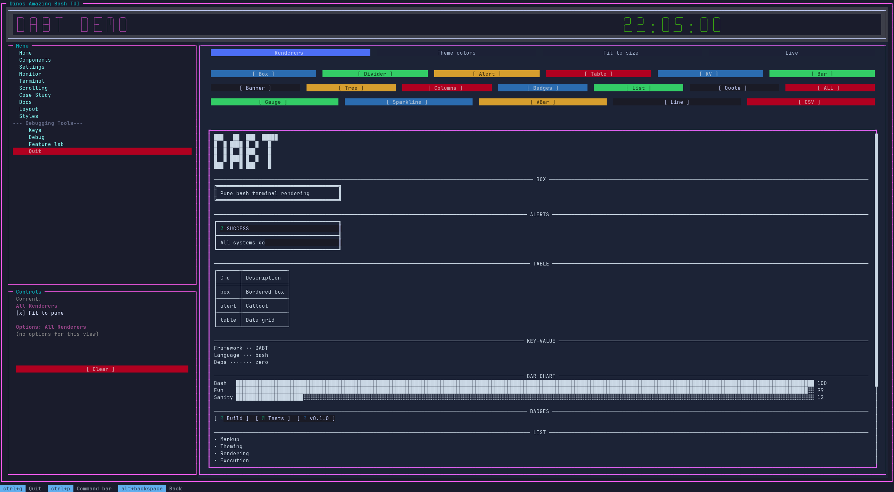

</details>

<details>
<summary><b>Case Study: real-world layout stress test</b></summary>

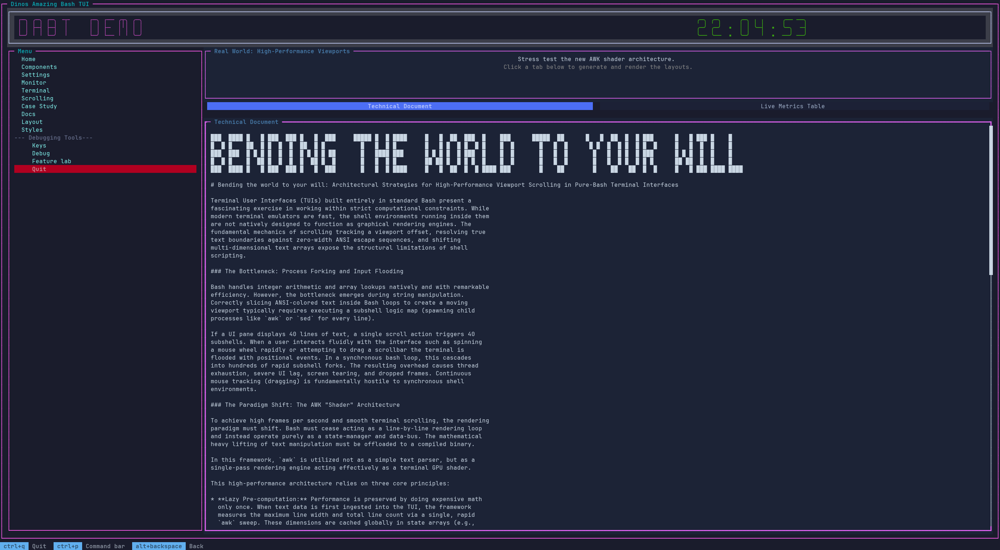

</details>

<details>
<summary><b>Documentation: one tab per markdown file</b></summary>

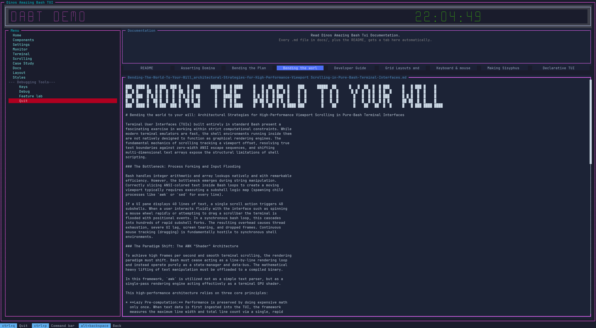

</details>

<details>
<summary><b>Scrolling: high-performance AWK shader viewports</b></summary>

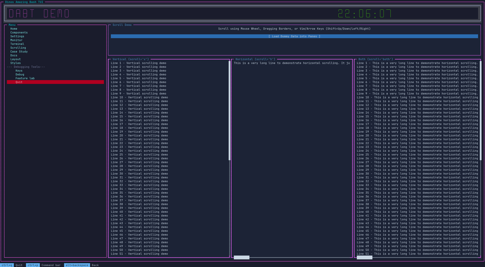

</details>

<details>
<summary><b>Monitor: live CPU, memory, load and disk straight from /proc</b></summary>

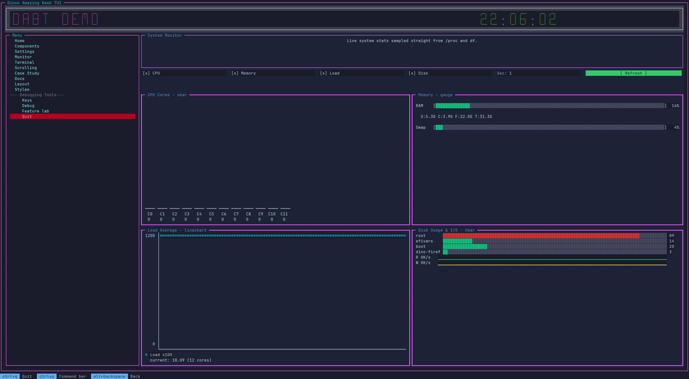

</details>

<details>
<summary><b>Debug: every key and mouse event lights up as you press it</b></summary>

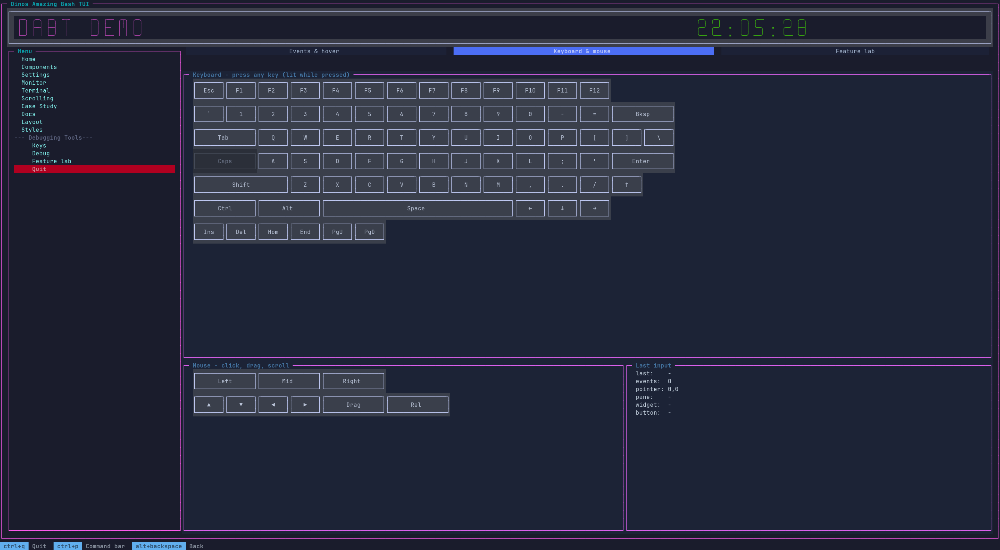

</details>
<br/>
<br/>
<h3 id="themes"></h3>

Switch the whole app from Settings; themes live in `share/demo/themes/*.css`.

| Default | Ocean | Forest |
|:---:|:---:|:---:|
| 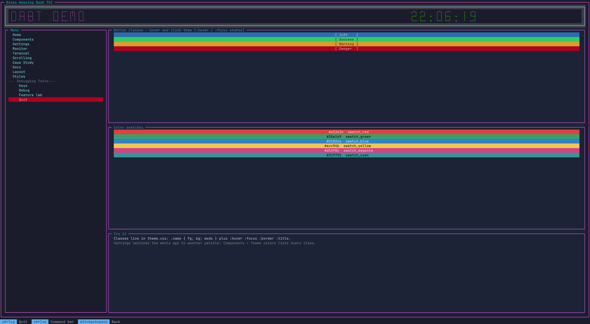 | 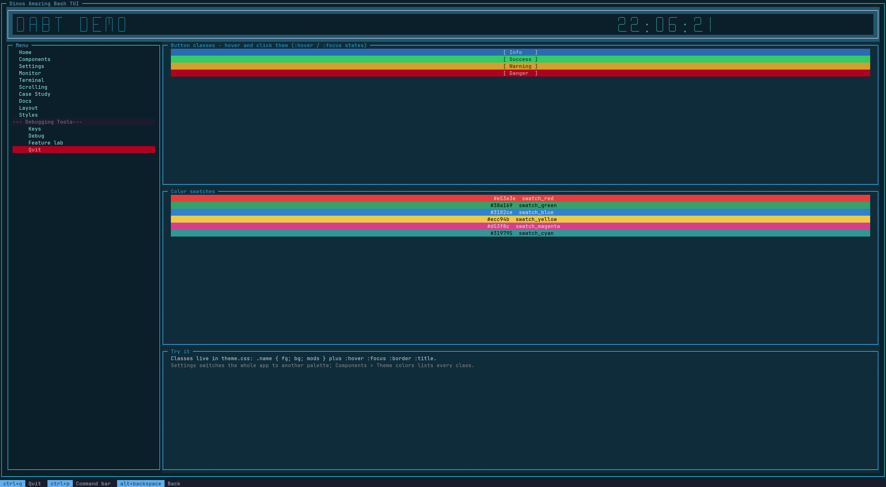 | 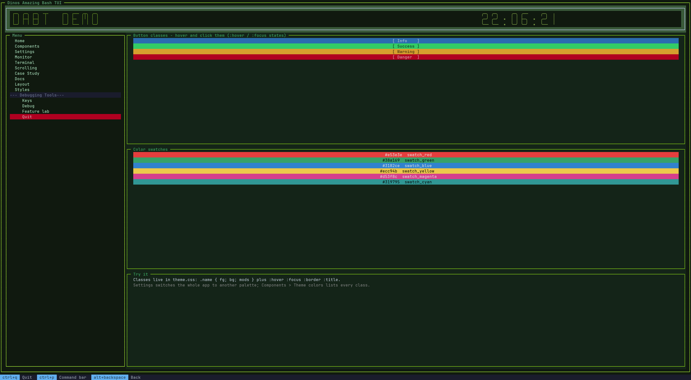 |

| Sunset | Light |
|:---:|:---:|
| 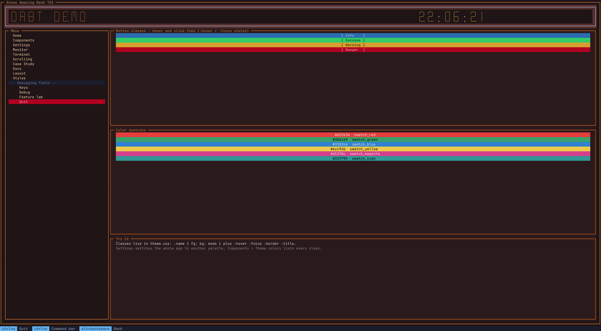 | 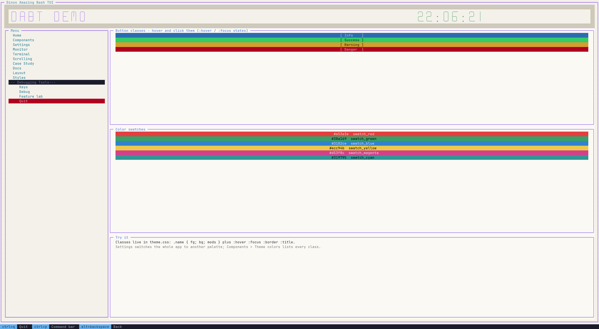 |
<br/>
<br/>
<h2 id="documentation"></h2>

Browse the [documentation site](https://dinosaursarecute.github.io/DinosAmazingBashTui/) or start at **[docs/README.md](docs/README.md)** for the architecture overview and a map of everything below.

| | |
|---|---|
| [API reference](docs/api/reference.md) | every function and parameter in one table |
| [API tour](docs/api/README.md) | by task, with examples |
| [**Writing Your First App**](docs/tutorials/writing-your-first-app.md) | step-by-step tutorial for complete beginners |
| [**Writing Your First Plugin**](docs/tutorials/writing-your-first-plugin.md) | step-by-step tutorial: commands, keys, timers, settings |
| [Writing an app](docs/guide/writing-an-app.md) | technical guide: lifecycle, state, packaging, pitfalls |
| [Markup](docs/guide/markup.md) | XML page format: panes, grids, tabs, includes, themes |
| [Widgets](docs/guide/widgets.md) | text editing, lists, tables, select, progress |
| [Plugins](docs/guide/plugins.md) | writing and managing plugins, hooks |
| [Input bindings](docs/guide/input-bindings.md) | keyboard / mouse bindings, command bar, footer |
| [Install & update](docs/guide/install-and-update.md) | installer, config home, updates, conflicts |
| [Callbacks & viewports](docs/guide/callbacks-and-viewports.md) | callbacks, hover / focus feedback, scrolling |
| [Design notes](docs/design/) | scrolling shader, pointer tracking, page cache, grid geometry |
<br/>
<br/>
<h2 id="project-structure"></h2>

```
install.sh  VERSION                    installer entry point, current version
bin/
├── dabt                               the command (see above)
└── DABT_demo.sh                       starts the demo application
lib/                                   the framework
├── tui.sh                             core: layout, widgets, event loop        ├── tui_input.sh  keys and mouse
├── tui_markup.sh / tui_style.sh       XML pages, CSS-like themes               ├── tui_cmd.sh    command bar
├── tui_text.sh / tui_widgets.sh       text editing, list/table/select/...      ├── tui_dialog.sh dialogs, toasts
├── tui_plugin.sh                      plugins and hooks                        ├── tui_home.sh   where files live
├── tui_cache.sh                       page cache
├── tui_sync.sh / tui_install.sh / tui_update.sh   installer + updater (three-way file sync)
└── terminal_controls.sh / terminal_renderer.sh / colors.sh   escape sequences, renderers, colours
share/
├── defaults/                          default keybinds, commands, theme, pages  -> ~/.config/DABT/defaults
├── plugins/                           plugins that ship with DABT               -> ~/.config/DABT/plugins
├── demo/  test_demo/                  the demo app
└── tui.xsd                            editor schema for the markup
docs/  examples/                       documentation, examples
tools/                                 repo only: profiling, screenshots, generators
tests/                                 repo only: bats tests (bats tests/)
```
<br/>
<br/>
<h2 id="requirements"></h2>

- **Bash 5.0+** (associative arrays, namerefs, `EPOCHREALTIME`, fractional `read -t`)
- A terminal emulator with mouse support (virtually all modern ones)
- `curl` or `wget` and `tar` for `dabt update` only
- [`bats`](https://github.com/bats-core/bats-core) to run the tests (optional)
- [`shellcheck`](https://www.shellcheck.net) / `semgrep` for deeper `dabt scan` checks (optional, [see why](#security-scan))

That's the whole list.
<br/>
<br/>
<h2 id="apps-built-with-dabt"></h2>

- **[DABT File Explorer](https://github.com/DinosaursAreCute/DabtFileExplorer)**: browse folders and preview files in the terminal. Install with `dabt app install https://github.com/DinosaursAreCute/DabtFileExplorer`.

<h2 id="going-beyond-the-demo"></h2>

Write your own pages (see `share/demo/` for a complete app) and link to them with `page="yourpage.xml"` on a button. Callbacks are plain bash functions: source them with `<script>` and reference them by name in `action="…"` or `submit="…"`.

For a real embedded terminal, point `tui.exec` at any command:

```xml
<script src="my_init.sh"/>
<!-- my_init.sh just contains: tui.exec "htop" "output_pane" "controls_pane" -->
```

The process runs in a real PTY. Pipe stdin to it, cancel it, save its output, or retry it, all from the TUI.

**Learn by building:**

- **[Writing Your First App](docs/tutorials/writing-your-first-app.md)**: step-by-step tutorial for complete beginners (pages, themes, callbacks).
- **[Writing Your First Plugin](docs/tutorials/writing-your-first-plugin.md)**: commands, keys, timers and settings.
- **[DABT File Explorer](https://github.com/DinosaursAreCute/DabtFileExplorer)**: a complete example application. Browse folders and preview files, then read its `config/` and `explorer.sh` as a real-world reference. Try it with `dabt app install https://github.com/DinosaursAreCute/DabtFileExplorer`.
<br/>
<br/>
<h2 id="contributing"></h2>

Contributions are currently not accepted. Contributions will be allowed once DABT has reached a maturity both in code, tests, and documentation that make effective contributing possible.

[MIT](LICENSE): free to use, modify and redistribute for any purpose, no warranty, no liability.

---

<div align="center">
<sub>Just bash, doing things bash was never meant to do. · <i>I use arch btw :D</i></sub>
</div>
