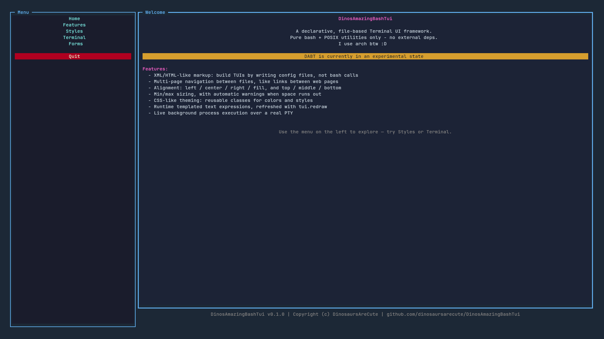
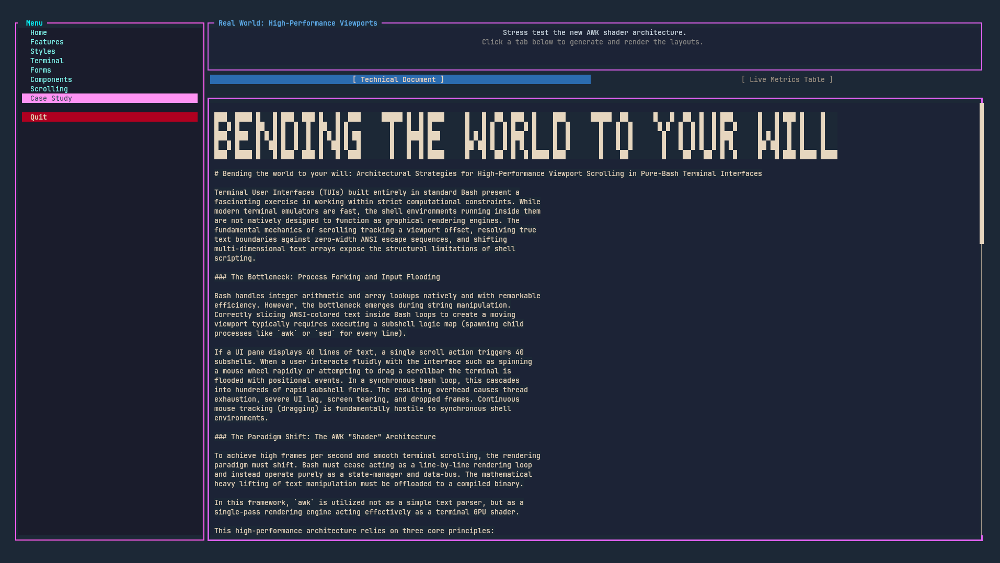
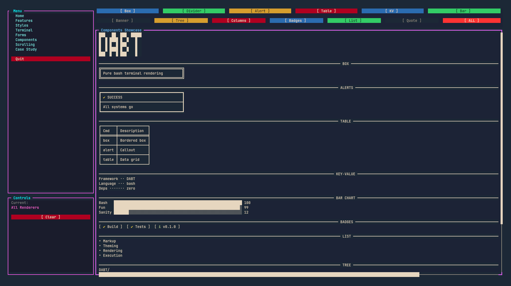
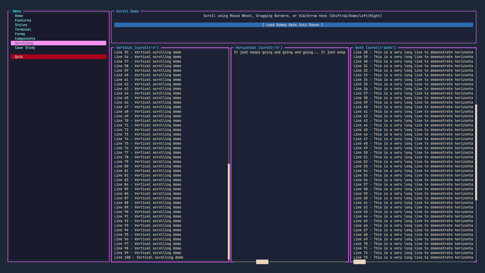
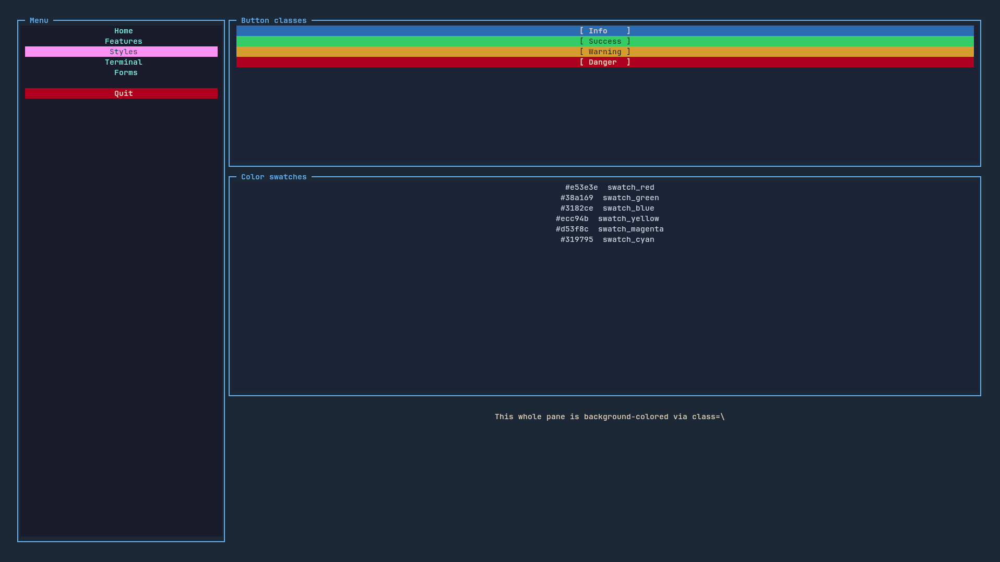
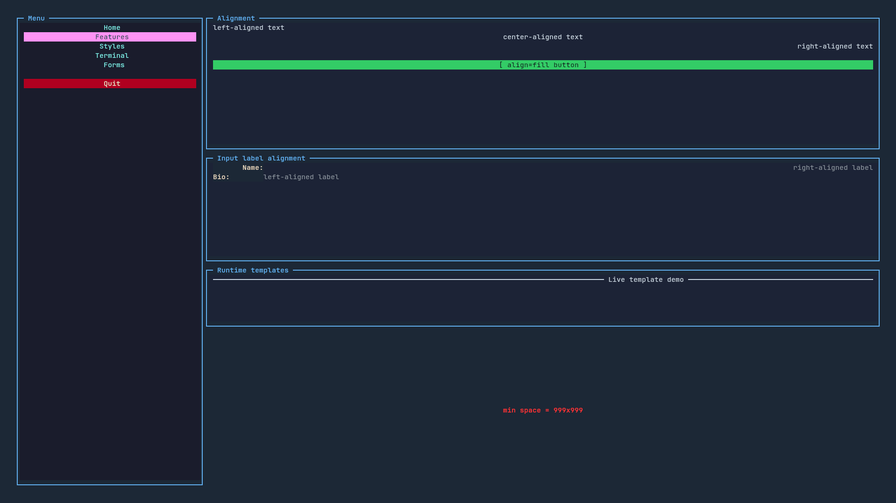
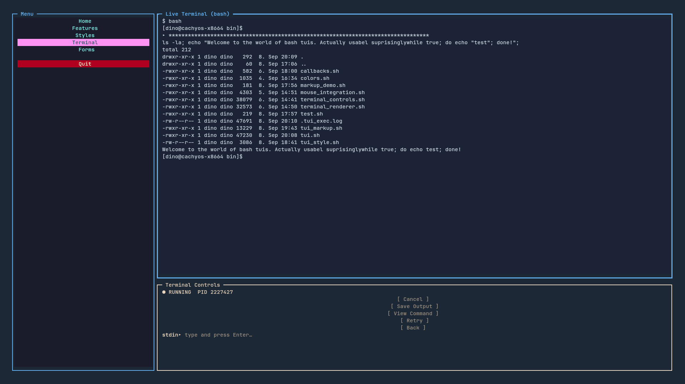
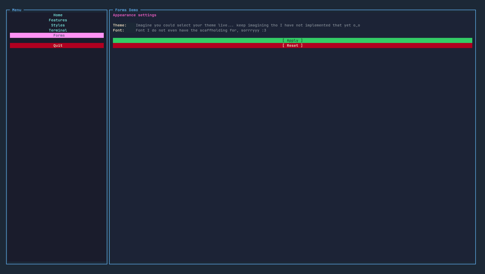
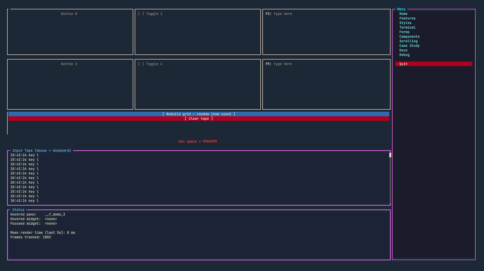

# 🦕 DinosAmazingBashTui<br/>

**A declarative, file-based Terminal UI framework.**<br/>
**Pure bash + POSIX utilities only - no external deps.**<br/>
<br/>
Build TUIs by writing XML config files, none of that peski in code stuff.<br/>
Think HTML pages, but for your terminal.<br/>

---



## What is this?

DinosAmazingBashTui or D.A.B.T for short, lets you build multi-page terminal interfaces the way you'd build a website: write markup, point at a stylesheet, wire up callbacks. The framework handles layout, rendering, focus management, mouse support, and live background process execution - all in pure bash.<br/>

<br/>
No Python. No Node. No ncurses. abstraction of any kind.<br/>
Just bash, doing things bash was never meant to do.<br/>

## ✨ Features

| | |
|---|---|
| **Declarative XML markup** | Define panes, buttons, inputs, and labels in config files — not imperative code |
|**Multi-page navigation** | Link between pages like HTML anchors with `page="other.xml"` on any button |
|**High-Performance Scrolling** | Batched AWK-shader viewports supporting Jump-to-Click scrollbars, Mouse Wheel, and Vim navigation |
|**CSS-like theming** | Reusable `.class` styles with `fg`, `bg`, `mods`, and `:focus`/`:border`/`:title` pseudo-states |
|**Flexible alignment** | `left` / `center` / `right` / `fill` horizontal, `top` / `middle` / `bottom` vertical |
|**Min/max sizing** | Constraint-based layout with automatic warnings when space runs out |
|**Runtime templates** | `${command args…}` expressions in text attributes, re-evaluated on every redraw |
|**Live terminal execution** | Stream a real PTY process into a pane with stdin piping, cancel, save, and retry |
|**Mouse + keyboard** | Click routing, Tab/Shift-Tab focus cycling, arrow key navigation — it all works |
|**Includes & fragments** | `<include src="_nav.xml"/>` for shared components across pages |

## Screenshots

<details>
<summary><b>Case Study — real world layout stress test</b></summary>



</details>

<details>
<summary><b>Components — all terminal renderers</b></summary>



</details>

<details>
<summary><b>Scrolling — high performance AWK shader viewports</b></summary>



</details>

<details>
<summary><b>Styles — themed buttons and color swatches</b></summary>



</details>

<details>
<summary><b>Features — alignment, label layout, runtime templates, min/max constraints</b></summary>



</details>

<details>
<summary><b>Terminal — live bash session with output streaming and controls</b></summary>



</details>

<details>
<summary><b>Forms — input fields with label alignment and action buttons</b></summary>



</details>

<details>
<summary><b>Debug - A live monitoring tool to see each mouse movement, keyboard press and focus event. Stress test the new rendering engine to its limit with the randomly generated layouts! </b></summary>



</details>

## Quick Start

```bash
# Clone it
git clone [https://github.com/yourname/DinosAmazingBashTui.git](https://github.com/yourname/DinosAmazingBashTui.git)
cd DinosAmazingBashTui

# Make everything executable
chmod +x bin/*

# Run the demo
bin/DABT_demo.sh

```

That's it. No install step, no package manager, no build tool. If you have bash, you're good.

## How it works

A page is just an XML file:

```xml
<tui>
  <script src="callbacks.sh"/>
  <theme src="theme.css"/>

  <pane id="root" split="h">
    <pane id="sidebar" weight="25" title="Menu" border="single" class="sidebar"/>
    <pane id="main"    weight="75" title="Welcome"/>
  </pane>

  <label  id="greeting" pane="main" row="0" text="Hello from DABT!" align="center"/>
  <button id="btn_quit" pane="sidebar" row="5" text="Quit" action="tui.stop" class="danger_button"/>
</tui>

```

Style it with a CSS-like stylesheet:

```css
.sidebar         { fg: #88c0d0; bg: #2e3440; }
.sidebar:border  { fg: #4c566a; }
.danger_button        { fg: white; bg: #b00020; mods: bold; }
.danger_button:focus  { fg: white; bg: #ff3333; mods: bold; }

```

Launch it from bash:

```bash
#!/usr/bin/env bash
source bin/tui.sh
tui.start "config/home.xml"

```

## 🏗️ Project Structure

```
bin/
├── callbacks.sh         # Legacy imperative demo callbacks
├── colors.sh            # Color helpers (named + hex)
├── DABT_demo.sh         # Entry point for the demo
├── mouse_integration.sh # Standalone mouse-tracking/color test harness
├── terminal_controls.sh # Low-level terminal escape sequences
├── terminal_renderer.sh # Runtime text rendering utilities
├── test.sh              # Ad-hoc terminal color/cursor test script
├── tui_markup.sh        # XML config loader
├── tui.sh               # Core framework — layout, widgets, event loop
└── tui_style.sh         # CSS-like theme engine

config/
├── case_study_callbacks.sh # callbacks for the case study page
├── case_study.xml          # case study page
├── components.xml          # renderer components showcase page
├── debug_callbacks.sh      # callbacks for the debug page
├── debug.xml               # hover/focus/input observability page
├── demo_callbacks.sh       # base callbacks
├── docu_callbacks.sh       # callbacks for the documentation page
├── docu.xml                # documentation page (tabs built dynamically from docs/*.md)
├── features.xml            # features page
├── home.xml                # entry point
├── _nav.xml                # reusable navigation pane
├── scroll_callbacks.sh     # scrolling page callbacks
├── scrolling.xml           # scrolling page
├── settings.xml            # settings/forms page
├── showcase_callbacks.sh   # callbacks for the components showcase page
├── styles.xml              # style page
├── terminal_init.sh        # terminal page callback
├── terminal.xml            # live terminal demo
├── theme.css               # css-like style sheet
└── tui.xsd                 # DABT xml syntax xsd

```

Regenerate this tree any time the file layout changes with
`scripts/gen_tree.sh` — it walks `bin/` and `config/` live and renders
them through `terminal_renderer.sh`'s own `tree` command, so it can't
silently drift out of sync with the actual files the way a hand-edited
one can.

## Requirements

* **Bash 4.3+** (associative arrays, `declare -g`, nameref)


* A terminal emulator with mouse support (virtually all modern ones)


* That's the whole list


## Going beyond the demo

Write your own pages, drop them in `config/`, and link to them with `page="yourpage.xml"` on a button. Callbacks are plain bash functions — source them with `<script>` and reference them by name in `action="…"` or `submit="…"` attributes.

For a real embedded terminal, point `tui.exec` at any command:

```xml
<script src="my_init.sh"/>
<!-- my_init.sh just contains: tui.exec "htop" "output_pane" "controls_pane" -->

```

The process runs in a real PTY. You can pipe stdin to it, cancel it, save its output, or retry it — all from the TUI.

---

*I use arch btw :D*

