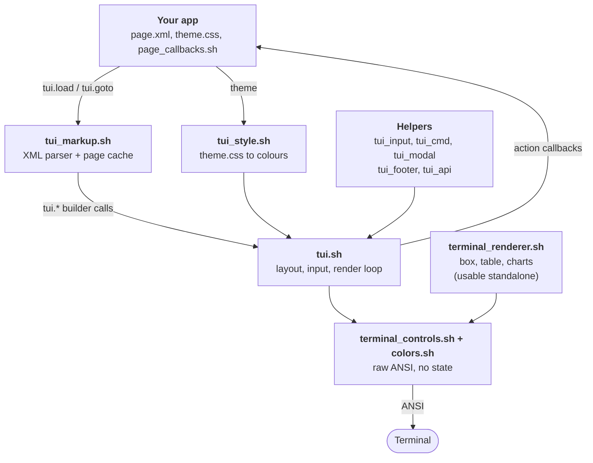

# D.A.B.T documentation

DinosAmazingBashTui is a terminal UI framework in **pure bash** (5.0+) plus POSIX utilities and `awk`. No Python, Node or ncurses.
This page is the map: how the framework is put together, and where to look for what.

## Where to look

| I want to... | Read |
|---|---|
| **New here?** Build a working app step by step | [tutorials/writing-your-first-app.md](tutorials/writing-your-first-app.md) |
| **New here?** Write a plugin step by step | [tutorials/writing-your-first-plugin.md](tutorials/writing-your-first-plugin.md) |
| Structure, package and ship an application (technical guide) | [guide/writing-an-app.md](guide/writing-an-app.md) |
| Build a page from XML (panes, grids, tabs, includes, themes) | [guide/markup.md](guide/markup.md) |
| Understand grids and tabs in depth | [guide/grid-layouts-and-tabs.md](guide/grid-layouts-and-tabs.md) |
| Write callbacks, hover/focus feedback and scrolling viewports | [guide/callbacks-and-viewports.md](guide/callbacks-and-viewports.md) |
| Bind keys and mouse, use the command bar, footer, default pages | [guide/input-bindings.md](guide/input-bindings.md) |
| Text editing, textarea, list, table, select, progress | [guide/widgets.md](guide/widgets.md) |
| Write, install and manage plugins; where DABT keeps its files | [guide/plugins.md](guide/plugins.md) |
| Install DABT, update it from GitHub, resolve conflicts | [guide/install-and-update.md](guide/install-and-update.md) |
| Look up **any function and its parameters** | [api/reference.md](api/reference.md) (one big table) |
| Read the API grouped by topic, with examples | [api/README.md](api/README.md) |
| Use the renderers (box, table, charts, banner...) without the TUI | [api/renderers.md](api/renderers.md), [examples/csv-charts](https://github.com/DinosaursAreCute/DinosAmazingBashTui/blob/main/examples/csv-charts/README.md) |
| Know why scrolling / hover / caching are built the way they are | [design/](#design-write-ups) |
| See what changed | [../CHANGELOG.md](https://github.com/DinosaursAreCute/DinosAmazingBashTui/blob/main/CHANGELOG.md) |
| Profile or screenshot the demo | [../tools/debug/README.md](https://github.com/DinosaursAreCute/DinosAmazingBashTui/blob/main/tools/debug/README.md) |

Fastest start: copy `share/demo/home.xml` + `bin/DABT_demo.sh`, then read [guide/markup.md](guide/markup.md).

Real-world example app: [DABT File Explorer](https://github.com/DinosaursAreCute/DabtFileExplorer).

## High-level architecture



### Layers (load order in `lib/tui.sh`)

| Layer | File | Job |
|---|---|---|
| Terminal primitives | `terminal_controls.sh`, `colors.sh` | Cursor, erase, SGR, modes, mouse, OSC. Stateless one-liners that print escape sequences. |
| Markup | `tui_markup.sh` | Parses XML pages into `tui.*` calls. `tui.start FILE` = init + load + run + cleanup. `tui.goto` switches page. |
| Style | `tui_style.sh` | `theme.css` (`.class`, `:focus`, `:hover`, `:border`, `:title`) resolved to fg/bg/mods per pane/widget. |
| Core | `tui.sh` | Pane tree + layout engine (`hsplit`/`vsplit`/`grid`/`fixed`), widgets, focus, mouse routing, render (AWK "shader" viewports), main loop, `tui.exec`. |
| Input | `tui_input.sh` | Key/mouse binding tables, dispatch, defaults (`share/defaults/keybinds.xml`), paste, focus movement, user keybind persistence. |
| Commands | `tui_cmd.sh`, `tui_modal.sh`, `tui_footer.sh` | Command registry + palette, overlay/modal layer, `<footer/>` key-hint bar. |
| Home + plugins | `tui_home.sh`, `tui_plugin.sh` | Where files live (`~/.config/DABT/`), app metadata, and the plugin system with hooks. |
| Config | `tui_config.sh` | Persisted framework settings (`~/.config/DABT/apps/<app>/dabt.conf`). |
| Cache | `tui_cache.sh` | Page record/replay cache, stylesheet memo, on-disk cache, warm-up. |
| Public helpers | `tui_api.sh` | Getters, live helpers (`tui.every`, `tui.clock`, `tui.watch`, `tui.monitor`), theme overlay, style helpers. |
| Renderers | `terminal_renderer.sh` | `box`, `table`, `hbar`, `linechart`, `banner`... each with a printing and a `_string` form. Usable with no TUI at all. |

### What happens when a page loads

1. `tui.goto page.xml` (or `tui.start`) → `tui.load_cached`. If the page's call log is cached and its files (page + includes) are unchanged it is **replayed**; otherwise the XML is parsed once and recorded.
2. The parser/replay issues builder calls: `tui.hsplit`, `tui.label`, `tui.button`, `tui.pane_border`, `tui.footer.set`, `tui.bind`... Nothing is drawn yet.
3. `<script>` files are sourced, the theme is applied, then layout runs (`_tui._layout`) and `on_visit` fires.
4. `tui.render` draws every pane, widget and content buffer inside one synchronized-output frame (`mode.sync_start/end`).
5. Overlays (footer, modal/palette, kill-switch box) are drawn on top after each flushed frame.

### The main loop (`tui.run`)

One loop iteration reads input (`read -t`, keyboard + SGR mouse), decodes it into an event (`TUI_EVENT_*`), and dispatches through the binding tables. Then it flushes any debounced render, runs `_TUI_TICK_FN`, redraws overlays (only after a frame was flushed) and calls every listener registered with `tui.tick.add`. `tui.every`, `tui.clock`, `tui.watch`, `tui.monitor` and `tui.exec` all ride one shared tick listener, so a page can run many live things without owning the loop.

### Input dispatch

`user binds → code binds (tui.bind, <bind>) → framework defaults (share/defaults/keybinds.xml)`, first match wins. Defaults are grouped (`focus`, `pane`, `scroll`, `click`, `wheel`, ...) and opt-out per app or page (`tui.defaults.off GROUP`). Details: [guide/input-bindings.md](guide/input-bindings.md).

### Design rules that shape the code

- **No external dependencies.** POSIX utilities + `awk` only.
- **Subshells are a last resort.** `$(...)` is a fork (~1 ms), so hot paths use `printf -v`, here-strings, namerefs, `EPOCHREALTIME` and `read < file`. Builders that would return text through a subshell have `_v` variants that write a result variable.
- **Redraw only what changed.** Content is change-detected (`tui.set_text`), scroll/content redraws are debounced, and overlays redraw only after a real frame.
- **Public vs private.** `tui.*`, `mode.*`, `cur.*` ... are public. Anything starting with `_` (`_tui.*`, `_exec_*`, `_tr_*`, `_tui_input.*`) is private: never call it from callbacks or config.
- **Multi-instance `tui.exec`.** Never assume one process per pane; instances are keyed `e1`, `e2`, ...
- **Page-level work uses `tui.tick.add`.** `_TUI_TICK_FN` is a legacy single slot; overwriting it breaks concurrent `tui.exec`.
- **Callbacks stay thin.** A callback is a plain bash function that calls public `tui.*` functions.

## App layout

```
my_app/
  bin/run.sh                 source tui.sh; TUI_APP_NAME=my_app; tui.start config/home.xml
  config/
    home.xml  other.xml      pages (HTML-like)
    _nav.xml                 shared fragment, <include src="_nav.xml"/>
    home_callbacks.sh        functions referenced by action="..." / on_visit="..."
    theme.css                <theme src="theme.css"/>
    themes/*.css             optional app-wide theme overlays (Settings / palette pick from here)
```

`share/demo/` is a complete working app. The framework's own defaults live in `share/defaults/` (`keybinds.xml`, `commands.xml`, `theme.css`, `pages/` for the built-in Settings and Keybinds pages); override the directory with `TUI_DEFAULTS_DIR`.

## Environment variables

| Variable | Default | Meaning |
|---|---|---|
| `TUI_APP_NAME` | `dabt` | The application's id (set BEFORE sourcing `tui.sh`): its files live in `~/.config/DABT/apps/$TUI_APP_NAME/` (`dabt.conf`, `keybinds.xml`, `settings.conf`, `app.meta`). |
| `TUI_HOME` | `~/.config/DABT` | DABT's home. Plugins you install go in `$TUI_HOME/plugins` (`TUI_PLUGINS_DIR`). |
| `TUI_DEFAULTS_DIR` | `share/defaults` | Where default keybinds, commands, theme and shipped pages are read from. |
| `TUI_THEMES_DIR` | `<app dir>/themes` | Themes offered by Settings and the palette (falls back to the shipped `share/defaults/themes`; the palette always lists those too). |
| `TUI_USER_KEYBINDS` | `$TUI_APP_CONF/keybinds.xml` | Saved user keybinds file. |
| `TUI_CONFIG_FILE` | `$TUI_APP_CONF/dabt.conf` | Persisted framework settings. |
| `TUI_FOOTER_DEFAULT` | quit, command bar, back | Default `<footer/>` items. |
| `TUI_INPUT_RETAIN_ON_SUBMIT` | `true` | Whether inputs keep focus after Enter (per input: `tui.input.retain`). |
| `TR_WIDTH` | terminal width | Renderers: force the width they lay out to (e.g. a pane's width). |
| `TUI_MOUSE_DRAIN_PEEK_TIMEOUT` | small, **> 0** | Mouse-motion coalescing peek. Never set to 0 (`read -t 0` consumes nothing). |

## Design write-ups

Long-form explanations of the non-obvious performance decisions. Read them before reimplementing scrolling, hover or caching.

| Document | Topic |
|---|---|
| [design/viewport-scrolling.md](design/viewport-scrolling.md) | Why scrolling is an AWK "shader" and how to keep wheel/drag fast. |
| [design/pointer-tracking-and-hover.md](design/pointer-tracking-and-hover.md) | Low-latency mouse tracking and hover resolution. |
| [design/grid-geometry-and-widget-factories.md](design/grid-geometry-and-widget-factories.md) | Grid geometry, container abstractions and runtime widget factories. |
| [design/write-ahead-logging-and-replay.md](design/write-ahead-logging-and-replay.md) | The page cache: recording builder calls and replaying them deterministically. |
| [design/rebindable-input-and-developer-ergonomics.md](design/rebindable-input-and-developer-ergonomics.md) | The 0.0.6 UX/DevX decisions: bindings as data, opt-out defaults, command bar, overlays, focus, live helpers. |

## Debugging and tooling

`tools/debug/` holds the profiling and screenshot tools (page-switch timings, per-call fork counts, full profile, PNG screenshots of every page and theme); see [../tools/debug/README.md](https://github.com/DinosaursAreCute/DinosAmazingBashTui/blob/main/tools/debug/README.md). `.tui_exec.log` is the runtime debug log written by `tui.log*`.
