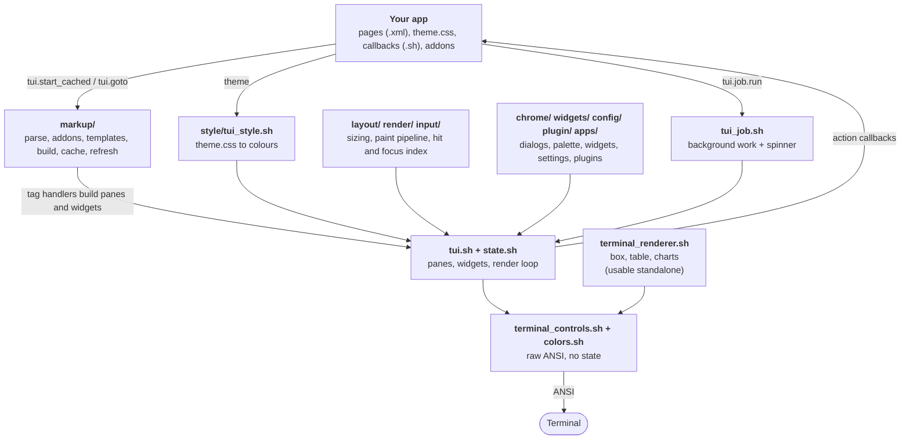

# D.A.B.T documentation

## Table of Contents

<details>

   <summary>Contents</summary>

1. [News](#news)
1. [Where to look](#where-to-look)
1. [High-level architecture](#high-level-architecture)
   1. [Layers (load order in `lib/tui.sh`)](#layers-load-order-in-libtuish)
   1. [What happens when a page loads](#what-happens-when-a-page-loads)
   1. [The main loop (`tui.run`)](#the-main-loop-tuirun)
   1. [Input dispatch](#input-dispatch)
   1. [Design rules that shape the code](#design-rules-that-shape-the-code)
1. [App layout](#app-layout)
1. [Environment variables](#environment-variables)
1. [Design write-ups](#design-write-ups)
1. [Debugging and tooling](#debugging-and-tooling)

</details>

DinosAmazingBashTui is a terminal UI framework in **pure bash** (5.0+) plus POSIX utilities and `awk`. No Python, Node or ncurses.
This page is the map: how the framework is put together, and where to look for what.

## News

- **Markup v2: pages are data** (unreleased). Templates, loops and conditions; addons that change a page without editing it; `tui.page.refresh`, which rebuilds only the panes that changed (an addon switches in about 45 ms); `tui.job.run` for slow work with a spinner after 100 ms; focus order and mouse zones; row-diffed redraws. Start with [Pages: the markup format](guide/markup.md) and [Pages, templates, addons and refresh](design/pages-templates-addons-refresh.md).
- **DevEx Update 2: Cleaned house, now off to the next venture** (unreleased). Pages are data now: templates, loops, conditionals, components and addons in the markup, and `tui.page.refresh` rebuilds only the panes that changed, shown live in the new Compose demo page. Holding Up/Down on the nav bar costs 47 ms of work per second instead of 478 and paints 4.3 KB instead of 49.5. Page switches and start-up got 6 to 20% slower from the stage 2 pipeline; winning that back is next. [Release notes](https://github.com/DinosaursAreCute/DinosAmazingBashTui/blob/main/release-notes/devex-update-2.md) · [Performance explorer](design/performance-explorer.html) · [The performance journey](design/performance-journey.md)
- **DevEx Update 1.93,75: Grinding the cleanup rubble to dust** (v0.0.22). A page switch between trivial pages is 86 ms instead of 136: the render cache now hits across pages, the page snapshot is rewritten once instead of on every replay, and the footer, the terminal-size read and the relayout only run when something changed. [Release notes](https://github.com/DinosaursAreCute/DinosAmazingBashTui/blob/main/release-notes/devex-update-1.93,75.md) · [Performance explorer](design/performance-explorer.html) · [The performance journey](design/performance-journey.md)
- **DevEx Update 1.87,5: Don't redo what you already know** (v0.0.21). Closing the command palette is 13 ms instead of 52, switching pages by key 106 ms instead of 229, and the demo no longer starts a process on every visit, tick or keystroke. [Release notes](https://github.com/DinosaursAreCute/DinosAmazingBashTui/blob/main/release-notes/devex-update-1.87,5.md) · [Designing fast apps](guide/performance.md) · [Performance explorer](design/performance-explorer.html)
- **DevEx Update 1.75: Blowing up a mountain** (v0.0.20). Page switches twice as fast, idle repaints down 90%. [Release notes](https://github.com/DinosaursAreCute/DinosAmazingBashTui/blob/main/release-notes/devex-update-1.75.md) · [The performance journey](design/performance-journey.md)

## Where to look

| I want to... | Read |
|---|---|
| **New here?**  Build a working app step by step | [tutorials/writing-your-first-app.md](tutorials/writing-your-first-app.md) |
| **New here?**  Write a plugin step by step | [tutorials/writing-your-first-plugin.md](tutorials/writing-your-first-plugin.md) |
| Structure, package and ship an application (technical guide) | [guide/writing-an-app.md](guide/writing-an-app.md) |
| Build a page from XML (panes, widgets, templates, addons, themes) | [guide/markup.md](guide/markup.md) |
| Understand grids and tabs in depth | [guide/grid-layouts-and-tabs.md](guide/grid-layouts-and-tabs.md) |
| Write callbacks, hover/focus feedback and scrolling viewports | [guide/callbacks-and-viewports.md](guide/callbacks-and-viewports.md) |
| Make pages and callbacks fast: budgets, fork-free callbacks, memoising, what the caches do | [guide/performance.md](guide/performance.md) |
| Bind keys and mouse, use the command bar, footer, default pages | [guide/input-bindings.md](guide/input-bindings.md) |
| Text editing, textarea, list, table, select, progress | [guide/widgets.md](guide/widgets.md) |
| Write, install and manage plugins; where DABT keeps its files | [guide/plugins.md](guide/plugins.md) |
| Install DABT, update it from GitHub, resolve conflicts | [guide/install-and-update.md](guide/install-and-update.md) |
| Look up **any function and its parameters** | [api/](api/) - one page per module, plus search (press `/`) |
| Read the API grouped by topic, with examples | [api/README.md](api/README.md) |
| Use the renderers (box, table, charts, banner...) without the TUI | [api/renderers.md](api/renderers.md), [examples/csv-charts](https://github.com/DinosaursAreCute/DinosAmazingBashTui/blob/main/examples/csv-charts/README.md) |
| Know why scrolling / hover / caching are built the way they are | [design/](#design-write-ups) |
| See what changed | [../CHANGELOG.md](https://github.com/DinosaursAreCute/DinosAmazingBashTui/blob/main/CHANGELOG.md) |
| Profile or screenshot the demo | [../tools/debug/README.md](https://github.com/DinosaursAreCute/DinosAmazingBashTui/blob/main/tools/debug/README.md) |

Fastest start: copy `share/demo/home.xml` + `bin/DABT_demo.sh`, then read [guide/markup.md](guide/markup.md).

Real-world example app: [DABT File Explorer](https://github.com/DinosaursAreCute/DabtFileExplorer). Writing an app in an editor? **[DABT Tools](https://github.com/DinosaursAreCute/DinosAmazingDabtPlugin)** is a companion VS Code extension: inlay hints and signature help for `dabt` function arguments, `class=` completion with live theme-aware color swatches, and required-attribute markers on your XML markup.

## High-level architecture


```mermaid
flowchart TB
  app["<b>Your app</b><br/>pages (.xml), theme.css, callbacks (.sh), addons"]
  markup["<b>markup/</b><br/>parse, addons, templates, build, cache, refresh"]
  styl["<b>style/tui_style.sh</b><br/>theme.css to colours"]
  core["<b>tui.sh + state.sh</b><br/>panes, widgets, render loop"]
  topic["<b>layout/ render/ input/</b><br/>sizing, paint pipeline, hit and focus index"]
  helpers["<b>chrome/ widgets/ config/ plugin/ apps/</b><br/>dialogs, palette, widgets, settings, plugins"]
  job["<b>tui_job.sh</b><br/>background work + spinner"]
  rend["<b>terminal_renderer.sh</b><br/>box, table, charts<br/>(usable standalone)"]
  ctl["<b>terminal_controls.sh + colors.sh</b><br/>raw ANSI, no state"]
  tty(["Terminal"])

  app -->|"tui.start_cached / tui.goto"| markup
  app -->|"theme"| styl
  app -->|"tui.job.run"| job
  markup -->|"tag handlers build panes and widgets"| core
  styl --> core
  topic --> core
  helpers --> core
  job --> core
  core -->|"action callbacks"| app
  core --> ctl
  rend --> ctl
  ctl -->|"ANSI"| tty
```

### Layers (load order in `lib/tui.sh`)

`lib/` puts shared/public files at its root and groups the rest by topic into subdirectories - see the [API index](api/) for the matching per-module API pages.

| Layer | File | Job |
|---|---|---|
| Terminal primitives | `terminal_controls.sh`, `colors.sh` | Cursor, erase, SGR, modes, mouse, OSC. Stateless one-liners that print escape sequences. |
| State and measurement | `state.sh`, `perf.sh` | `tui.sh`'s global state (pane geometry, widget registries, background-exec instances); spans, counters and the `tui.perf.*` report. |
| Layout | `layout/tui_layout.sh` | Size tokens (`24`, `30%`, `2fr`, `clamp()`), largest-remainder distribution, min/max with redistribution. |
| Render | `render/tui_emit.sh`, `tui_paint.sh`, `tui_canvas.sh`, `tui_rowcache.sh` | Everything is drawn into one frame buffer; changed rows are diffed against the last flush; one glyph and junction table for every border style; composed fragments are cached on their inputs. |
| Hit and focus | `input/tui_hit.sh`, `input/tui_focus.sh` | A per-row index of mouse zones (scrollbar, title, widget, extra hit areas, pane); the Tab order, groups and `autofocus`. |
| Page tree | `markup/tui_node.sh`, `tui_ops.sh`, `tui_parse.sh` | The node store and its operations; the tokenizer that fills it. |
| Reuse | `markup/tui_compose.sh`, `tui_addon.sh` | `<template>`, `<use>`, `<for>`, `<if>`, `<component>`; addon files applied to a tree. |
| Build | `markup/tui_build.sh`, `markup/tui_markup.sh`, `tui_registry.sh` | One registered handler per tag turns nodes into panes and widgets; `tui.load` and `tui.goto`; the registry of tags, widgets and style contracts. |
| Refresh | `markup/tui_refresh.sh` | `tui.page.refresh`: sign what was built, compare after a change, rebuild only the changed panes. |
| Validation | `markup/tui_validate.sh`, `tui_validate_rules.sh` | Checks pages (and includes) before an app starts: file/line/col errors, rules registered as tables or functions. |
| Style | `style/tui_style.sh` | `theme.css` (`.class`, `:focus`, `:hover`, `:border`, `:title`) resolved to fg/bg/mods per pane/widget. |
| Core | `tui.sh` | Pane tree, widgets, mouse routing, the render driver, main loop, `tui.exec`. |
| Input | `input/tui_input.sh` | Key/mouse binding tables, dispatch, defaults (`share/defaults/keybinds.xml`), paste, user keybind persistence. |
| Commands | `chrome/tui_cmd.sh`, `chrome/tui_modal.sh`, `chrome/tui_footer.sh`, `chrome/tui_dialog.sh` | Command registry + palette, overlay/modal layer, `<footer/>` key-hint bar, dialogs and toasts. |
| Background work | `tui_job.sh` | `tui.job.run`, `tui.page.rebuild`, the spinner. |
| Widgets | `widgets/tui_widgets.sh`, `widgets/tui_text.sh` | Widget constructors and the shared text-editing engine (input, password, textarea). |
| Home + plugins | `tui_home.sh`, `plugin/tui_plugin.sh` | Where files live (`~/.config/DABT/`), app metadata, and the plugin system with hooks. |
| Config | `config/tui_config.sh` | Persisted framework settings (`~/.config/DABT/apps/<app>/dabt.conf`). |
| Cache | `markup/tui_cache.sh` | Page snapshot cache, stylesheet memo, on-disk cache, parallel warm-up. |
| App lifecycle | `apps/tui_apps.sh`, `apps/tui_install.sh`, `apps/tui_sync.sh`, `apps/tui_update.sh`, `apps/tui_scan.sh` | `dabt app`/`dabt update` install, sync and security-scan machinery. |
| Public helpers | `tui_api.sh` | Getters, live helpers (`tui.every`, `tui.clock`, `tui.watch`, `tui.monitor`), theme overlay, style helpers. |
| Renderers | `terminal_renderer.sh` | `box`, `table`, `hbar`, `linechart`, `banner`... each with a printing and a `_string` form. Usable with no TUI at all. |
| Packaging | `dapk/` | `.dapk` build/sign/verify/publish - the module behind `dabt build` / `dabt pkg`. |

### What happens when a page loads

1. `tui.goto page.xml` (or `tui.start_cached`) → `tui.load_cached`. If the page has a snapshot and its files (page, includes, addon files) are unchanged, it is **restored**: one `eval` of the saved engine state, then the dynamic parts are replayed (`<script>` sourcing, nav handlers, classes, `on_visit`). Otherwise the page is built and recorded for next time.
2. Building: the file is tokenized into a node tree, addons are applied, templates and loops are expanded, and every node is handed to the handler registered for its tag, which creates the panes and widgets. Nothing is drawn yet. The raw tree and a signature per pane are kept with the snapshot.
3. Layout runs (`_tui._layout`) and `on_visit` fires.
4. `tui.render` draws every pane, widget and content buffer into one frame inside a synchronized-output block (`mode.sync_start/end`). Later partial redraws (hover, focus) are diffed against the previous flush row by row, so only changed rows are written.
5. Overlays (footer, modal/palette, toasts, the job spinner) are drawn on top after each flushed frame.
6. To change a page that is showing, `tui.page.refresh` rebuilds only the panes that changed ([design](design/pages-templates-addons-refresh.md)); slow work goes through `tui.job.run`.

### The main loop (`tui.run`)

One loop iteration reads input (`read -t`, keyboard + SGR mouse), decodes it into an event (`TUI_EVENT_*`), and dispatches through the binding tables. Then it flushes any debounced render, runs `_TUI_TICK_FN`, redraws overlays (only after a frame was flushed) and calls every listener registered with `tui.tick.add`. `tui.every`, `tui.clock`, `tui.watch`, `tui.monitor` and `tui.exec` all ride one shared tick listener, so a page can run many live things without owning the loop.

### Input dispatch

`user binds → code binds (tui.bind, <bind>) → framework defaults (share/defaults/keybinds.xml)`, first match wins. Defaults are grouped (`focus`, `pane`, `scroll`, `click`, `wheel`, ...) and opt-out per app or page (`tui.defaults.off GROUP`). Details: [guide/input-bindings.md](guide/input-bindings.md).

### Design rules that shape the code

- **No external dependencies.** POSIX utilities + `awk` only.
- **Subshells are a last resort.** `$(...)` is a fork (~1 ms), so hot paths use `printf -v`, here-strings, namerefs, `EPOCHREALTIME` and `read < file`. Builders that would return text through a subshell have `_v` variants that write a result variable.
- **Redraw only what changed.** Content is change-detected (`tui.set_text`), scroll/content redraws are debounced, and overlays redraw only after a real frame.
- **Public vs private.** `tui.*`, `mode.*`, `cur.*` ... are public. Anything starting with `_` (`_tui.*`, `_exec_*`, `_tr_*`, `_tui_input.*`) is private: never call it from callbacks or config.
- **Multi-instance `tui.exec`.** Never assume one process per pane; instances are keyed `e1`, `e2`, ...
- **Page-level work uses `tui.tick.add`.** Never assign `_TUI_TICK_FN`: it is a single slot and overwriting it breaks concurrent `tui.exec`.
- **Callbacks stay thin, and fast.** A callback is a plain bash function that calls public `tui.*` functions; anything that can take longer than a blink goes through `tui.job.run`. Read widgets into variables (`tui.get ID VAR`).
- **A page is data.** Write widgets inside their pane, give panes an `id`, share parts as templates, change pages with addons and `tui.page.refresh`.

## App layout

```
my_app/
  bin/run.sh                 TUI_APP_NAME=my_app; source tui.sh; tui.start_cached config/home.xml
  config/
    home.xml  other.xml      pages (XML)
    _templates.xml           shared parts as <template>s, <include src="_templates.xml"/>
    home_callbacks.sh        functions referenced by action="..." / on_visit="..."
    theme.css                <theme src="theme.css"/>
    themes/*.css             optional app-wide theme overlays (Settings / palette pick from here)
~/.config/DABT/apps/my_app/
    addons/*.xml             addons: changes to pages without editing them
```

`share/demo/` is a complete working app. The framework's own defaults live in `share/defaults/` (`keybinds.xml`, `commands.xml`, `theme.css`, `pages/` for the built-in Settings and Keybinds pages); override the directory with `TUI_DEFAULTS_DIR`.

## Environment variables

| Variable | Default | Meaning |
|---|---|---|
| `TUI_APP_NAME` | `dabt` | The application's id (set BEFORE sourcing `tui.sh`): its files live in `~/.config/DABT/apps/$TUI_APP_NAME/` (`dabt.conf`, `keybinds.xml`, `settings.conf`, `app.meta`). |
| `TUI_HOME` | `~/.config/DABT` | DABT's home. Plugins you install go in `$TUI_HOME/plugins` (`TUI_PLUGINS_DIR`). |
| `TUI_DEFAULTS_DIR` | `share/defaults` | Where default keybinds, commands, theme and shipped pages are read from. |
| `TUI_THEMES_DIR` | `<app dir>/themes` | The app's own themes. Settings and the palette offer these together with every `*.css` in DABT's installed themes directory (`tui.theme.list`); an app theme with the same name wins. |
| `TUI_USER_KEYBINDS` | `$TUI_APP_CONF/keybinds.xml` | Saved user keybinds file. |
| `TUI_CONFIG_FILE` | `$TUI_APP_CONF/dabt.conf` | Persisted framework settings. |
| `TUI_FOOTER_DEFAULT` | quit, command bar, back | Default `<footer/>` items. |
| `TUI_INPUT_RETAIN_ON_SUBMIT` | `true` | Whether inputs keep focus after Enter (per input: `tui.input.retain`). |
| `TUI_CACHE_TRUST` | `1` | Source files (pages, includes, themes) are checked against the page cache once, at start-up, and assumed unchanged while the app runs; edits take effect on the next start. `0` keeps the check on every page switch, for developing a page with the app open. |
| `TR_WIDTH` | terminal width | Renderers: force the width they lay out to (e.g. a pane's width). |
| `TUI_MOUSE_DRAIN_PEEK_TIMEOUT` | small, **> 0** | Mouse-motion coalescing peek. Never set to 0 (`read -t 0` consumes nothing). |

## Design write-ups

Long-form explanations of the non-obvious performance decisions. Read them before reimplementing scrolling, hover or caching.

| Document | Topic |
|---|---|
| [design/viewport-scrolling.md](design/viewport-scrolling.md) | Why scrolling is an AWK "shader" and how to keep wheel/drag fast. |
| [design/pointer-tracking-and-hover.md](design/pointer-tracking-and-hover.md) | Low-latency mouse tracking and hover resolution. |
| [design/grid-geometry-and-widget-factories.md](design/grid-geometry-and-widget-factories.md) | Grid geometry, container abstractions and runtime widget factories. |
| [design/write-ahead-logging-and-replay.md](design/write-ahead-logging-and-replay.md) | The page cache: why a built page is snapshotted and replayed, and how it is kept honest. |
| [design/pages-templates-addons-refresh.md](design/pages-templates-addons-refresh.md) | How a page is built, reused and changed: node tree, templates, addons, `tui.page.refresh`, background jobs. |
| [design/rebindable-input-and-developer-ergonomics.md](design/rebindable-input-and-developer-ergonomics.md) | The 0.0.6 UX/DevX decisions: bindings as data, opt-out defaults, command bar, overlays, focus, live helpers. |

## Debugging and tooling

`tools/debug/` holds the profiling and screenshot tools (page-switch timings, per-call fork counts, full profile, PNG screenshots of every page and theme); see [../tools/debug/README.md](https://github.com/DinosaursAreCute/DinosAmazingBashTui/blob/main/tools/debug/README.md). `tui.log*` writes the runtime log to `~/.config/DABT/apps/<app>/logs/<yyyy-mm-dd>_<app>.log` (`tui.log.file` prints the path).
