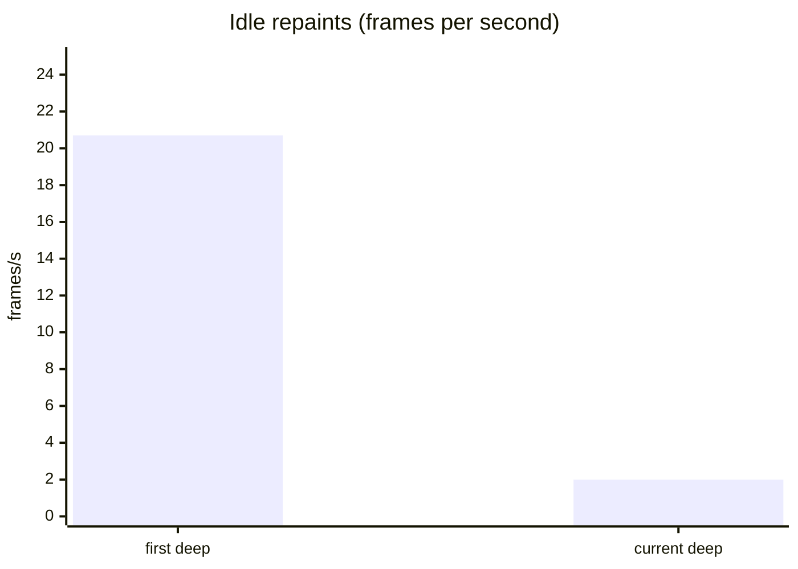
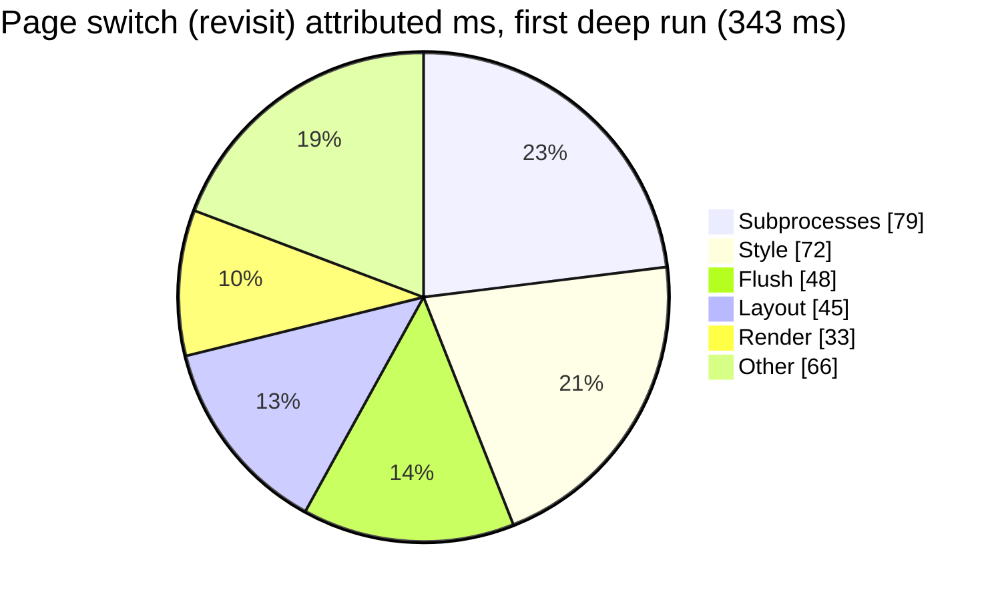
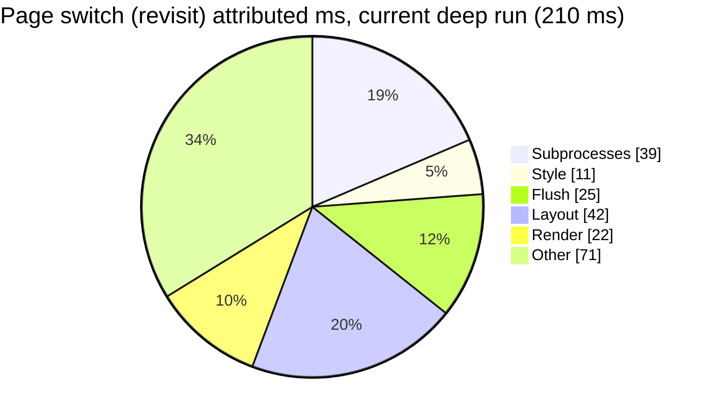
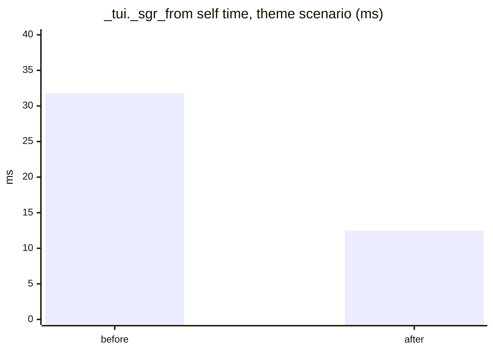
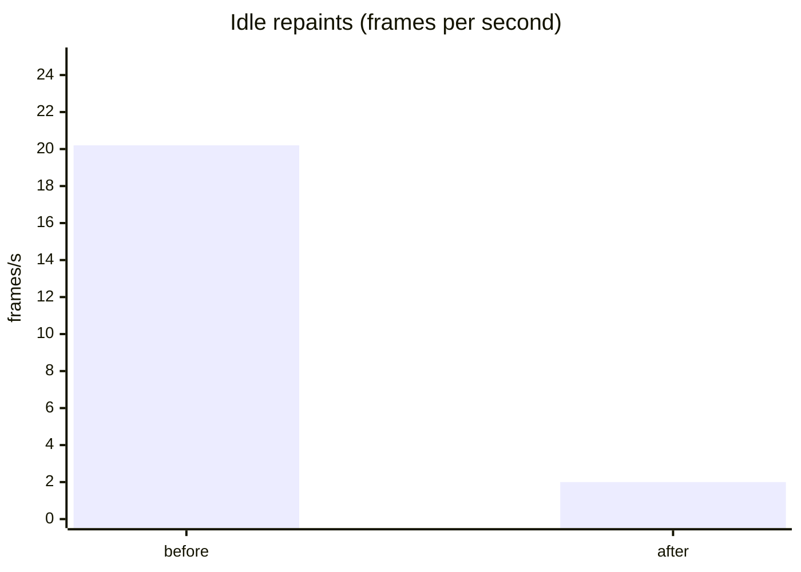
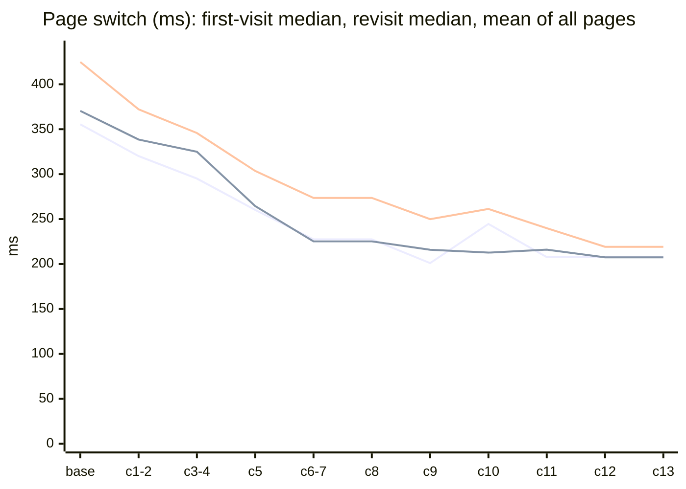

# Performance progress

Status: living overview. First entry 2026-09-30, commit 8274c7f plus uncommitted local changes. All numbers come from `tools/profiler` (150x45 terminal, demo app). Plans and concepts referenced here: `sgr-cache-plan.md`, `cheap-redraws-concept.md`.

## 1. Summary

Thirteen changes have been made so far (in `lib/tui.sh`, `lib/chrome/tui_modal.sh`, `lib/markup/tui_cache.sh` and `lib/markup/tui_build.sh`):

| change | what it does | outcome |
|---|---|---|
| Memo of `_tui._sgr_from` | Caches the colour-to-escape-sequence result per (fg, bg, mods) | Works as designed; saves ~19 ms of a 378 ms theme switch, too small to show in wall time |
| Pure-bash `_tui._vslice` replacing the `awk` fork in `_tui._render_output_buf` | Slices coloured and scrolled pane lines without spawning a process | Removes every fork from hover, focus, click and scroll, and halves subprocess time on page switches; page switch −5 to −11%, scroll −8 to −9% |
| Overlay redraw generation fix in `_tui_overlay.draw_all` | Stops the main loop from redrawing overlays on every tick | Idle frames 20.2 → 2.0 per second, idle bytes 39.2 → 3.8 KB/s, idle CPU 5.0% → 2.7% of a core |
| Interior row built once in `_tui._draw_pane_buf` | Bordered panes stop re-resolving the same border/fill styles for every interior row | Pane drawing per full render roughly halved (44 → 22 ms page switch); page switch first visit −8%, palette close −30%, theme first use −8% |
| Skip the per-widget style re-bake on cache replay when the theme overlay is unchanged | `tui.cache.replay` no longer re-runs `tui.class` for every widget | Replay 122 → 92 ms; page switch revisit 303 → 265 ms (−13%), first visit 285 → 260 ms (−9%) (8-round confirmation) |
| `<bind>` tags recorded for cache replay | Page key bindings (alt+1..0, alt+n) exist on cached pages | alt+2 navigates on a warm start; `nav.key` now measures a real page switch (368 ms) |
| Input settle timeout while a render is queued (`TUI_INPUT_SETTLE_TIMEOUT`) | Removes a 50 ms idle wait before queued renders are flushed | Scroll 58 → 18 ms, Page Down 54 → 14 ms, page switch about −35 ms |
| Batched `stat` and fork-free reads in the page cache check and load | One `stat` call for any number of files, reads without `cat` forks | Warm start 823 → 308 ms (−63%), `load cache` 361 → 35 ms |
| Layout: single-pass content-fit index, no duplicate fit refresh, `_eff_border` inlined into `_inset` | `tui.render` stops scanning every widget once per pane (twice) | Layout layer 42 → 26 ms per page switch, 38 → 22 ms per resize; `_pane_content_need` 13 → 1.3 ms |
| Shared pane inset for consecutive widgets (`_TUI_WP_REUSE`) in the render widget pass and the hit test | `_widget_pos` stops recomputing one pane's inset per widget | Small: layout 26.7 → 24.0 ms per page switch; hover 9.6 → 8.2 ms, click 11.1 → 10.2 ms |
| `tui.goto` defers `tui.render` while loading (`_TUI_DEFER_RENDER`), fork-free docs titles | Removes the duplicate full render inside `on_visit` | `components` page switch 364 → 276 ms, `docs` 384 → 287 ms; mean page switch 261 → 240 ms |
| Fork-free page build, `_tui_cache_class`, process-tree kill (`/proc` children, one grace period) | Removes about 9,000 forks from the cache build and 250 ms of sleeps from leaving the Terminal page | Cold start 5.54 → 3.11 s (−44%); `scrolling` page switch 426 → 261 ms (−39%) |
| Remaining cold-start forks in the cache recording (`deps_of`, goto records, `_markup_wx` attributes, spinner clock) | Removes 872 more forks from the cold start | Cold start 3.11 → 2.87 s, warm start 303 → 287 ms |

The profile also changed what we think matters. Colour and theme work is worth about 5% of a page switch at best. The remaining time is the full repaint: Flush, Layout, Render and Style together are about 160 ms of a ~270 ms page switch. The frame-source investigation (section 17) showed that the extra frames per action are small (one 40 KB render plus ~15 KB across the rest), so dirty flags are no longer the lead item; redundant chrome drawing and page loading are.

## Preliminary result: first deep run vs current deep run

Status: preliminary. Both runs are `--deep` full scenarios (5 rounds, traced cold start), taken 2026-09-30 about 2.5 hours apart on the same machine: the first is `20260930-193435` (before any change in this document), the current is `20260930-214915` (after changes 1–7). Medians of the probe-measured latency; budgets are the perceived-instant lines from `tools/profiler/dprof/scenarios.py`.

### Latency, all interactions

| interaction | budget | first deep | current deep | change | state |
|---|---|---|---|---|---|
| Cold start | 5000 ms | 5836 ms | 5597 ms | -4% | over (1.1×) |
| Warm start | 1000 ms | 857 ms | 823 ms | -4% | within |
| Page switch, first visit | 150 ms | 356 ms | 228 ms | -36% | over (1.5×) |
| Page switch, revisit | 100 ms | 370 ms | 225 ms | -39% | over (2.3×) |
| Page switch by key (alt+2) | 100 ms | 10.9 ms | 368 ms | +3285% | over (3.7×) |
| Focus next (Tab) | 50.0 ms | 3.05 ms | 3.32 ms | +9% | within |
| Focus previous | 50.0 ms | 2.43 ms | 3.22 ms | +33% | within |
| Mouse hover | 30.0 ms | 9.45 ms | 9.56 ms | +1% | within |
| Mouse click | 100 ms | 11.4 ms | 11.1 ms | -3% | within |
| Wheel scroll, single | 60.0 ms | 64.1 ms | 18.3 ms | -72% | within |
| Wheel scroll, burst | 150 ms | 68.9 ms | 22.9 ms | -67% | within |
| Page Down | 100 ms | 60.2 ms | 14.3 ms | -76% | within |
| Palette open | 100 ms | 29.4 ms | 28.4 ms | -4% | within |
| Palette typing | 50.0 ms | 25.7 ms | 24.4 ms | -5% | within |
| Palette close | 100 ms | 143 ms | 57.5 ms | -60% | within |
| Theme switch, first use | 250 ms | – | 306 ms | new | over (1.2×) |
| Theme switch, repeat | 150 ms | – | 16.1 ms | new | within |
| Terminal resize | 250 ms | 260 ms | 219 ms | -16% | within |
| Quit | 500 ms | 31.5 ms | 54.2 ms | +72% | within |

Read with these caveats: "Page switch by key" did not navigate in the first run (the binding was lost on cached pages), so its first value is a 11 ms no-op and the current 368 ms is a real page switch; the focus steps now start from a different focus state after that fix (see the anomalies below); theme switching did not exist as a scenario in the first run.

```mermaid
xychart-beta
    title "Median latency (ms): first deep run vs current deep run"
    x-axis ["page first", "page revisit", "palette close", "resize", "scroll step", "scroll burst", "page down"]
    y-axis "ms" 0 --> 400
    bar [355.5, 370.4, 142.7, 259.9, 64.1, 68.9, 60.2]
    bar [227.5, 225.2, 57.5, 218.9, 18.3, 22.9, 14.3]
```

(First series = first deep run, second = current.)

```mermaid
xychart-beta
    title "Idle repaints (frames per second)"
    x-axis ["first deep", "current deep"]
    y-axis "frames/s" 0 --> 25
    bar [20.7, 2.0]
```

### Where the attributed time went (trace, calibrated ms per action)

| scenario | first total → current | Subprocesses | Style | Flush | Layout | Render |
|---|---|---|---|---|---|---|
| page switch, first visit | 319 → 206 | 73 → 37 | 68 → 11 | 46 → 25 | 38 → 42 | 31 → 22 |
| page switch, revisit | 343 → 210 | 79 → 39 | 72 → 11 | 48 → 25 | 45 → 42 | 33 → 22 |
| mouse click | 58 → 46 | 12 → 2 | 8 → 2 | 7 → 6 | 13 → 15 | 5 → 4 |
| scroll, single | 14 → 7 | 13 → 0 | 0 → 0 | 0 → 0 | 0 → 2 | 0 → 2 |
| palette close | 140 → 48 | 29 → 0 | 43 → 4 | 33 → 10 | 10 → 17 | 21 → 9 |
| terminal resize | 149 → 107 | 18 → 3 | 40 → 8 | 32 → 17 | 25 → 38 | 20 → 18 |

```mermaid
pie showData
    title Page switch (revisit) attributed ms, first deep run (343 ms)
    "Subprocesses" : 79
    "Style" : 72
    "Flush" : 48
    "Layout" : 45
    "Render" : 33
    "Other" : 66
```

```mermaid
pie showData
    title Page switch (revisit) attributed ms, current deep run (210 ms)
    "Subprocesses" : 39
    "Style" : 11
    "Flush" : 25
    "Layout" : 42
    "Render" : 22
    "Other" : 71
```

Style (−85%), subprocesses (−50%) and flush (−48%) moved; layout did not (45 → 42 ms) and is now the largest single layer of a page switch together with subprocesses. The calibration check on the current run is 6.5% mean error with −1.0% bias over 60 functions, so the layer numbers are reliable.

### What moved, and which change caused it

| outcome | change |
|---|---|
| Scroll, Page Down and wheel bursts −67 to −76% (about 60 → 18 ms) | 7: input settle timeout replaces the 50 ms wait before a queued render is flushed |
| Page switch −36/−39% (355/370 → 228/225 ms) | 2 (awk fork), 4 (pane interior), 5 (style re-bake skip), 7 (settle timeout) |
| Palette close −60% (143 → 58 ms) | 4 (pane interior), 2 |
| Idle 20.7 → 2.0 frames per second, bytes −65% (10.8 → 3.8 KB/s) | 3: overlay redraw generation |
| Style layer −85% in page switches | 1 (`_sgr_from` memo), 5 (re-bake skip) |
| Subprocess time −50% to −100% across interactions | 2 (awk fork) |
| Startup −4% (cold 5.84 → 5.60 s, warm 857 → 823 ms) | none targeted yet |

### Not improved, or worse

- **Warm start was essentially unchanged in this run (857 → 823 ms); change 8 below fixed it afterwards (308 ms).** `load cache` is 361 ms of it. It is dominated by `tui.cache.valid` stat forks: `stat` is 191 runs and 257 ms per pass in the current run, 119 of those in the warm start. Attributed warm-start time fell from 857 to 445 ms, but wall time did not, because the remaining time is the fork-heavy cache load and validity check.
- **Cold start** is still 5.6 s (over its 5.0 s budget): 4.2 s of it is the cache-building splash.
- **Page switches are still over budget** (1.5× first visit, 2.3× revisit), and alt+2 at 368 ms is the slowest since it lands on the heavy `components` page.
- **Layout** is now the biggest layer of a page switch (42 ms; `_tui._widget_pos` 568× and `_tui._inset` 1,510× per click action in the trace).
- **Focus Tab / Shift+Tab settle went 3.8 → 9 ms** (paint unchanged at 3.3 ms). Its frames now carry a 2.1 KB pane-border redraw instead of 116 B, so focus now moves between panes: the scenario state changed when alt+2 started navigating, not the code. Comparing these two rows across the runs is not valid.
- **Shutdown 31.5 → 54 ms.** The value is stable (54 in every sample and since `20260930-205743`); its cause has not been investigated.
- **Resize** remains noisy (113–244 ms per sample, bimodal by target size); −16% is not a reliable figure.

### Open points

1. The 687 B frame of the old `nav.key` is gone with the fix; nothing is open there.
2. Two items from the traced run need a decision: `tui.theme.list` still forks on palette open (3 forks + 1 program, `tui_api.sh:671`), and the `stat`-based cache check.
3. The tests were run by the maintainer after changes 5–7; their results are not recorded in this document.

## 2. How this was measured

- **Baseline:** `--deep` full run, 5 rounds, report `20260930-193435`. Theme baseline: 3 rounds, report `20260930-200833`.
- **After:** theme `20260930-201013` (3 rounds); `nav` `20260930-202352`, `input` `20260930-202642`, `scroll` `20260930-202655` (4 rounds each).
- **Two kinds of numbers.** *Wall time* is the median latency measured by in-app probes in an untraced run. It is what the user feels. *Attributed time* comes from the bash trace, rescaled to untraced speed; it says where time goes but excludes waiting. The calibration check against the probes showed 10% mean error and −2% bias on the baseline run, so per-layer numbers are trustworthy; the wall and attributed totals should not be expected to agree.
- **Noise.** Run-to-run spread is roughly ±3% on medians. Changes smaller than that are not reported as changes.

## 3. Change 1: memoised `_sgr_from`

### What changed

`_tui._sgr_from` turns `#rrggbb`, colour names and modifiers into an escape sequence. It is pure, so its result is now cached under the key `fg|bg|mods`, bounded at 4096 entries. See `sgr-cache-plan.md` step 2a.

### Expected vs real

| | expected (plan) | real |
|---|---|---|
| Cost per call | ~78 µs → ~3 µs | 69 µs → 27 µs |
| `_sgr_from` self time (theme scenario) | drops by more than half | 31.8 → 12.5 ms (−61%) |
| Style layer, theme switch first use | −50% or more | 80 → 63 ms (−21%) |
| Theme switch wall time, first use | not stated; plan implied a visible gain | 390 → 378 ms (−3%, within noise) |
| Theme switch wall time, repeat | unchanged | 20.0 → 20.5 ms |

```mermaid
xychart-beta
    title "_tui._sgr_from self time, theme scenario (ms)"
    x-axis ["before", "after"]
    y-axis "ms" 0 --> 40
    bar [31.8, 12.5]
```

### Why the result is smaller than expected

- **The per-call estimate was too optimistic.** Building the `"$1|$2|$3"` key and the `${var+x}` test cost more in bash than assumed. 27 µs includes trace overhead, so the real cost is lower, but nowhere near 3 µs.
- **The function was a small share of the total.** Only ~19 ms of a 378 ms switch. The rest of the Style layer is theme handling, not colour conversion:

| function (theme first use) | self time |
|---|---|
| `_tui.theme_parse` | 13.5 ms |
| `_tui._sgr_from` (after memo) | 12.5 ms |
| `_tui._style_v` | 8.7 ms |
| `_tui._find_theme_collisions` | 8.4 ms |
| `tui.class` | 7.7 ms |
| `tui.style` | 4.7 ms |
| `_tui.theme_decl` | 4.5 ms |

- **Where it pays more.** `_sgr_from` is called ~2,850 times per pass of the full scenario, not ~460. Page switch Style time already fell from 72 ms to 40 ms (revisit), which is a real but shared gain with the other change.

### Verdict

Correct, cheap, keep. It did not move the user-visible number for theme switching. The rest of the plan (`_style_v` baking, per-theme snapshot) is deferred: the remaining theme cost is ~40 ms inside a rare 378 ms event.

## 4. Change 2: no `awk` fork in `_render_output_buf`

### What changed

Any pane with colour codes, scrolling or overflow used to pipe all its lines through `awk` (one process per pane per render). `_tui._vslice` does the same slicing in bash. It was checked against the original `awk` program on 300 cases (plain, coloured, nested and trailing escapes, UTF-8, offsets 0–40, widths 1–80) with no differences, and byte counts per action are identical before and after.

### Expected vs real

| | expected | real |
|---|---|---|
| Forks on hover, focus, click, scroll | none | none (subprocess time 3–13 ms → 0 ms; click 12.3 → 1.6 ms) |
| Subprocess time, page switch | roughly halved | 73 → 37 ms (first), 79 → 40 ms (revisit) |
| `_render_output_buf` as top fork site | gone | gone; scroll scenario has no forks left |
| Cost of the bash replacement | small | ~110–150 µs per call, ~13 ms per page switch (88 calls) |
| Wall time, page switch | clear gain | −11% (first visit), −5% (revisit) |
| Wall time, scroll | clear gain | −8 to −9% |
| Wall time, hover / focus / click | little change (already cheap) | within ±2% |

```mermaid
xychart-beta
    title "Subprocess time per action (ms), before vs after"
    x-axis ["page first", "page revisit", "click", "focus", "hover", "scroll"]
    y-axis "ms" 0 --> 90
    bar [73.4, 79.3, 12.3, 2.8, 2.9, 13.0]
    bar [36.9, 39.5, 1.6, 0, 0, 0]
```

(First series = before, second = after.)

```mermaid
xychart-beta
    title "Median latency (ms), before vs after"
    x-axis ["page first", "page revisit", "scroll step", "scroll burst", "page down"]
    y-axis "ms" 0 --> 400
    bar [355.5, 370.4, 64.1, 68.9, 60.2]
    bar [315.2, 350.6, 58.6, 63.3, 54.5]
```

### Why wall time improved less than compute

Attributed compute for a revisit fell from 343 ms to 269 ms (−22%), but the median latency fell 5%. Part of the compute drop is this change and part is the colour memo (Style 72 → 40 ms); wall time also contains waiting that the trace total does not. Scroll shows the clearest gap: attributed compute per tick went from 13.8 ms to 6.9 ms, yet latency only moved from 64 to 59 ms. The floor of ~55–60 ms is not rendering (4.1 KB per tick, unchanged). It looks like fixed per-cycle waiting (debounce or settle), which has not been traced yet.

### Verdict

Achieved its stated goal and is the larger of the two changes. The page switch is still 315–350 ms against a 100 ms budget, so it is not sufficient on its own.

## 5. Change 3: idle overlay redraw loop

### What changed

The main loop redraws overlays (footer, toasts, modals) when `_TUI_FLUSH_GEN != _TUI_OVL_GEN`. `_tui_overlay.draw_all` stored the generation before its own flush, and the flush increments it, so the generations differed again immediately and the next tick redrew the overlays, indefinitely. The generation is now stored after the flush, so overlays redraw only when something else has flushed since the last overlay draw. The profiler's new frame-source view ("Who draws the frames") found it: 57.7 of the 60.7 flushes per 3 s of idle came from `_tui_overlay.draw_all` called directly by `tui.run`.

### Expected vs real

| | expected | real |
|---|---|---|
| Idle frames per second | ~1 (the clock tick) | 20.2 → 2.0 |
| Idle bytes per second | small | 39.2 KB → 1.1 KB |
| Idle CPU | lower | 5.0% → 1.3% of a core |
| Probe-measured busy time | lower | 0.35% → 0.02% |
| Other interactions | unchanged | not re-run |

```mermaid
xychart-beta
    title "Idle repaints (frames per second)"
    x-axis ["before", "after"]
    y-axis "frames/s" 0 --> 25
    bar [20.2, 2.0]
```

The remaining 2 per second are 1 main-loop flush and 1 overlay redraw per second (about 0.7 KB each), probably the clock tick.

### Notes

- Before numbers come from the 3-round full run, the after number from an idle-only run with the same 3 s idle step. The CPU figure is noisy at this scale.
- Idle is now at the 2 frames per second budget line, not comfortably under it.

### Verdict

Matches the expectation. The fix is one line moved plus a comment, and it was invisible to the earlier per-function profile because the cost was many small draws, not a slow function.

## 6. Change 4: pane interior row built once

### What changed

`_tui._draw_pane_buf` drew every interior row of a bordered pane with about nine `emit_*` calls that re-resolved the same border and fill styles each time. `root` is the full-screen pane (about 45 rows), so it cost ~400 calls per render, and its children then draw over that interior. The row body (border, vertical bar, fill, blank, border, bar) is now built once and appended per row after its cursor move. The emitted bytes are identical by construction (same calls, same order, once instead of per row). Found with the new "Where pane drawing goes" view.

### Expected vs real

Baseline: full run `20260930-204936` (after change 2, before changes 3 and 4 were measured). After: full run `20260930-205743`, 3 rounds each.

| | expected | real |
|---|---|---|
| `root` pane draw, page switch | ~17 → ~5 ms | 16.9 → 7.9 ms |
| `nav` pane draw, page switch | ~14 → ~5 ms | 13.9 → 7.1 ms |
| Pane drawing per full render | −15 to −20 ms | page switch 44.0 → 22.6, palette close 41.3 → 21.3, resize 44.1 → 26.3, theme first use 46.6 → 26.7 ms (−18 to −22 ms) |
| Page switch first visit | ~−20 ms | 320 → 295 ms (−8%) |
| Page switch revisit | ~−20 ms | 339 → 325 ms (−4%) |
| Palette close | ~−20 ms | 88 → 62 ms (−30%) |
| Theme switch first use | ~−20 ms | 380 → 349 ms (−8%) |
| Hover, focus, click, scroll | unchanged | unchanged (±3%) |

```mermaid
xychart-beta
    title "Pane drawing per full render (ms), before vs after"
    x-axis ["page switch", "palette close", "resize", "theme first use"]
    y-axis "ms" 0 --> 50
    bar [44.0, 41.3, 44.1, 46.6]
    bar [22.6, 21.3, 26.3, 26.7]
```

(First series = before, second = after.)

### Notes

- Pane-level numbers match the expectation; wall-time gains are slightly smaller than the pane savings for page switches (revisit −13 ms against −21 ms of pane drawing), within the ±3% noise of the medians.
- **Resize latency is noise.** Its median moved 157 → 207 ms, but the three resize targets swap between ~115–150 ms and ~260–440 ms from run to run (baseline `20260930-193435`: 260/156/266; `204936`: 113/440/150; `205743`: 207/149/230). Pane drawing for resize fell 44 → 26 ms, so this is not a regression; the resize metric itself needs more rounds or a steadier measurement.
- **Later runs settle the pane-drawing numbers.** Total pane drawing per page switch was 22.6 ms in `205743`, then 12.0 ms (`210746`), and 11.7 ms in the 3-round and 8-round `nav` runs (`root` 3.2 ms, `nav` 3.5 ms each time). The 22.6 ms run looks like an outlier (machine load), and the only pre-change value is 44.0 ms from one run (`204936`), so "44 → ~12 ms" is the best estimate, not a precise one.
- **Shutdown** went 120 → 54 ms, probably because the idle loop no longer competes with the quit key. Not investigated.

### Verdict

Matches the expectation at pane level and gives a solid 20–30 ms on every full repaint. Two later 2-round `nav` runs showed `root` and `nav` at about 3 ms each, lower again; not explained (machine load is a candidate), so not counted here.

## 7. Change 5: skip the style re-bake on cache replay

### What changed

A cache replay restores the page snapshot (which already contains every widget's baked `_TUI_STYLE_*`) and then re-ran `tui.class` for every widget to pick up theme changes: ~25 ms per page switch, traced in `20260930-211857`. The page snapshot now records the theme overlay the styles were baked under (`_TUI_STYLE_SIG`, in `lib/markup/tui_cache.sh`; the `_TUI_STYLE_` prefix puts it in the snapshot automatically). On replay the re-bake is skipped when it equals the current overlay. `tui.load_theme` still runs, so the class table stays current. Snapshots without a signature, or recorded under a different overlay, re-bake as before.

### Expected vs real

Baseline: `nav` run `20260930-211235` (3 rounds, untraced). After: `nav` run `20260930-213033` (8 rounds, 88 actions per scenario) and `theme` run `20260930-212622` (3 rounds). An earlier 3-round `nav` run after the change (`20260930-212520`) gave the same picture (259 / 261 ms).

| | expected | real |
|---|---|---|
| `tui.cache.replay` (wall) | ~−25 ms | 122 → 92 ms (−30 ms; 88 ms first visit) |
| `tui.load_cached` (wall) | ~−25 ms | 133 → 103 ms (99 ms first visit) |
| Page switch, revisit | ~−25 ms | 303 → 265 ms (−13%) |
| Page switch, first visit | ~−25 ms | 285 → 260 ms (−9%) |
| Theme switch, first use | unchanged (overlay active, signature mismatches) | 337 → 329 ms (within noise) |
| Theme switch, repeat | unchanged | 17 → 18 ms |

```mermaid
xychart-beta
    title "Page switch median latency (ms), before vs after"
    x-axis ["first visit", "revisit"]
    y-axis "ms" 0 --> 320
    bar [285, 303]
    bar [260, 265]
```

(First series = before, second = after.)

### Notes

- The gain is slightly larger than the trace estimate (−30 ms against −25 ms), plausibly because the re-bake also ran `tui.style` and debug logging per class.
- Pages still differ widely (8-round medians, first visit): `scrolling` 479 ms, `docs` 421, `components` 419, `monitor` 337, against `case_study` 199 ms, `home` 215 and `layout` 220. This spread is the page mix, not noise (see section 18); `on_visit` page code (46–49 ms on average) is the likely driver.
- With a theme overlay active the signature does not match (the cache builder records pages without the overlay), so the re-bake still runs on every replay there. Fixing it means re-capturing the snapshot after a re-bake.
- Not covered by this measurement: visual equality. Run `tests/unit/cache.t.sh` and the golden frames (`tools/t_golden.sh`) before relying on it.

### Verdict

Matches the expectation and a bit more. The theme switch is unchanged, as intended.

## 8. Change 6: `<bind>` tags survive a cache replay

### What changed

`<bind>` tags (alt+1..0, alt+n and every other page binding) are registered while the markup is built. A cache replay skips tag dispatch and the page snapshot does not include the binding tables, so on any cached page, which is every warm start, the bindings did not exist. `_tui_build.tag.bind` (`lib/markup/tui_build.sh`) now records a ready-to-eval `tui.bind …` call in the list that replay already runs for nav-button handlers, so replay re-creates the bindings (and the existing disk persistence carries them).

### Expected vs real

| | expected | real |
|---|---|---|
| alt+2 navigates on a warm start | yes | yes (verified in a live session: alt+2 → Components, alt+3 → Settings) |
| The bimodal 11 ms / 67 ms `nav.key` timing | gone | gone: all 5 samples 363–371 ms, a real page switch |
| Cost of the extra replayed binds | negligible | not separated out in the profile (bind calls are not among the hot functions) |

```mermaid
xychart-beta
    title "alt+2 samples (ms), 5 rounds: before vs after the fix"
    x-axis ["r1", "r2", "r3", "r4", "r5"]
    y-axis "ms" 0 --> 400
    bar [10.9, 67.4, 10.9, 67.4, 10.9]
    bar [368, 370, 363, 371, 368]
```

(First series = before, where the key did nothing or echoed on the Home page; second = after, a real page switch to Components.)

### Notes

- The 687 B frame and the 67 ms samples were the Home page's key echo consuming the key when the binding was missing.
- `nav.key` now measures a full page switch to `components` (368 ms, 29 forks + 5 programs per action in the trace), so it is over budget and not comparable with its earlier values.
- **Key goto vs click goto (deep run `20260930-231054`, same page):** alt+2 to `components` takes 229 ms against 242 ms (first visit) and 260 ms (revisit) for clicking the same page, so the key path is not slower; it is 15–30 ms faster. The click path spends its first 18 ms on hover and press handling (goto starts at 29 ms against 11 ms for the key) and writes 7 frames against 3. `components` is one of the two heaviest pages (`on_visit` 62 ms, render 79 ms), which is why `nav.key` looks slow next to the page-switch median. `nav.key` is a separate group and is not part of the page-switch median or mean. The one real difference is first visible feedback: a click paints the button highlight after about 14 ms, a key press shows nothing until the new page renders (194 ms for `components`, 83 ms for a light page). The profiler scenario now also presses alt+7 (`case_study`, a light page): 114 ms against 131 ms for clicking it.
- Caches already on disk from before the change lack the recorded binds until they are rebuilt; there is no cache format version. Clearing `$TUI_HOME/cache/pages/` rebuilds them.

### Verdict

A correctness fix, found by the profiler's own "key does nothing" finding. The latency numbers of this scenario change meaning and should be read as page-switch numbers from here on.

## 9. Change 7: input settle timeout for queued renders

### What changed

A queued pane render (`tui.output`, scroll batching) is flushed by the main loop once the input goes quiet. The loop decided that by waiting the full `TUI_INPUT_POLL_TIMEOUT` (0.05 s while ticking) for the next byte, so every scroll step and every page load with queued output paid an idle wait of about 50 ms before its last frame. While a render is pending the loop now polls with `TUI_INPUT_SETTLE_TIMEOUT` (0.01 s, `lib/tui.sh`). Found with the new "Timeline of one page switch" view: a 50 ms gap between the release event and `_tui._flush_pending_render`.

### Expected vs real

| | expected | real (current deep run vs previous full runs) |
|---|---|---|
| Wheel scroll, single | 58 → ~18 ms | 58.6 → 18.3 ms (−69%) |
| Wheel scroll, burst | 63 → ~23 ms | 63.5 → 22.9 ms (−64%) |
| Page Down | 54 → ~15 ms | 54.5 → 14.3 ms (−74%) |
| Page switch, any page with queued output | ~−40 ms | first visit 260 → 228 ms, revisit 265 → 225 ms (−32 and −40 ms) |
| Hover, click, palette typing | unchanged | unchanged |

```mermaid
xychart-beta
    title "Scroll and page switch median (ms) before/after the settle timeout"
    x-axis ["scroll step", "scroll burst", "page down", "page first", "page revisit"]
    y-axis "ms" 0 --> 280
    bar [58.6, 63.5, 54.5, 260, 265]
    bar [18.3, 22.9, 14.3, 228, 225]
```

(First series = before, second = after; before = `nav`/`scroll` runs `20260930-212520` and full run `20260930-210746`, after = current deep run.)

### Notes

- This was the "scroll floor" noted earlier as not rendering: scroll ticks wrote 4.1 KB and computed for about 7 ms, and the remaining 50 ms was the wait.
- Risk not covered by the profiler: a slow physical mouse-wheel spin with notches more than 10 ms apart now flushes per notch instead of batching. The scripted bursts arrive in one write and do not show it. If scrolling feels choppy, raise `TUI_INPUT_SETTLE_TIMEOUT` (for example 0.02).

### Verdict

Matches the expectation and was the largest single latency win per interaction, for a one-variable change.

## 10. Change 8: batched `stat` and fork-free cache loading

### What changed

All in `lib/markup/tui_cache.sh`:

- `_tui_cache_stat_many` reads the mtimes of any number of files with one `stat` call. `tui.cache.valid` used one fork per dependency and now uses one per check; `tui.cache.signature` also uses it.
- `tui.cache.load_dir` stats every dependency of every cached page once (`_TUI_CACHE_MTIME_FRESH=1`), and `tui.cache.valid` reads that snapshot until `start_cached` finishes its start-up check and clears the flag. The per-page-switch check stats again, so edits made while the app runs are still noticed. The rule itself is unchanged: the mtime must equal the recorded one exactly.
- `tui.cache.load_dir` reads its eight files per page with `_tui_cache_slurp` (a builtin `read`) instead of `$(<file)` / `$(cat file)`, about 176 forks for 22 pages.
- Two `basename` forks per page in `start_cached` replaced with parameter expansion.

Found in the traced deep run (`20260930-214915`): 191 `stat` runs and 257 ms per pass, 119 of them in the warm start, plus about 176 read forks in `load_dir`.

### Expected vs real

Baseline: deep run `20260930-214915`. After: `startup` run `20260930-215938` (5 rounds, traced).

| | expected | real |
|---|---|---|
| `stat` processes in the warm start | ~119 → a handful | 119 → 2 (plus 1 in the validation gate) |
| `load cache` phase | 361 → well under 200 ms | 361 → 35 ms |
| Warm start, ready | 823 → ~600 ms or less | 823 → 308 ms (−63%; samples 305–310) |
| First output on screen | earlier | 666 → 156 ms |
| Attributed warm-start time | 445 → lower | 445 → 121 ms; subprocess time 354 → 50 ms |
| Cold start | unchanged | 5.60 → 5.54 s (unchanged) |

```mermaid
xychart-beta
    title "Warm start phases (ms), before vs after"
    x-axis ["boot+lib", "validate", "load cache", "init term", "first page", "first frame"]
    y-axis "ms" 0 --> 400
    bar [68, 4, 361, 21, 94, 45]
    bar [68, 4, 35, 21, 89, 44]
```

(First series = before, second = after.)

### Notes

- The phase dropped by 326 ms. The traced estimates (about 280 ms for the stat forks, 130–180 ms for the read forks) overlap, so they cannot be simply added, but together they account for nearly all of the phase.
- The remaining warm start is the library load (64 ms), the first page (89 ms), the terminal init (21 ms) and the first frame (44 ms), about 300 ms in total with almost no subprocesses left (8 from `_tui._calc_bounds`, 7 in `start_cached`).
- The cold start did not move. It is 1.08 s of page validation plus 4.18 s of cache building in the splash (`markup` 1.95 s attributed, process 0.5 s in the trace). It only matters on first launch or after an update, but it is now the single largest remaining startup cost.
- Paths containing spaces are still not supported by the cache signature; that limitation pre-dates this change.

### Verdict

A much larger gain than expected for the effort: the warm start is now well inside its 1 s budget (308 ms, about 3×). It came from removing process spawns, not from faster code.

## 11. Change 9: layout, content-fit index and `_inset`

### What changed

All in `lib/tui.sh`. The traced deep run (`20260930-214915`) put `_tui._pane_content_need` at the top of the layout layer: 194 calls at 668 µs, about 130 ms per pass. It scans every widget to size one pane, and a full render ran it twice per leaf (once in `tui.render`'s up-front refresh, once inside `_tui._draw_pane_buf`): panes × widgets × 2 (the `components` page has 36 panes and 44 widgets).

- `_tui._content_need_index` computes the per-pane maxima for all widgets in one pass. `tui.render` builds it before its refresh loop; `_tui._pane_content_need` reads it while `_TUI_CN_ON=1` and uses the old loop otherwise.
- `tui.render` marks `_TUI_FIT_FRESH` after the up-front pass, and `_tui._draw_pane_buf` skips the second refresh for leaf panes (containers and standalone draws still refresh).
- `_tui._eff_border` is inlined into `_tui._inset`, which every widget position and pane rect calls (1,510 times in the deep run); the two must stay in step.

Verified by a differential test on six real demo pages (121 panes): the index result, the loop result and the original function from git agree in every case, and so do `_inset` and its original (242 comparisons, 0 mismatches).

### Expected vs real

Baseline: deep run `20260930-214915`. After: `nav`+`palette`+`resize` run `20260930-221040` (3 rounds, traced, calibration error 6.8%). Attributed ms per action.

| | expected | real |
|---|---|---|
| Layout layer, page switch | 42 → ~25 ms | 42 → 26–27 ms (first visit 41.6 → 26.4, revisit 41.7 → 26.7) |
| Layout layer, resize | 38 → ~22 ms | 37.9 → 22.4 ms |
| Layout layer, palette close | 17 → ~10 ms | 17.3 → 10.1 ms |
| `_tui._pane_content_need` | ~13 → ~1 ms | 13.1 → 1.3 ms (page switch), 14.3 → 0.9 ms (resize) |
| `_tui._inset` + `_tui._eff_border` | ~15 → ~11 ms | 15.2 → 12.5 ms (page switch; `_inset` 9.9 → 11.3 absorbed most of `_eff_border`'s 5.3 → 1.2) |
| Page switch, wall, first visit | ~−15 ms | 227 → 201 ms (−12%) |
| Page switch, wall, revisit | ~−15 ms | 225 → 216 ms (−4%; within run-to-run noise) |
| Terminal resize, attributed total | 107 → ~90 ms | 107 → 91 ms |
| Terminal resize, wall | not specified | 219 → 91 ms median, but the resize samples are noisy (see below) |

```mermaid
xychart-beta
    title "Layout layer (attributed ms per action), before vs after"
    x-axis ["page first", "page revisit", "resize", "palette close"]
    y-axis "ms" 0 --> 45
    bar [41.6, 41.7, 37.9, 17.3]
    bar [26.4, 26.7, 22.4, 10.1]
```

(First series = before, second = after.)

### Notes

- The per-function results match the estimates closely; the wall-clock gain is smaller than the attributed one because the trace inflates in-shell time (calibration factor 0.39) and because medians of 3 rounds move by a few percent.
- **Resize wall time needs more rounds before it can be trusted.** Its three targets give 220 / 114 / 243 ms in the deep run and 89 / 167 / 91 ms here (one 270 ms outlier), and frames dropped from 3 to 2 per resize (bytes 45 → 37 KB). The attributed total moved only 107 → 91 ms. The −58% is therefore not a reliable figure; the attributed −15% is.
- After this change the layout layer is still the second largest of a page switch (26 ms; `_tui._inset` 11.3 ms, `_tui._pane_too_small` 2.5 ms, `_tui._content_rect` 1.9 ms, `_tui._layout_r` 4 ms). `_tui._widget_pos` (55 ms self in the whole run, called per widget) and `_tui._draw_widget_buf` (61 ms) are the largest single functions left in the draw path.
- The unit tests (`tests/unit/`) and golden frames were not run by me; run them before relying on this.

### Verdict

Matches the expectation: the layout layer dropped 37–42% across interactions, from one O(panes × widgets) scan that was executed twice. Layout is no longer the dominant layer of a page switch.

## 12. Change 10: shared pane inset in `_widget_pos`

### What changed

The plan was a per-layout-generation cache of widget geometry. It was dropped after reading the code: `_tui._widget_pos` runs about once per widget per render (a cache would rarely hit there), it reads some 25 widget and pane properties written at about 100 sites, and the page-cache restore replaces those arrays without going through any setter. A stale entry would mean wrong positions and mis-clicks, for a few milliseconds on hover. Instead, `_tui._widget_pos` (`lib/tui.sh`) reuses the pane inset across consecutive widgets of one pane while `_TUI_WP_REUSE=1`, which only `tui.render`'s widget pass and `_tui._hit_test` set, and always reset afterwards.

Verified against the original functions on 10 demo pages: 292 widget positions and 6,900 hit-test points, 0 differences.

### Expected vs real

Baseline: `nav`+`palette`+`resize` run `20260930-221040`, and deep run `20260930-214915` for hover and click. After: `nav`+`input` run `20260930-222311` (6 rounds, traced, calibration error 4.9%). Attributed ms per action.

| | expected | real |
|---|---|---|
| `_widget_pos` inclusive, page switch | 17.7 → ~9 ms | 17.7 → 15.6 ms |
| `_inset` inclusive, page switch | 11.3 → ~4 ms | 11.3 → 8.1 ms |
| Layout layer, page switch | ~−8 ms | 26.7 → 24.0 ms (revisit), 26.4 → 24.2 ms (first visit) |
| Hover, attributed | −1 to −2 ms | 9.7 → 8.3 ms; wall 9.56 → 8.16 ms (−15%) |
| Click, attributed | −1 to −2 ms | 45.5 → 41.3 ms (layout 15.2 → 7.5 ms, mostly change 9); wall 11.1 → 10.2 ms |
| Page switch, wall | about −3 ms | first visit 201 → 245 ms, revisit 216 → 213 ms; first visit is within its normal run-to-run swing (median 201–245 ms across runs of 3 to 6 rounds) |

```mermaid
xychart-beta
    title "Change 10: hover, click and page-switch layout (ms), before vs after"
    x-axis ["hover", "click", "layout, page switch"]
    y-axis "ms" 0 --> 30
    bar [9.56, 11.12, 26.7]
    bar [8.16, 10.19, 24.0]
```

(First series = before, second = after.)

### Notes

- The gain is smaller than estimated for the page switch because `W_ORDER` is not grouped by pane in most pages, so consecutive widgets often belong to different panes and the reuse does not apply.
- The first-visit wall median moved the wrong way (+22%), but the same run shows attributed time unchanged (187 → 192 ms); first-visit medians of pages swing this much between runs (see the stability notes in the last section).

### Verdict

Correct and safe, but small. It does not change the picture: the remaining page-switch cost is in page loading and drawing, not in geometry lookup.

## 13. Change 11: no render inside `on_visit`, fork-free docs titles

### What changed

- **Framework (`lib/tui.sh`, `lib/markup/tui_markup.sh`, `lib/state.sh`):** `tui.goto` renders once after loading a page, but `on_visit` code often ends with its own `tui.render`, which drew the whole page a second time. `tui.goto` now sets `_TUI_DEFER_RENDER=1` around `tui.load_cached`, and `tui.render` returns immediately while it is set. A goto made from inside an `on_visit` restores the outer value, so only the outermost goto renders.
- **Demo docs page (`share/demo/docu_callbacks.sh`):** `_docu_short_title` and `_docu_banner_title` forked `basename` and `head -1` per file (about 3 forks per file for 17 files, plus the caller's `$(…)`). They use parameter expansion and `read`; a `_docu_short_title_v` variant sets a variable so the caller needs no substitution.

Found in the per-page timeline: the `components` page rendered twice per visit (render column 199 ms for a 103 KB frame), because `_sc_controls` ends with `tui.render`.

Checked: all 17 docs files give identical short and banner titles to the originals; in a warm-start session the `components` inner render returns in 0 ms, the final render still draws, and the controls, status label, tab titles and page content are on screen after navigating. The unit tests and golden frames were not run by me.

### Expected vs real

Baseline: `nav` run `20260930-222311`. After: `nav` run `20260930-223251` (8 rounds, traced). Median `done` per page, ms.

| page (revisit) | before | after | `on_visit` before → after | render before → after |
|---|---|---|---|---|
| components | 364 | 276 | 150 → 61 | 166 → 82 (KB 103 → 58) |
| docs | 384 | 287 | 183 → 85 | 77 → 77 |
| scrolling | 499 | 433 | 24 → 23 | 53 → 52 |
| monitor | 312 | 293 | 97 → 96 | 64 → 64 |
| widgets, settings, terminal, layout, home | 157–221 | 160–216 | unchanged | unchanged |

```mermaid
xychart-beta
    title "Page switch revisit, median ms per page: before vs after change 11"
    x-axis ["scroll", "monitor", "docs", "compon.", "settings", "case st.", "widgets", "terminal", "layout", "home"]
    y-axis "ms" 0 --> 520
    bar [499, 312, 384, 364, 221, 154, 210, 193, 157, 166]
    bar [433, 293, 287, 276, 216, 212, 208, 197, 164, 160]
```

(First series = before, second = after.)

| | expected | real |
|---|---|---|
| `components` page switch | 446 → ~340 ms | 364 → 276 ms revisit, 344 → 259 ms first visit (−24%) |
| `docs` page switch | 444 → ~320 ms | 384 → 287 ms revisit, 363 → 285 ms first visit (−25%) |
| Average page switch (mean over all pages) | about −20 ms | 261 → 240 ms (−8%) |
| Page switch median | small | first visit 245 → 208 ms; revisit 213 → 216 ms (unchanged: the median sits on the light pages) |
| Bytes written on `components` | −35 KB | 103 → 58 KB |

### Notes

- The page-switch **median did not move** because the gain is on the two heaviest pages, which are above the median; the mean (which includes them) fell 8%. Use the mean when judging changes to page code, and the per-page table above.
- `case_study` revisit went 154 → 212 ms while its first visit stayed at 149 → 148 ms; nothing in this change touches it, so it is treated as an outlier and not investigated.
- Still heavy: `scrolling` (433 ms), `monitor` (293 ms, system stats collection, inherent) and `components` (276 ms). The `docs` page spends about 89 ms attributed in the framework's `tui.tabs.build`, not yet looked at.

### Verdict

Removed about 80–100 ms from the two heaviest pages by removing a redundant render and a few dozen forks. No effect on the light pages, as expected.

## 14. Change 12: fork-free page build, process-tree kill, `_tui_cache_class`

### What changed

- **`lib/markup/tui_build.sh`:** the page-build tag handlers called `_tui_build.attr` inside `$(…)` about 90 times per page (one fork each). 83 assignments now use the existing fork-free `_tui_build.attrv`; `pane_of` and `row_of` (two forks per call) got `pane_ofv` and `row_ofv`; `auto_id` uses `printf -v`; the five inline argument sites use temporaries. The last deep trace had about 6,900 forks in `_tui_build.tag.button`, 1,386 in `bind` and 1,274 in `label`, all in the cold start's cache build.
- **`lib/markup/tui_cache.sh`:** `_tui_cache_class` recorded each class with `$(printf …)` (one fork per class, 21 of the 37 ms `_tui_cache_class` cost on the docs page); it now concatenates the string.
- **`lib/tui.sh`, `_kill_process_tree`:** leaving the Terminal page killed the running shell's process tree with a `pgrep` and a `sleep 0.05` per level; `pgrep` alone costs about 25 ms because it scans all of `/proc`. The tree is now read from `/proc/PID/task/PID/children` (fork-free, `pgrep` as fallback), all processes get SIGTERM at once, and only those still running after up to 50 ms (polled every 5 ms, zombies counted as dead by `_tui_proc_running`) get SIGKILL. The cost of this hid inside whichever page was visited next, which made `scrolling` the slowest page.
- **Not a cost:** `tui.tick.add` showed 12 ms of self time in the trace but costs 17 µs per call when timed directly (one listener); it is a tracing artifact.

Verified: all 22 demo and default pages build to identical state (every `_TUI_*`, `_TA_*`, `_WX*`, `_TX*` variable, compared in fresh processes against the old `tui_build.sh` from git) apart from timestamps, CPU counters, PIDs and temp directory names. The kill function was checked standalone: a 4-level tree 302 → 6 ms, a single process 75 → 5 ms, a SIGTERM-ignoring process 75 → 56 ms, no stray processes. The unit tests and golden frames were not run by me.

### Expected vs real

Baseline: startup run `20260930-215938` (cold, warm), `nav` run `20260930-223251`, deep run `20260930-214915` (cold trace). After: `startup`+`nav` run `20260930-225600` (8 rounds, cold traced, calibration error 6.3%).

| | expected | real |
|---|---|---|
| Cold start, ready | 5.54 s, clearly lower | 5536 → 3113 ms (−44%; samples 3062–3356) |
| Cache build (splash) | 4.18 s, much lower | 4176 → 1758 ms (−58%) |
| Cold start, attributed (traced) | lower | 3186 → 1908 ms; `markup` 1951 → 1157 ms, subprocesses 498 → 230 ms |
| Warm start | unchanged | 308 → 303 ms |
| `scrolling` page switch (first / revisit) | about −150 ms | 426 → 261 ms, 433 → 263 ms (−39%) |
| `docs` `on_visit` | about −20 ms | 83 → 61 ms (first visit), 85 → 62 ms (revisit) |
| Mean page switch (all pages) | lower | first visit 235 → 219 ms, revisit 245 → 220 ms |
| Page switch median | small | 208 → 208 ms, 216 → 207 ms |

```mermaid
xychart-beta
    title "Cold start phases (ms), before vs after change 12"
    x-axis ["validate pages", "build caches", "first page+frame", "boot+lib+term"]
    y-axis "ms" 0 --> 4500
    bar [1084, 4176, 135, 89]
    bar [1086, 1758, 127, 91]
```

(First series = before, second = after.)

```mermaid
xychart-beta
    title "Page switch, first visit (ms), before vs after change 12"
    x-axis ["monitor", "componen.", "case st.", "scrolling", "docs", "widgets", "settings", "terminal", "layout", "home"]
    y-axis "ms" 0 --> 450
    bar [283, 259, 148, 426, 285, 211, 205, 200, 162, 164]
    bar [281, 275, 265, 261, 259, 210, 202, 198, 161, 150]
```

(First series = before, second = after.)

### Notes

- **Unexplained per-page shifts, probably external load:**
  - `case_study` first visit is bimodal in this run: 147 ms in 3 of 8 rounds and about 266 ms in the other 5, where it was 148 ms in every round before. `widgets` first visit shows +70 ms in 2 rounds.
  - `monitor` revisit went 293 → 360 ms (first visit unchanged at 281 ms).
  - A separate session visiting the same pages in order four times gave `case_study` 147–150 ms each time, so it does not reproduce in isolation. Nothing in this change touches those pages, and `monitor` collects live system statistics.
  - Do not read the `case_study`, `widgets` or `monitor` per-page changes as regressions until a repeat run confirms them.
- **The scrolling gain is the terminal cleanup:** the Terminal page is visited right before `scrolling` in the scenario, so its process-tree kill used to be charged to `scrolling`. A shell ignores SIGTERM when interactive, so a grace period of up to 50 ms remains on leaving the Terminal page.
- **Cold-start forks that remain** (traced run): `tui.cache.deps_of` 268 forks (`dirname` 116×, `basename` 58×), `_tui_cache_define_goto` 252 (a `$(printf …)` per nav button), `_markup_wx` 168, `tui.cache.warm_with_spinner` 103, `tui.cache.record` 88, `_dbg_layout` 87, and the `awk` in `_tui._calc_bounds` (28 runs, 54 ms). Page validation takes 1.09 s, unchanged.
- Warm start did not change, as expected: it does no page build.

### Verdict

The cold start, previously the largest startup cost, dropped by 44% from removing forks in the page build; the warm start is unaffected. The Terminal-page cleanup bug was found by reading the timeline of the slowest page.

## 15. Change 13: remaining cold-start forks in the cache recording

### What changed

Files: `lib/markup/tui_cache.sh`, `lib/markup/tui_markup.sh`, `lib/widgets/tui_widgets.sh`.

- `tui.cache.deps_of` no longer forks `dirname`, `basename` or `cd … && pwd` (268 forks); it uses a new fork-free `_tui_cache_dir` built on `_tui_path_canon`.
- `_tui_cache_define_goto` records nav buttons with `printf -v` instead of `$(printf …)` (252 forks).
- `_markup_wx` (the widget tag handler) reads its attributes with a new fork-free `_markup_attrv` (168 forks, 37 call sites).
- `warm_with_spinner` takes the clock from `${EPOCHREALTIME}` instead of a `$(…)` per poll and stops forking `dirname` per page; `tui.cache.record` joins its arrays without `$(printf …)`; `tui.cache.signature` sorts with a bash insertion sort instead of `printf | sort`; `start_cached` resolves its directory with `_tui_cache_dir` (3 forks on every warm start).

Verified: 60 attribute lookups give identical values to `_markup_attr` (including entity-encoded values); `_tui_cache_dir` matches the old `cd … && pwd` on 8 path shapes; all 22 pages build and record to identical cache state (page snapshot, scripts, gotos, classes, theme, signature) against the old files from git, apart from timestamps, CPU counters, PIDs and temp directory names. The unit tests and golden frames were not run by me.

### Expected vs real

Baseline: startup run `20260930-225600` (5 rounds, cold traced). After: startup run `20260930-230441` (5 rounds, cold traced).

| | expected | real |
|---|---|---|
| Forks in a cold start (traced) | about 800 fewer | 1,658 → 786 (−872) |
| Cold start, ready | 3.11 s, several hundred ms lower | 3113 → 2867 ms (−8%; samples 2844–2872) |
| Cache build (splash) | 1.76 s, lower | 1758 → 1526 ms (−13%) |
| Cold start, attributed | lower | 1908 → 1756 ms; subprocesses 230 → 154 ms, markup 1157 → 1061 ms |
| Warm start | −3 forks | 303 → 287 ms; `load first page` 88 → 75 ms |

```mermaid
xychart-beta
    title "Cold start: forks and build time, before vs after change 13"
    x-axis ["forks (x10)", "build caches (ms/10)", "cold ready (ms/10)"]
    y-axis "scaled" 0 --> 340
    bar [166, 176, 311]
    bar [79, 153, 287]
```

(First series = before, second = after; values are scaled by 10 so three different units fit one axis.)

### Notes

- Removing 872 forks saved only about 230 ms of the cache build, about 0.26 ms per fork, well under the 1 ms I assumed: most of the forks were cheap `dirname` and `printf` calls. The remaining cold start is not fork-bound any more.
- **What is left of the 2.87 s cold start:** page validation 1.09 s (unchanged: `_tui_validate.attrs` 155, `_tui_validate.tables` 126 and `_tui_validate.walk` 101 ms attributed in the trace), the cache build 1.53 s (`_tui_parse.scan` alone 376 ms self, `_tui.theme_parse` 84 ms, `_tui_build.attrv` 59 ms), plus 0.13 s of start-up and first page. All of it is pure bash CPU, no longer processes.
- Remaining forks (786): `_dbg_layout` 87 (debug demo page), `_tui._calc_bounds` 50 (the `awk`), `_tui_home.meta_save` 48, `tui.plugin.add` 48, `term.size` 47, the snapshot `grep` pipeline 44.
- Warm start gained 16 ms, mostly in `load first page`.

### Verdict

Correct and low-risk, but smaller than expected: the cold start is now limited by parsing and validating markup in bash, not by process creation.

## 16. Standing against the budgets

Budgets are the perceived-instant lines in `tools/profiler/dprof/scenarios.py`. Baseline is the first deep run (`20260930-193435`); current is the latest deep run (`20260930-214915`). Theme switching and alt+2 are compared with their first measured values where they exist (the baseline alt+2 was a no-op).

| interaction | budget | baseline | current | state |
|---|---|---|---|---|
| Cold start | 5000 ms | 5836 ms | 2867 ms (run `230441`) | within |
| Warm start | 1000 ms | 857 ms | 287 ms (run `230441`) | within |
| Page switch, first visit | 150 ms | 356 ms | 208 ms (run `225600`) | over (1.4×) |
| Page switch, revisit | 100 ms | 370 ms | 207 ms (run `225600`) | over (2.1×) |
| Page switch by key (alt+2) | 100 ms | 10.9 ms | 368 ms | over (3.7×) |
| Theme switch, first use | 250 ms | – | 306 ms | over (1.2×) |
| Theme switch, repeat | 150 ms | – | 16.1 ms | within |
| Focus next | 50.0 ms | 3.05 ms | 3.32 ms | within |
| Mouse hover | 30.0 ms | 9.45 ms | 9.56 ms | within |
| Mouse click | 100 ms | 11.4 ms | 11.1 ms | within |
| Wheel scroll, single | 60.0 ms | 64.1 ms | 18.3 ms | within |
| Command palette close | 100 ms | 143 ms | 53 ms (run `221040`) | within |
| Terminal resize | 250 ms | 260 ms | 91 ms (noisy, run `221040`) | within |
| Idle repaints | 2 per s | 20.7 per s | 2.0 per s, 2.4% CPU | at budget |

## 17. What the data says about the next step

From the latest runs (deep run `20260930-214915` for interactions, startup run `20260930-215938` for start-up; calibration error 6.5%):

- **The `stat` and read forks are done** (change 8): warm start 308 ms, almost no subprocesses left in start-up.
- **Cold start is 2.87 s** after changes 12 and 13 (was 5.54 s), of which 1.09 s is validating every page (`_tui_validate.attrs`, `tables`, `walk`) and 1.53 s the cache-building splash (`_tui_parse.scan` 376 ms self, `_tui.theme_parse` 84 ms). It is no longer fork-bound (786 forks left, about 0.26 ms each); further gains need a cheaper parse and validation.
- **Layout dropped from 42 to 26 ms per page switch** (change 9). The largest functions left in the draw path are `_tui._draw_widget_buf` (61 ms self in the traced run), `_tui._inset` (58), `_tui._widget_pos` (55) and `_tui.emit_goto` (45), with `⟨fork⟩` at 63 ms (mostly page code and the `_calc_bounds` awk).
- **Page code** (`on_visit`): `docs` 175–190 ms, `components` 163–168 ms, `monitor` 92–99 ms, and the `components` render is 200 ms for a 103 KB frame. `show_all` builds its output with 13 command substitutions.
- **Forks left in input paths:** `tui.theme.list` (`tui_api.sh:671`) on palette open (3 forks + 1 program), 1 fork per mouse click.

Order:

1. **Remaining page code and framework work on heavy pages:** `docs` spends about 89 ms attributed in `tui.tabs.build`, `monitor` ~93 ms collecting system stats (inherent), `scrolling` 433 ms (output rendering of 300 lines), and `components` 276 ms. Change 11 already removed the duplicate render and the docs forks. Page script re-sourcing (`_tui_cache_source`, 16.4 ms inclusive), `tui.tick.add` (12 ms self with one listener, unexplained) and `pgrep` (6.5 ms) are next; `_tui.emit_goto` (8.6 ms) is the largest remaining draw-path function.
2. **Page code:** read `on_docu_visit`, `on_monitor_visit` and the `components` render.
3. **Cold start:** the page validation (1.08 s) and parse/build cost; a parallel build or a cheaper parse.
4. **Remaining forks:** `tui.theme.list` on palette open, `_tui._calc_bounds` awk.
5. Dirty flags and one draw per tick stay demoted (the extra frames are cheap).

Deferred: `_style_v` baking and a per-theme snapshot (about 40 ms inside a rare event), re-capturing the snapshot after a re-bake with a theme overlay active, and the shutdown increase (31 → 54 ms).

## 18. Method notes and caveats

### Run-to-run stability (8-round `nav` run, `20260930-213033`)

- **Page revisit is very stable.** Per page, the median coefficient of variation across the 8 rounds is 0.8% (most pages 0.5–1.2%; one page shows 10%). Round medians are 261–270 ms (±2%). Differences of a few ms between runs are real signal for this scenario.
- **First visit is noisier.** Per-page median CV 7.5% (range 0.5–18%), round medians 253–291 ms (±7%). The first visit of a page includes one-time work, so compare first-visit numbers only across runs with several rounds.
- **The large overall spread is the page mix, not instability.** Overall CV is 33% (183–529 ms) because the scripted session visits cheap and heavy pages; pages repeat their own value from round to round.
- **Pane-drawing milliseconds** were unstable across earlier runs (see change 4 notes) but agree across the last three (11.7–12.0 ms).
- **`nav.key` (alt+2) is bimodal, and the median misleads.** It alternates between 10.9 ms (nothing happens) and ~67 ms (a 687 B frame is written) and in this run strictly every other round (39 ms median of 10.9 / 67.4). It also appears in 4 of the 12 earlier runs (for example `[11, 11, 74, 11, 11]`). In all 13 runs the key never navigates. Cause not investigated; the 687 B frame also shows up in click results, so it may be a hover or status repaint hitting the key's window.

### Other notes

- Baseline and after-runs differ in round counts (5 vs 3–4) and, for the after-runs, in scenario scope. Medians are compared, not means, and differences under ~3% are treated as noise.
- Attribution numbers exclude blocking time (input waits, debounce) from the trace-to-real scale factor after a calibration fix on 2026-09-30; wall-time numbers are unaffected by it.
- The memo and `_tui._vslice` both live in uncommitted changes in `lib/tui.sh`; the `_vslice` output equivalence was tested in isolation and through matching byte counts, not through the full unit test suite.
- Update this document after each optimisation: add the change, expected vs real, and refresh the standing table in section 16.

## 19. Running comparison per revision

Each column is the state of the code after that change (changes that were measured together share a column: c1-2 = changes 1 and 2, c3-4, c6-7; the others are one change each). The values are the medians from the run closest to that revision, all in the sections above; a value in parentheses was not measured in that step's run and is carried forward from the previous one, and `–` means the metric did not exist yet. The trend column is a sparkline of the carried series (low → high within each row), and the last column is the change from the first to the last value.

| metric | base | c1-2 | c3-4 | c5 | c6-7 | c8 | c9 | c10 | c11 | c12 | c13 | trend | total |
|---|---|---|---|---|---|---|---|---|---|---|---|---|---|
| Page switch, first visit (median) (ms) | 356 | 320 | 295 | 260 | 228 | (228) | 201 | 245 | 208 | 208 | (208) | `█▆▅▄▂▂▁▃▁▁▁` | -42% |
| Page switch, revisit (median) (ms) | 370 | 338 | 325 | 264 | 225 | (225) | 216 | 213 | 216 | 207 | (207) | `█▇▆▃▂▂▁▁▁▁▁` | -44% |
| Page switch, mean of all pages (ms) | 425 | 372 | 346 | 304 | 274 | (274) | 250 | 261 | 240 | 219 | (219) | `█▆▅▄▃▃▂▂▂▁▁` | -48% |
| Palette close (ms) | 143 | 88.1 | 61.8 | (61.8) | 57.5 | (57.5) | 53.1 | (53.1) | (53.1) | (53.1) | (53.1) | `█▄▂▂▁▁▁▁▁▁▁` | -63% |
| Wheel scroll, single (ms) | 64.1 | 58.6 | 58.7 | (58.7) | 18.3 | (18.3) | (18.3) | (18.3) | (18.3) | (18.3) | (18.3) | `█▇▇▇▁▁▁▁▁▁▁` | -72% |
| Mouse hover (ms) | 9.4 | 9.4 | 9.6 | (9.6) | 9.6 | (9.6) | (9.6) | 8.2 | (8.2) | (8.2) | (8.2) | `▇▇█████▁▁▁▁` | -14% |
| Mouse click (ms) | 11.4 | 11.2 | 11.6 | (11.6) | 11.1 | (11.1) | (11.1) | 10.2 | (10.2) | (10.2) | (10.2) | `▇▆██▅▅▅▁▁▁▁` | -11% |
| Terminal resize (noisy) (ms) | 260 | 157 | 207 | (207) | 219 | (219) | 90.9 | (90.9) | (90.9) | (90.9) | (90.9) | `█▄▆▆▆▆▁▁▁▁▁` | -65% |
| Idle repaints (/s) | 20.7 | 20.2 | 2.0 | (2.0) | 2.0 | (2.0) | (2.0) | (2.0) | (2.0) | (2.0) | (2.0) | `██▁▁▁▁▁▁▁▁▁` | -90% |
| Warm start (ms) | 857 | 861 | 850 | (850) | 823 | 308 | (308) | (308) | (308) | 303 | 287 | `█████▁▁▁▁▁▁` | -66% |
| Cold start (ms) | 5836 | 5678 | 5610 | (5610) | 5597 | 5536 | (5536) | (5536) | (5536) | 3113 | 2867 | `██▇▇▇▇▇▇▇▂▁` | -51% |
| Theme switch, first use (ms) | – | 380 | 349 | (349) | 306 | (306) | (306) | (306) | (306) | (306) | (306) | ` █▅▅▁▁▁▁▁▁▁` | -19% |

Note: the change-10 first-visit value (245 ms) is the known first-visit swing, not a regression (its attributed time did not change; see change 10). Reading guide: the page-switch rows are the ones to watch for user impact; the mean row is the most sensitive to page-code changes because the median sits on the light pages. Idle repaints is frames per second with nothing happening. Resize is shown for completeness but its three targets swing between runs.

### Charts

```mermaid
xychart-beta
    title "Page switch (ms): first-visit median, revisit median, mean of all pages"
    x-axis ["base", "c1-2", "c3-4", "c5", "c6-7", "c8", "c9", "c10", "c11", "c12", "c13"]
    y-axis "ms" 0 --> 440
    line [355.5, 320.1, 295.1, 260.2, 227.5, 227.5, 201.0, 244.6, 207.7, 207.7, 207.7]
    line [370.4, 338.5, 325.0, 264.5, 225.2, 225.2, 215.9, 212.7, 216.0, 207.4, 207.4]
    line [424.8, 372.1, 345.8, 303.6, 273.6, 273.6, 249.9, 261.3, 239.9, 219.2, 219.2]
```

(Series in order: first visit, revisit, mean.)

```mermaid
xychart-beta
    title "Palette close and wheel scroll (ms)"
    x-axis ["base", "c1-2", "c3-4", "c5", "c6-7", "c8", "c9", "c10", "c11", "c12", "c13"]
    y-axis "ms" 0 --> 160
    line [142.7, 88.1, 61.8, 61.8, 57.5, 57.5, 53.1, 53.1, 53.1, 53.1, 53.1]
    line [64.1, 58.6, 58.7, 58.7, 18.3, 18.3, 18.3, 18.3, 18.3, 18.3, 18.3]
```

(Series in order: palette close, wheel scroll single.)

```mermaid
xychart-beta
    title "Warm start (ms)"
    x-axis ["base", "c1-2", "c3-4", "c5", "c6-7", "c8", "c9", "c10", "c11", "c12", "c13"]
    y-axis "ms" 0 --> 900
    line [856.7, 861.1, 849.6, 849.6, 822.9, 307.6, 307.6, 307.6, 307.6, 303.0, 287.0]
```

```mermaid
xychart-beta
    title "Cold start (ms)"
    x-axis ["base", "c1-2", "c3-4", "c5", "c6-7", "c8", "c9", "c10", "c11", "c12", "c13"]
    y-axis "ms" 0 --> 6000
    line [5836.1, 5677.8, 5610.3, 5610.3, 5596.6, 5536.1, 5536.1, 5536.1, 5536.1, 3113.3, 2867.0]
```

```mermaid
xychart-beta
    title "Idle repaints (frames per second)"
    x-axis ["base", "c1-2", "c3-4", "c5", "c6-7", "c8", "c9", "c10", "c11", "c12", "c13"]
    y-axis "frames/s" 0 --> 25
    line [20.7, 20.2, 2.0, 2.0, 2.0, 2.0, 2.0, 2.0, 2.0, 2.0, 2.0]
```

```mermaid
xychart-beta
    title "Hover and click (ms)"
    x-axis ["base", "c1-2", "c3-4", "c5", "c6-7", "c8", "c9", "c10", "c11", "c12", "c13"]
    y-axis "ms" 0 --> 14
    line [9.4, 9.4, 9.6, 9.6, 9.6, 9.6, 9.6, 8.2, 8.2, 8.2, 8.2]
    line [11.4, 11.2, 11.6, 11.6, 11.1, 11.1, 11.1, 10.2, 10.2, 10.2, 10.2]
```

(Series in order: hover, click.)

Update this section together with the matching change section after each optimisation: add a column and a row value per metric that was re-measured.
