# Performance progress

Status: living overview. First entry 2026-09-30, commit 8274c7f plus uncommitted local changes. All numbers come from `tools/profiler` (150x45 terminal, demo app). Plans and concepts referenced here: `sgr-cache-plan.md`, `cheap-redraws-concept.md`.

## 1. Summary

Seven changes have been made so far (in `lib/tui.sh`, `lib/chrome/tui_modal.sh`, `lib/markup/tui_cache.sh` and `lib/markup/tui_build.sh`):

| change | what it does | outcome |
|---|---|---|
| Memo of `_tui._sgr_from` | Caches the colour-to-escape-sequence result per (fg, bg, mods) | Works as designed; saves ~19 ms of a 378 ms theme switch, too small to show in wall time |
| Pure-bash `_tui._vslice` replacing the `awk` fork in `_tui._render_output_buf` | Slices coloured and scrolled pane lines without spawning a process | Removes every fork from hover, focus, click and scroll, and halves subprocess time on page switches; page switch −5 to −11%, scroll −8 to −9% |
| Overlay redraw generation fix in `_tui_overlay.draw_all` | Stops the main loop from redrawing overlays on every tick | Idle frames 20.2 → 2.0 per second, idle bytes 39.2 → 3.8 KB/s, idle CPU 5.0% → 2.7% of a core |
| Interior row built once in `_tui._draw_pane_buf` | Bordered panes stop re-resolving the same border/fill styles for every interior row | Pane drawing per full render roughly halved (44 → 22 ms page switch); page switch first visit −8%, palette close −30%, theme first use −8% |
| Skip the per-widget style re-bake on cache replay when the theme overlay is unchanged | `tui.cache.replay` no longer re-runs `tui.class` for every widget | Replay 122 → 92 ms; page switch revisit 303 → 265 ms (−13%), first visit 285 → 260 ms (−9%) (8-round confirmation) |
| `<bind>` tags recorded for cache replay | Page key bindings (alt+1..0, alt+n) exist on cached pages | alt+2 navigates on a warm start; `nav.key` now measures a real page switch (368 ms) |
| Input settle timeout while a render is queued (`TUI_INPUT_SETTLE_TIMEOUT`) | Removes a 50 ms idle wait before queued renders are flushed | Scroll 58 → 18 ms, Page Down 54 → 14 ms, page switch about −35 ms |

The profile also changed what we think matters. Colour and theme work is worth about 5% of a page switch at best. The remaining time is the full repaint: Flush, Layout, Render and Style together are about 160 ms of a ~270 ms page switch. The frame-source investigation (section 11) showed that the extra frames per action are small (one 40 KB render plus ~15 KB across the rest), so dirty flags are no longer the lead item; redundant chrome drawing and page loading are.

## Preliminary result: first deep run vs current deep run

Status: preliminary. Both runs are `--deep` full scenarios (5 rounds, traced cold start), taken 2026-09-30 about 2.5 hours apart on the same machine: the first is `20260930-193435` (before any change in this document), the current is `20260930-214915` (after changes 1–7). Medians of the probe-measured latency; budgets are the perceived-instant lines from `tools/profiler/dprof/scenarios.py`.

### Latency, all interactions

| interaction | budget | first deep | current deep | change | state |
|---|---|---|---|---|---|
| Cold start | 5000 ms | 5836 ms | 5597 ms | -4% | over (1.1×) |
| Warm start | 1000 ms | 857 ms | 823 ms | -4% | within |
| Page switch, first visit | 150 ms | 356 ms | 228 ms | -36% | over (1.5×) |
| Page switch, revisit | 100 ms | 370 ms | 225 ms | -39% | over (2.3×) |
| Page switch by key (alt+2) | 100 ms | 10.9 ms | 368 ms | +3285% | over (3.7×) |
| Focus next (Tab) | 50.0 ms | 3.05 ms | 3.32 ms | +9% | within |
| Focus previous | 50.0 ms | 2.43 ms | 3.22 ms | +33% | within |
| Mouse hover | 30.0 ms | 9.45 ms | 9.56 ms | +1% | within |
| Mouse click | 100 ms | 11.4 ms | 11.1 ms | -3% | within |
| Wheel scroll, single | 60.0 ms | 64.1 ms | 18.3 ms | -72% | within |
| Wheel scroll, burst | 150 ms | 68.9 ms | 22.9 ms | -67% | within |
| Page Down | 100 ms | 60.2 ms | 14.3 ms | -76% | within |
| Palette open | 100 ms | 29.4 ms | 28.4 ms | -4% | within |
| Palette typing | 50.0 ms | 25.7 ms | 24.4 ms | -5% | within |
| Palette close | 100 ms | 143 ms | 57.5 ms | -60% | within |
| Theme switch, first use | 250 ms | – | 306 ms | new | over (1.2×) |
| Theme switch, repeat | 150 ms | – | 16.1 ms | new | within |
| Terminal resize | 250 ms | 260 ms | 219 ms | -16% | within |
| Quit | 500 ms | 31.5 ms | 54.2 ms | +72% | within |

Read with these caveats: "Page switch by key" did not navigate in the first run (the binding was lost on cached pages), so its first value is a 11 ms no-op and the current 368 ms is a real page switch; the focus steps now start from a different focus state after that fix (see the anomalies below); theme switching did not exist as a scenario in the first run.

```mermaid
xychart-beta
    title "Median latency (ms): first deep run vs current deep run"
    x-axis ["page first", "page revisit", "palette close", "resize", "scroll step", "scroll burst", "page down"]
    y-axis "ms" 0 --> 400
    bar [355.5, 370.4, 142.7, 259.9, 64.1, 68.9, 60.2]
    bar [227.5, 225.2, 57.5, 218.9, 18.3, 22.9, 14.3]
```

(First series = first deep run, second = current.)

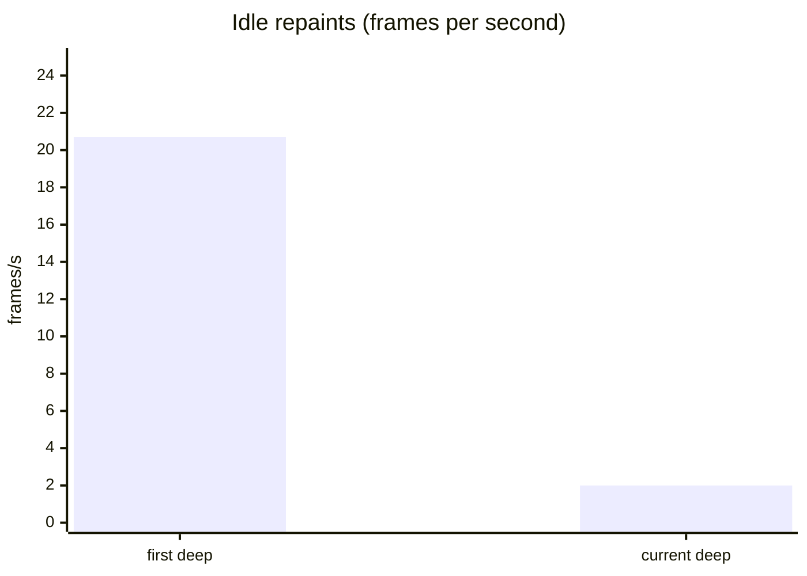

### Where the attributed time went (trace, calibrated ms per action)

| scenario | first total → current | Subprocesses | Style | Flush | Layout | Render |
|---|---|---|---|---|---|---|
| page switch, first visit | 319 → 206 | 73 → 37 | 68 → 11 | 46 → 25 | 38 → 42 | 31 → 22 |
| page switch, revisit | 343 → 210 | 79 → 39 | 72 → 11 | 48 → 25 | 45 → 42 | 33 → 22 |
| mouse click | 58 → 46 | 12 → 2 | 8 → 2 | 7 → 6 | 13 → 15 | 5 → 4 |
| scroll, single | 14 → 7 | 13 → 0 | 0 → 0 | 0 → 0 | 0 → 2 | 0 → 2 |
| palette close | 140 → 48 | 29 → 0 | 43 → 4 | 33 → 10 | 10 → 17 | 21 → 9 |
| terminal resize | 149 → 107 | 18 → 3 | 40 → 8 | 32 → 17 | 25 → 38 | 20 → 18 |

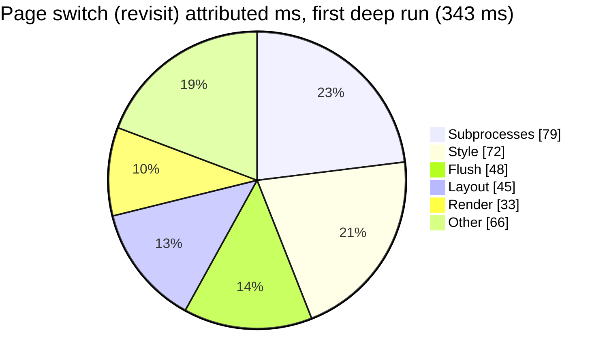

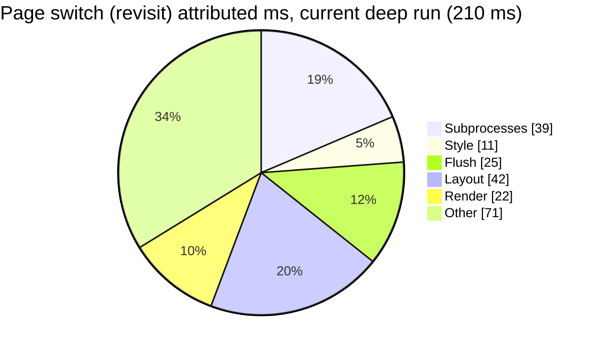

Style (−85%), subprocesses (−50%) and flush (−48%) moved; layout did not (45 → 42 ms) and is now the largest single layer of a page switch together with subprocesses. The calibration check on the current run is 6.5% mean error with −1.0% bias over 60 functions, so the layer numbers are reliable.

### What moved, and which change caused it

| outcome | change |
|---|---|
| Scroll, Page Down and wheel bursts −67 to −76% (about 60 → 18 ms) | 7: input settle timeout replaces the 50 ms wait before a queued render is flushed |
| Page switch −36/−39% (355/370 → 228/225 ms) | 2 (awk fork), 4 (pane interior), 5 (style re-bake skip), 7 (settle timeout) |
| Palette close −60% (143 → 58 ms) | 4 (pane interior), 2 |
| Idle 20.7 → 2.0 frames per second, bytes −65% (10.8 → 3.8 KB/s) | 3: overlay redraw generation |
| Style layer −85% in page switches | 1 (`_sgr_from` memo), 5 (re-bake skip) |
| Subprocess time −50% to −100% across interactions | 2 (awk fork) |
| Startup −4% (cold 5.84 → 5.60 s, warm 857 → 823 ms) | none targeted yet |

### Not improved, or worse

- **Warm start is essentially unchanged (857 → 823 ms).** `load cache` is 361 ms of it. It is dominated by `tui.cache.valid` stat forks: `stat` is 191 runs and 257 ms per pass in the current run, 119 of those in the warm start. Attributed warm-start time fell from 857 to 445 ms, but wall time did not, because the remaining time is the fork-heavy cache load and validity check.
- **Cold start** is still 5.6 s (over its 5.0 s budget): 4.2 s of it is the cache-building splash.
- **Page switches are still over budget** (1.5× first visit, 2.3× revisit), and alt+2 at 368 ms is the slowest since it lands on the heavy `components` page.
- **Layout** is now the biggest layer of a page switch (42 ms; `_tui._widget_pos` 568× and `_tui._inset` 1,510× per click action in the trace).
- **Focus Tab / Shift+Tab settle went 3.8 → 9 ms** (paint unchanged at 3.3 ms). Its frames now carry a 2.1 KB pane-border redraw instead of 116 B, so focus now moves between panes: the scenario state changed when alt+2 started navigating, not the code. Comparing these two rows across the runs is not valid.
- **Shutdown 31.5 → 54 ms.** The value is stable (54 in every sample and since `20260930-205743`); its cause has not been investigated.
- **Resize** remains noisy (113–244 ms per sample, bimodal by target size); −16% is not a reliable figure.

### Open points

1. The 687 B frame of the old `nav.key` is gone with the fix; nothing is open there.
2. Two items from the traced run need a decision: `tui.theme.list` still forks on palette open (3 forks + 1 program, `tui_api.sh:671`), and the `stat`-based cache check.
3. The tests were run by the maintainer after changes 5–7; their results are not recorded in this document.

## 2. How this was measured

- **Baseline:** `--deep` full run, 5 rounds, report `20260930-193435`. Theme baseline: 3 rounds, report `20260930-200833`.
- **After:** theme `20260930-201013` (3 rounds); `nav` `20260930-202352`, `input` `20260930-202642`, `scroll` `20260930-202655` (4 rounds each).
- **Two kinds of numbers.** *Wall time* is the median latency measured by in-app probes in an untraced run. It is what the user feels. *Attributed time* comes from the bash trace, rescaled to untraced speed; it says where time goes but excludes waiting. The calibration check against the probes showed 10% mean error and −2% bias on the baseline run, so per-layer numbers are trustworthy; the wall and attributed totals should not be expected to agree.
- **Noise.** Run-to-run spread is roughly ±3% on medians. Changes smaller than that are not reported as changes.

## 3. Change 1: memoised `_sgr_from`

### What changed

`_tui._sgr_from` turns `#rrggbb`, colour names and modifiers into an escape sequence. It is pure, so its result is now cached under the key `fg|bg|mods`, bounded at 4096 entries. See `sgr-cache-plan.md` step 2a.

### Expected vs real

| | expected (plan) | real |
|---|---|---|
| Cost per call | ~78 µs → ~3 µs | 69 µs → 27 µs |
| `_sgr_from` self time (theme scenario) | drops by more than half | 31.8 → 12.5 ms (−61%) |
| Style layer, theme switch first use | −50% or more | 80 → 63 ms (−21%) |
| Theme switch wall time, first use | not stated; plan implied a visible gain | 390 → 378 ms (−3%, within noise) |
| Theme switch wall time, repeat | unchanged | 20.0 → 20.5 ms |

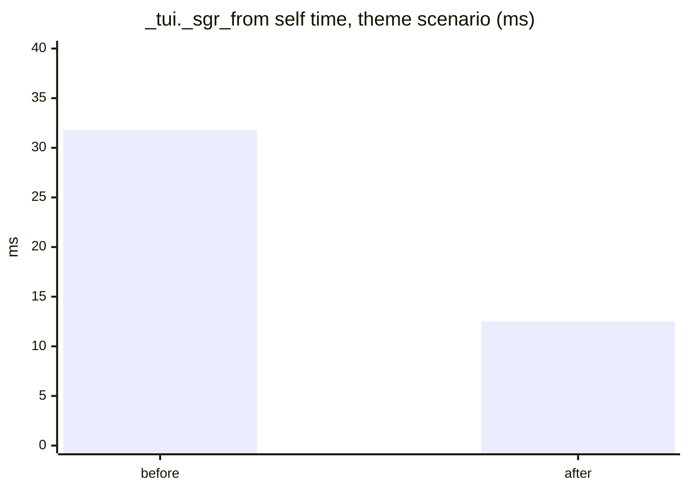

### Why the result is smaller than expected

- **The per-call estimate was too optimistic.** Building the `"$1|$2|$3"` key and the `${var+x}` test cost more in bash than assumed. 27 µs includes trace overhead, so the real cost is lower, but nowhere near 3 µs.
- **The function was a small share of the total.** Only ~19 ms of a 378 ms switch. The rest of the Style layer is theme handling, not colour conversion:

| function (theme first use) | self time |
|---|---|
| `_tui.theme_parse` | 13.5 ms |
| `_tui._sgr_from` (after memo) | 12.5 ms |
| `_tui._style_v` | 8.7 ms |
| `_tui._find_theme_collisions` | 8.4 ms |
| `tui.class` | 7.7 ms |
| `tui.style` | 4.7 ms |
| `_tui.theme_decl` | 4.5 ms |

- **Where it pays more.** `_sgr_from` is called ~2,850 times per pass of the full scenario, not ~460. Page switch Style time already fell from 72 ms to 40 ms (revisit), which is a real but shared gain with the other change.

### Verdict

Correct, cheap, keep. It did not move the user-visible number for theme switching. The rest of the plan (`_style_v` baking, per-theme snapshot) is deferred: the remaining theme cost is ~40 ms inside a rare 378 ms event.

## 4. Change 2: no `awk` fork in `_render_output_buf`

### What changed

Any pane with colour codes, scrolling or overflow used to pipe all its lines through `awk` (one process per pane per render). `_tui._vslice` does the same slicing in bash. It was checked against the original `awk` program on 300 cases (plain, coloured, nested and trailing escapes, UTF-8, offsets 0–40, widths 1–80) with no differences, and byte counts per action are identical before and after.

### Expected vs real

| | expected | real |
|---|---|---|
| Forks on hover, focus, click, scroll | none | none (subprocess time 3–13 ms → 0 ms; click 12.3 → 1.6 ms) |
| Subprocess time, page switch | roughly halved | 73 → 37 ms (first), 79 → 40 ms (revisit) |
| `_render_output_buf` as top fork site | gone | gone; scroll scenario has no forks left |
| Cost of the bash replacement | small | ~110–150 µs per call, ~13 ms per page switch (88 calls) |
| Wall time, page switch | clear gain | −11% (first visit), −5% (revisit) |
| Wall time, scroll | clear gain | −8 to −9% |
| Wall time, hover / focus / click | little change (already cheap) | within ±2% |

```mermaid
xychart-beta
    title "Subprocess time per action (ms), before vs after"
    x-axis ["page first", "page revisit", "click", "focus", "hover", "scroll"]
    y-axis "ms" 0 --> 90
    bar [73.4, 79.3, 12.3, 2.8, 2.9, 13.0]
    bar [36.9, 39.5, 1.6, 0, 0, 0]
```

(First series = before, second = after.)

```mermaid
xychart-beta
    title "Median latency (ms), before vs after"
    x-axis ["page first", "page revisit", "scroll step", "scroll burst", "page down"]
    y-axis "ms" 0 --> 400
    bar [355.5, 370.4, 64.1, 68.9, 60.2]
    bar [315.2, 350.6, 58.6, 63.3, 54.5]
```

### Why wall time improved less than compute

Attributed compute for a revisit fell from 343 ms to 269 ms (−22%), but the median latency fell 5%. Part of the compute drop is this change and part is the colour memo (Style 72 → 40 ms); wall time also contains waiting that the trace total does not. Scroll shows the clearest gap: attributed compute per tick went from 13.8 ms to 6.9 ms, yet latency only moved from 64 to 59 ms. The floor of ~55–60 ms is not rendering (4.1 KB per tick, unchanged). It looks like fixed per-cycle waiting (debounce or settle), which has not been traced yet.

### Verdict

Achieved its stated goal and is the larger of the two changes. The page switch is still 315–350 ms against a 100 ms budget, so it is not sufficient on its own.

## 5. Change 3: idle overlay redraw loop

### What changed

The main loop redraws overlays (footer, toasts, modals) when `_TUI_FLUSH_GEN != _TUI_OVL_GEN`. `_tui_overlay.draw_all` stored the generation before its own flush, and the flush increments it, so the generations differed again immediately and the next tick redrew the overlays, indefinitely. The generation is now stored after the flush, so overlays redraw only when something else has flushed since the last overlay draw. The profiler's new frame-source view ("Who draws the frames") found it: 57.7 of the 60.7 flushes per 3 s of idle came from `_tui_overlay.draw_all` called directly by `tui.run`.

### Expected vs real

| | expected | real |
|---|---|---|
| Idle frames per second | ~1 (the clock tick) | 20.2 → 2.0 |
| Idle bytes per second | small | 39.2 KB → 1.1 KB |
| Idle CPU | lower | 5.0% → 1.3% of a core |
| Probe-measured busy time | lower | 0.35% → 0.02% |
| Other interactions | unchanged | not re-run |

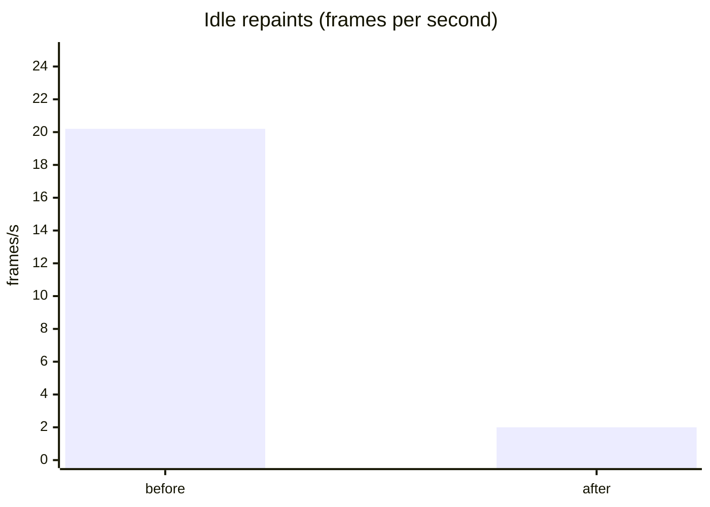

The remaining 2 per second are 1 main-loop flush and 1 overlay redraw per second (about 0.7 KB each), probably the clock tick.

### Notes

- Before numbers come from the 3-round full run, the after number from an idle-only run with the same 3 s idle step. The CPU figure is noisy at this scale.
- Idle is now at the 2 frames per second budget line, not comfortably under it.

### Verdict

Matches the expectation. The fix is one line moved plus a comment, and it was invisible to the earlier per-function profile because the cost was many small draws, not a slow function.

## 6. Change 4: pane interior row built once

### What changed

`_tui._draw_pane_buf` drew every interior row of a bordered pane with about nine `emit_*` calls that re-resolved the same border and fill styles each time. `root` is the full-screen pane (about 45 rows), so it cost ~400 calls per render, and its children then draw over that interior. The row body (border, vertical bar, fill, blank, border, bar) is now built once and appended per row after its cursor move. The emitted bytes are identical by construction (same calls, same order, once instead of per row). Found with the new "Where pane drawing goes" view.

### Expected vs real

Baseline: full run `20260930-204936` (after change 2, before changes 3 and 4 were measured). After: full run `20260930-205743`, 3 rounds each.

| | expected | real |
|---|---|---|
| `root` pane draw, page switch | ~17 → ~5 ms | 16.9 → 7.9 ms |
| `nav` pane draw, page switch | ~14 → ~5 ms | 13.9 → 7.1 ms |
| Pane drawing per full render | −15 to −20 ms | page switch 44.0 → 22.6, palette close 41.3 → 21.3, resize 44.1 → 26.3, theme first use 46.6 → 26.7 ms (−18 to −22 ms) |
| Page switch first visit | ~−20 ms | 320 → 295 ms (−8%) |
| Page switch revisit | ~−20 ms | 339 → 325 ms (−4%) |
| Palette close | ~−20 ms | 88 → 62 ms (−30%) |
| Theme switch first use | ~−20 ms | 380 → 349 ms (−8%) |
| Hover, focus, click, scroll | unchanged | unchanged (±3%) |

```mermaid
xychart-beta
    title "Pane drawing per full render (ms), before vs after"
    x-axis ["page switch", "palette close", "resize", "theme first use"]
    y-axis "ms" 0 --> 50
    bar [44.0, 41.3, 44.1, 46.6]
    bar [22.6, 21.3, 26.3, 26.7]
```

(First series = before, second = after.)

### Notes

- Pane-level numbers match the expectation; wall-time gains are slightly smaller than the pane savings for page switches (revisit −13 ms against −21 ms of pane drawing), within the ±3% noise of the medians.
- **Resize latency is noise.** Its median moved 157 → 207 ms, but the three resize targets swap between ~115–150 ms and ~260–440 ms from run to run (baseline `20260930-193435`: 260/156/266; `204936`: 113/440/150; `205743`: 207/149/230). Pane drawing for resize fell 44 → 26 ms, so this is not a regression; the resize metric itself needs more rounds or a steadier measurement.
- **Later runs settle the pane-drawing numbers.** Total pane drawing per page switch was 22.6 ms in `205743`, then 12.0 ms (`210746`), and 11.7 ms in the 3-round and 8-round `nav` runs (`root` 3.2 ms, `nav` 3.5 ms each time). The 22.6 ms run looks like an outlier (machine load), and the only pre-change value is 44.0 ms from one run (`204936`), so "44 → ~12 ms" is the best estimate, not a precise one.
- **Shutdown** went 120 → 54 ms, probably because the idle loop no longer competes with the quit key. Not investigated.

### Verdict

Matches the expectation at pane level and gives a solid 20–30 ms on every full repaint. Two later 2-round `nav` runs showed `root` and `nav` at about 3 ms each, lower again; not explained (machine load is a candidate), so not counted here.

## 7. Change 5: skip the style re-bake on cache replay

### What changed

A cache replay restores the page snapshot (which already contains every widget's baked `_TUI_STYLE_*`) and then re-ran `tui.class` for every widget to pick up theme changes: ~25 ms per page switch, traced in `20260930-211857`. The page snapshot now records the theme overlay the styles were baked under (`_TUI_STYLE_SIG`, in `lib/markup/tui_cache.sh`; the `_TUI_STYLE_` prefix puts it in the snapshot automatically). On replay the re-bake is skipped when it equals the current overlay. `tui.load_theme` still runs, so the class table stays current. Snapshots without a signature, or recorded under a different overlay, re-bake as before.

### Expected vs real

Baseline: `nav` run `20260930-211235` (3 rounds, untraced). After: `nav` run `20260930-213033` (8 rounds, 88 actions per scenario) and `theme` run `20260930-212622` (3 rounds). An earlier 3-round `nav` run after the change (`20260930-212520`) gave the same picture (259 / 261 ms).

| | expected | real |
|---|---|---|
| `tui.cache.replay` (wall) | ~−25 ms | 122 → 92 ms (−30 ms; 88 ms first visit) |
| `tui.load_cached` (wall) | ~−25 ms | 133 → 103 ms (99 ms first visit) |
| Page switch, revisit | ~−25 ms | 303 → 265 ms (−13%) |
| Page switch, first visit | ~−25 ms | 285 → 260 ms (−9%) |
| Theme switch, first use | unchanged (overlay active, signature mismatches) | 337 → 329 ms (within noise) |
| Theme switch, repeat | unchanged | 17 → 18 ms |

```mermaid
xychart-beta
    title "Page switch median latency (ms), before vs after"
    x-axis ["first visit", "revisit"]
    y-axis "ms" 0 --> 320
    bar [285, 303]
    bar [260, 265]
```

(First series = before, second = after.)

### Notes

- The gain is slightly larger than the trace estimate (−30 ms against −25 ms), plausibly because the re-bake also ran `tui.style` and debug logging per class.
- Pages still differ widely (8-round medians, first visit): `scrolling` 479 ms, `docs` 421, `components` 419, `monitor` 337, against `case_study` 199 ms, `home` 215 and `layout` 220. This spread is the page mix, not noise (see section 12); `on_visit` page code (46–49 ms on average) is the likely driver.
- With a theme overlay active the signature does not match (the cache builder records pages without the overlay), so the re-bake still runs on every replay there. Fixing it means re-capturing the snapshot after a re-bake.
- Not covered by this measurement: visual equality. Run `tests/unit/cache.t.sh` and the golden frames (`tools/t_golden.sh`) before relying on it.

### Verdict

Matches the expectation and a bit more. The theme switch is unchanged, as intended.

## 8. Change 6: `<bind>` tags survive a cache replay

### What changed

`<bind>` tags (alt+1..0, alt+n and every other page binding) are registered while the markup is built. A cache replay skips tag dispatch and the page snapshot does not include the binding tables, so on any cached page, which is every warm start, the bindings did not exist. `_tui_build.tag.bind` (`lib/markup/tui_build.sh`) now records a ready-to-eval `tui.bind …` call in the list that replay already runs for nav-button handlers, so replay re-creates the bindings (and the existing disk persistence carries them).

### Expected vs real

| | expected | real |
|---|---|---|
| alt+2 navigates on a warm start | yes | yes (verified in a live session: alt+2 → Components, alt+3 → Settings) |
| The bimodal 11 ms / 67 ms `nav.key` timing | gone | gone: all 5 samples 363–371 ms, a real page switch |
| Cost of the extra replayed binds | negligible | not separated out in the profile (bind calls are not among the hot functions) |

### Notes

- The 687 B frame and the 67 ms samples were the Home page's key echo consuming the key when the binding was missing.
- `nav.key` now measures a full page switch to `components` (368 ms, 29 forks + 5 programs per action in the trace), so it is over budget and not comparable with its earlier values.
- Caches already on disk from before the change lack the recorded binds until they are rebuilt; there is no cache format version. Clearing `$TUI_HOME/cache/pages/` rebuilds them.

### Verdict

A correctness fix, found by the profiler's own "key does nothing" finding. The latency numbers of this scenario change meaning and should be read as page-switch numbers from here on.

## 9. Change 7: input settle timeout for queued renders

### What changed

A queued pane render (`tui.output`, scroll batching) is flushed by the main loop once the input goes quiet. The loop decided that by waiting the full `TUI_INPUT_POLL_TIMEOUT` (0.05 s while ticking) for the next byte, so every scroll step and every page load with queued output paid an idle wait of about 50 ms before its last frame. While a render is pending the loop now polls with `TUI_INPUT_SETTLE_TIMEOUT` (0.01 s, `lib/tui.sh`). Found with the new "Timeline of one page switch" view: a 50 ms gap between the release event and `_tui._flush_pending_render`.

### Expected vs real

| | expected | real (current deep run vs previous full runs) |
|---|---|---|
| Wheel scroll, single | 58 → ~18 ms | 58.6 → 18.3 ms (−69%) |
| Wheel scroll, burst | 63 → ~23 ms | 63.5 → 22.9 ms (−64%) |
| Page Down | 54 → ~15 ms | 54.5 → 14.3 ms (−74%) |
| Page switch, any page with queued output | ~−40 ms | first visit 260 → 228 ms, revisit 265 → 225 ms (−32 and −40 ms) |
| Hover, click, palette typing | unchanged | unchanged |

```mermaid
xychart-beta
    title "Scroll and page switch median (ms) before/after the settle timeout"
    x-axis ["scroll step", "scroll burst", "page down", "page first", "page revisit"]
    y-axis "ms" 0 --> 280
    bar [58.6, 63.5, 54.5, 260, 265]
    bar [18.3, 22.9, 14.3, 228, 225]
```

(First series = before, second = after; before = `nav`/`scroll` runs `20260930-212520` and full run `20260930-210746`, after = current deep run.)

### Notes

- This was the "scroll floor" noted earlier as not rendering: scroll ticks wrote 4.1 KB and computed for about 7 ms, and the remaining 50 ms was the wait.
- Risk not covered by the profiler: a slow physical mouse-wheel spin with notches more than 10 ms apart now flushes per notch instead of batching. The scripted bursts arrive in one write and do not show it. If scrolling feels choppy, raise `TUI_INPUT_SETTLE_TIMEOUT` (for example 0.02).

### Verdict

Matches the expectation and was the largest single latency win per interaction, for a one-variable change.

## 10. Standing against the budgets

Budgets are the perceived-instant lines in `tools/profiler/dprof/scenarios.py`. Baseline is the first deep run (`20260930-193435`); current is the latest deep run (`20260930-214915`). Theme switching and alt+2 are compared with their first measured values where they exist (the baseline alt+2 was a no-op).

| interaction | budget | baseline | current | state |
|---|---|---|---|---|
| Cold start | 5000 ms | 5836 ms | 5597 ms | over (1.1×) |
| Warm start | 1000 ms | 857 ms | 823 ms | within |
| Page switch, first visit | 150 ms | 356 ms | 228 ms | over (1.5×) |
| Page switch, revisit | 100 ms | 370 ms | 225 ms | over (2.3×) |
| Page switch by key (alt+2) | 100 ms | 10.9 ms | 368 ms | over (3.7×) |
| Theme switch, first use | 250 ms | – | 306 ms | over (1.2×) |
| Theme switch, repeat | 150 ms | – | 16.1 ms | within |
| Focus next | 50.0 ms | 3.05 ms | 3.32 ms | within |
| Mouse hover | 30.0 ms | 9.45 ms | 9.56 ms | within |
| Mouse click | 100 ms | 11.4 ms | 11.1 ms | within |
| Wheel scroll, single | 60.0 ms | 64.1 ms | 18.3 ms | within |
| Command palette close | 100 ms | 143 ms | 57.5 ms | within |
| Terminal resize | 250 ms | 260 ms | 219 ms | within |
| Idle repaints | 2 per s | 20.7 per s | 2.0 per s, 2.4% CPU | at budget |

## 11. What the data says about the next step

From the current deep run (`20260930-214915`, traced, calibration error 6.5%):

- **`stat` forks in the cache validity check are now the biggest single cost outside page code.** `_tui_cache_mtime` runs `stat` 191 times for 257 ms per pass, 119 of them and about 280 ms in the warm start alone (`tui.cache.valid`, in `load cache`, 361 ms of the 823 ms start). The warm start did not move at all in this document's changes, so this is where startup time is.
- **Layout is the largest layer of a page switch** (42 ms of 210), and did not improve: `_tui._widget_pos` 568× and `_tui._inset` 1,510× per click action, `_tui._pane_content_need` the top self-time function in the traced interactions.
- **Page code** (`on_visit`): `docs` 175–190 ms, `components` 163–168 ms, `monitor` 92–99 ms, and the `components` render is 200 ms for a 103 KB frame. `show_all` builds its output with 13 command substitutions.
- **Forks left in input paths:** `tui.theme.list` (`tui_api.sh:671`) on palette open (3 forks + 1 program), 1 fork per mouse click.

Order:

1. **`stat` forks in cache validity and cache load** (~250 ms in the warm start). Needs a reference-file or single-call design, since bash has no builtin for a file's mtime.
2. **Layout:** `_tui._widget_pos` / `_tui._inset` called per widget per redraw; look for memoisation per layout generation.
3. **Page code:** read `on_docu_visit`, `on_monitor_visit` and the `components` render.
4. **Cold start:** 4.2 s is the cache-building splash; only matters on first run.
5. Dirty flags and one draw per tick stay demoted (the extra frames are cheap).

Deferred: `_style_v` baking and a per-theme snapshot (about 40 ms inside a rare event), re-capturing the snapshot after a re-bake with a theme overlay active, and the shutdown increase (31 → 54 ms).

## 12. Method notes and caveats

### Run-to-run stability (8-round `nav` run, `20260930-213033`)

- **Page revisit is very stable.** Per page, the median coefficient of variation across the 8 rounds is 0.8% (most pages 0.5–1.2%; one page shows 10%). Round medians are 261–270 ms (±2%). Differences of a few ms between runs are real signal for this scenario.
- **First visit is noisier.** Per-page median CV 7.5% (range 0.5–18%), round medians 253–291 ms (±7%). The first visit of a page includes one-time work, so compare first-visit numbers only across runs with several rounds.
- **The large overall spread is the page mix, not instability.** Overall CV is 33% (183–529 ms) because the scripted session visits cheap and heavy pages; pages repeat their own value from round to round.
- **Pane-drawing milliseconds** were unstable across earlier runs (see change 4 notes) but agree across the last three (11.7–12.0 ms).
- **`nav.key` (alt+2) is bimodal, and the median misleads.** It alternates between 10.9 ms (nothing happens) and ~67 ms (a 687 B frame is written) and in this run strictly every other round (39 ms median of 10.9 / 67.4). It also appears in 4 of the 12 earlier runs (for example `[11, 11, 74, 11, 11]`). In all 13 runs the key never navigates. Cause not investigated; the 687 B frame also shows up in click results, so it may be a hover or status repaint hitting the key's window.

### Other notes

- Baseline and after-runs differ in round counts (5 vs 3–4) and, for the after-runs, in scenario scope. Medians are compared, not means, and differences under ~3% are treated as noise.
- Attribution numbers exclude blocking time (input waits, debounce) from the trace-to-real scale factor after a calibration fix on 2026-09-30; wall-time numbers are unaffected by it.
- The memo and `_tui._vslice` both live in uncommitted changes in `lib/tui.sh`; the `_vslice` output equivalence was tested in isolation and through matching byte counts, not through the full unit test suite.
- Update this document after each optimisation: add the change, expected vs real, and refresh the standing table in section 10.
