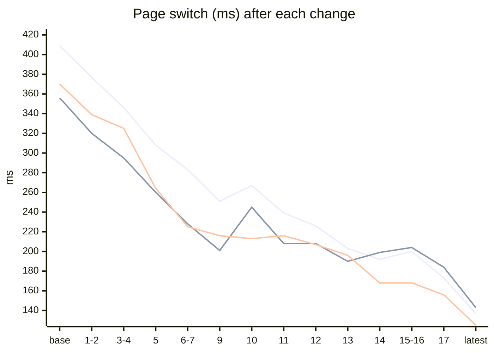
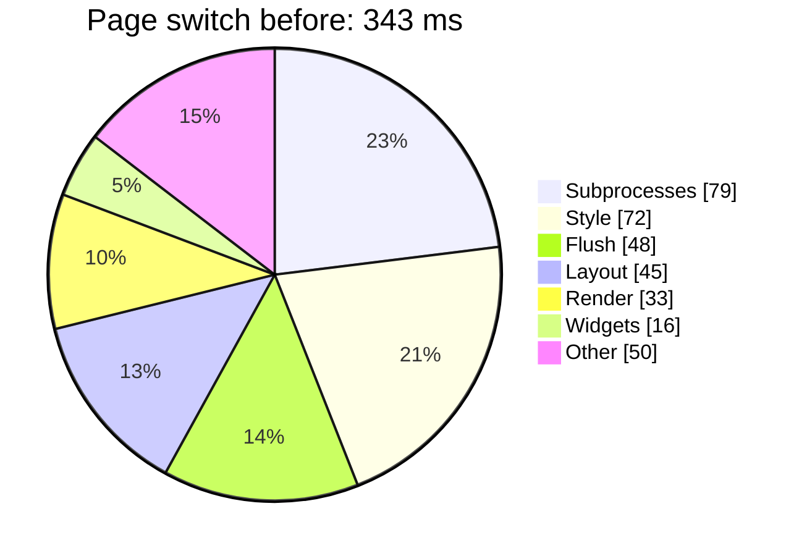
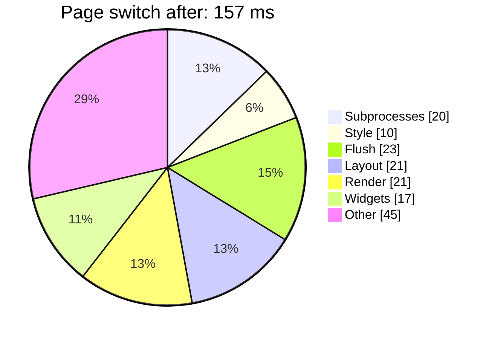
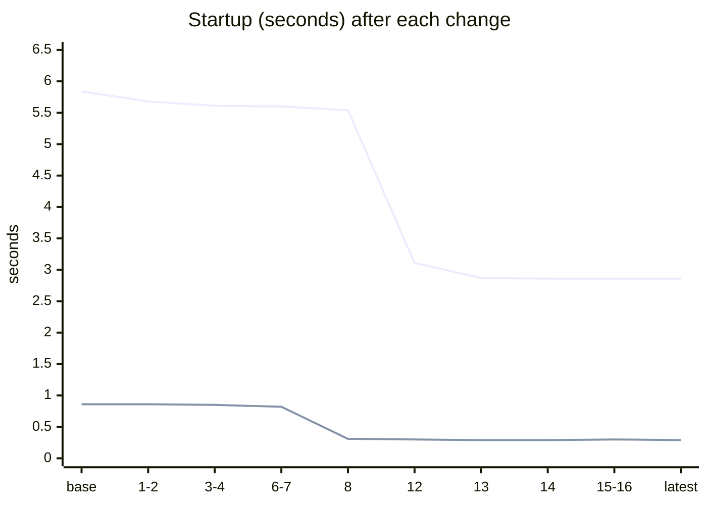

# Making a pure-bash TUI feel instant

A terminal UI written in nothing but bash has no compiled fast path to fall back on: every frame, every hover and every page switch is shell code, and every external program it calls costs a process. This page is the short version of a performance project that profiled the real D.A.B.T demo app from the outside, found where the time was going, and cut it roughly in half across the board: **page switches from about 410 ms to 200 ms, startup from 6 s to 3 s, and the warm start from 860 ms to 290 ms**.

It is written for readers who want the result and the lessons. The interactive [performance explorer](performance-explorer.html) lets you compare any two profiler runs, and the [detailed log](../concepts/performance-progress.md) has every change with its expected and measured effect.

## At a glance

Medians of the profiler's probe-measured latency, first deep run against the latest deep run, on a 150×45 terminal.

| Interaction | Before | After | Change | Budget |
|---|---|---|---|---|
| Page switch, mean over all pages | 409 ms | 137 ms | **−67%** | — |
| Page switch, first visit | 356 ms | 143 ms | **−60%** | 150 ms |
| Page switch, revisit | 370 ms | 125 ms | **−66%** | 100 ms |
| Command palette close | 143 ms | 14 ms | **−90%** | 100 ms |
| Wheel scroll | 64 ms | 18 ms | **−72%** | 60 ms |
| Terminal resize | 260 ms | 145 to 203 ms | **−22 to −44%** | 250 ms |
| Idle repaints | 20.7 /s | 2.0 /s | **−90%** | 2 /s |
| Warm start | 857 ms | 290 ms | **−66%** | 1 s |
| Cold start (first launch) | 5.84 s | 2.83 s | **−52%** | 5 s |

Budgets are the "perceived instant" lines the profiler checks against. Everything except the page switches is now inside its budget; the page switches are the remaining gap, and they are dominated by a few heavy pages (see below).

```mermaid
xychart-beta
    title "Median latency (ms): before vs after"
    x-axis ["page first", "page revisit", "palette close", "wheel scroll"]
    y-axis "ms" 0 --> 400
    bar [356, 370, 143, 64]
    bar [143, 125, 14, 18]
```

*Pink: before. Blue: after.*

## The journey

22 changes, each followed by a measurement. The page switch fell in steps; no single change did it.

*Pink: mean over all pages. Blue: first visit. Yellow: revisit. The bump at change 10 is the known first-visit run-to-run swing, not a regression. The first-visit points for changes 14 and 15-16 (199, 204 ms) are slightly above change 13: the fragment cache pays to build and store a key on a first visit and only wins on repeats.*

### Held keys

Holding an arrow key repeats it about every 33 ms, so each press has to be cheap, not just the first. `tools/profiler/profile.sh --scenario held` sends held keys at that rate (holds of 0.1 to 1 s) and measures, per press, the time from the key sent to the first output the terminal receives. Two changes: `tui.focus` draws the widgets it knows changed as one raw frame without the row diff (change 21), and arrow-key focus search reads the hit index instead of recomputing every widget's position (change 22; 80 → 8 ms per hold action on the Scrolling page).

| Held key (nav bar), same build | Before | After |
|---|---|---|
| App work per 1 s hold | 478 ms | 47 ms |
| Bytes written | 49.5 KB | 4.3 KB |
| Per-press lag | 8.5 ms | 4.5 ms |
| Tab hold: work / lag | 420 ms / 33.2 ms | 60 ms / 21.2 ms |

List, table, page keys and cursor holds were already cheap (2.6 to 7.3 ms) and are unchanged. All held groups are inside their 50 ms budget except `held.scroll`, a measurement artefact (it lands on a textarea and pairs presses that paint nothing with the next unrelated frame).

Stage 2 of markup v2 (templates, addons, `tui.page.refresh`) was not free: against v0.0.22, page-switch revisit went 125 → 141 ms, first visit 143 → 151 ms, warm start 290 → 347 ms and cold start 2.8 → 3.4 s (+6 to +20%; the machine was not idle for the newer run). The addon files in the cache signature and composition on every build account for it. The At-a-glance table above is the v0.0.22 state; getting the page-switch and start-up costs back is the next work.

## Where the time went

The profiler runs the app twice: once untraced for honest latency, once with bash's `xtrace` to attribute time to functions and layers. For a page switch, the attributed time per layer looked like this:

Style and subprocess time almost vanished; what is left is the actual drawing work. That is where a further win would need a different approach (caching rows, not recomputing them). Changes 14 to 16 took that approach: panes and plain widgets are composed once per distinct input, and closing the palette replays the saved page. The measured effect is under "What we changed" and in the explorer.

## What we changed

| Theme | Change | Effect |
|---|---|---|
| **Fewer processes** | The pane renderer piped every coloured line through `awk`; it now slices in bash | Hover, click and scroll fork nothing; subprocess time per page switch halved |
| | One `stat` call for any number of files, and file reads without `cat` | Warm start 823 → 308 ms |
| | Page-build attribute reads, cache bookkeeping and path handling without `$(…)` | Cold start 5.5 → 2.9 s over two steps, 1,658 → 786 forks |
| | Killing a process tree on leaving the Terminal page slept 50 ms per process | 302 → 6 ms for a four-level tree |
| **Less waiting** | The main loop waited a full 50 ms poll before flushing a queued render | Scroll 58 → 18 ms; every page load about 40 ms |
| | The overlay redraw re-triggered itself every tick | Idle 20 → 2 frames a second |
| **Less repeated work** | Bordered panes rebuilt the same interior row for every row | About 20 ms off every full repaint |
| | Content fit scanned every widget once per pane, twice per render | Layout 42 → 26 ms per page switch |
| | Cached pages re-applied every widget's style on each visit | 25 ms per page switch |
| | On-visit code called `tui.render` a second time | Heaviest page: −90 ms |
| | Colour-code conversion recomputed per call | Memoised; style layer −85% together with the above |
| **Caching by content, across pages** | Panes, labels, buttons and checkboxes are composed once per distinct input (geometry, state, text, style epoch) and replayed; widget positions and coloured-line slices are memoised the same way | Render of a content-heavy page 54 → 30 ms; revisits −15% |
| | Closing the palette repainted the whole page from scratch | The saved page is replayed when nothing else painted: 38 → 14 ms |
| **The page-switch floor** | The cached snapshot was rewritten line by line in a bash loop on every replay; it is now rewritten once, at record time | Restore 9.5 → 2.6 ms; a switch between trivial pages 34 → 15 ms in the headless loop |
| | The fragment cache key held a counter that every page switch bumped, so no fragment ever hit across pages (57 stores per switch); the key now holds the style strings the fragment draws with | `tui.render` 58 → 28 ms on trivial pages; the menu and header hit on every page |
| | Source files were checked against the cache on every switch (a `stat` fork); they are checked once at start-up and assumed unchanged afterwards (`TUI_CACHE_TRUST=0` keeps the check) | One fork and about 4 ms per switch |
| | `tui.reset_ui` forked `stty size` on every switch; the footer was rewritten on every render and its key map rebuilt; the relayout ran even at the recorded size | About 2 + 2 + 4 ms per switch; trivial-page switch 94 → 86 ms |
| **Page code, not framework** | Demo callbacks forked on every visit, tick and keystroke (`date`, `cat`, `awk`, `$( )` around each renderer); a new `tui.capture VAR CMD` runs them in the current shell | Switch by key 201 → 106 ms; settings first visit 278 → 176 ms; monitor refresh 20 forks → 1 |
| | The same static renderer view was rebuilt on every visit | Built once per width |
| | Output widths of coloured lines forked `awk` | Measured in bash and memoised, identical results on 1,500 randomised lines |
| | A shell that ignores SIGTERM made leaving the Terminal page wait the full 50 ms | SIGHUP after the first poll: 55 → 11 ms; the next page's revisit 211 → 163 ms |
| **Found by profiling** | Key bindings from markup were lost on cached pages | `alt+1…0` navigation works on a warm start |

## Which pages gained most

The per-page view shows why the median barely moved after the later changes: the gains landed on the heaviest pages, which sit above the median.

```mermaid
xychart-beta
    title "Page switch revisit per page (ms): before vs after"
    x-axis ["componen.", "docs", "scrolling", "monitor", "settings", "widgets", "terminal", "layout", "case st.", "home"]
    y-axis "ms" 0 --> 650
    bar [618, 532, 488, 472, 372, 364, 358, 307, 283, 288]
    bar [125, 188, 143, 161, 121, 124, 129, 94, 86, 91]
```

*Pink: before. Blue: after.*

## Startup

A first launch has to validate every page and build the page cache; every later launch loads it. The cold start halved by removing forks from that build. The warm start dropped by two thirds once the cache check stopped spawning a `stat` process per file.

*Pink: cold start. Blue: warm start.*

## Lessons

- **Measure from the outside, then from the inside.** Probes inside the app give trustworthy latency; a bash trace gives attribution but runs about three times slower. Scaling the trace back to untraced speed per scenario kept the attribution within about 6% of the probes.
- **The biggest wins were not where the profile first pointed.** The 50 ms wait in the input loop and a duplicate render inside page code each cost more than any single hot function.
- **Forks are cheaper than assumed, but they still add up.** Removing 872 forks saved about 230 ms: roughly a quarter of a millisecond each, not the millisecond we had guessed.
- **A median hides the heavy pages.** Page-code changes moved the mean and the heaviest pages by up to 25% while the median stayed put. Look at both.
- **Some wins are correctness bugs.** The profiler's "this key does nothing" finding led to key bindings that had silently disappeared on every cached page.
- **Remove forks and waits before shaving arithmetic.** An associative-array lookup costs 2 to 3 µs in bash, so trimming a handful of lookups per widget moved a render by a few percent, while removing a fork or a wait moved a page by tens of milliseconds.
- **A wait that looks like another page's cost.** The scrolling page took 70 ms longer than the sum of its parts; the missing time was the Terminal page's interactive shell, which ignores SIGTERM, being waited out when you left it. Compare a page's total with its parts.
- **Cache on inputs, not on counters.** Row, geometry and slice caches are keyed on the values that produce them, so a stale result cannot happen. The first version of the palette replay invalidated itself on any paint under it and never ran, because the header clock repaints every second; folding those paints into the saved page fixed it.
- **Prove a rewrite is byte-identical.** Every fork-free conversion was compared with the old output (including a 1,500-line randomised comparison for the width measurement) before it was kept.
- **A cache is only as good as its key, so count the hits.** The fragment cache looked fine in a repeat-render benchmark and never hit across page switches, because its key held a counter every switch bumped. A trace that shows 57 stores per switch finds that; a median does not. Putting the actual style strings in the key fixed it and halved the render of a trivial page.
- **Check the trace against an untraced clock.** The trace blamed 6 ms on re-sourcing the page scripts and 6 ms on one `tui.tick.add` line; timing both untraced gave 0.5 ms and 19 µs. In-shell time under `xtrace` is inflated unevenly: use it to find candidates and an untraced loop to price them.
- **Fix the instruments first.** The golden-frame check had rendered every page as one line for weeks, because the frame tool set the terminal size before the library reset it. After the fix the same check proved the caches change no pixel.
- **Keep the noise in view.** Run-to-run swings of up to 10% on first-visit medians and a bimodal resize timing meant that changes under about 3% were never reported as changes.

## How it was measured

The profiler drives the real demo in a hidden pseudo-terminal with a scripted user session (start, navigation, keys, mouse, scrolling, palette, themes, resize, idle, quit), five rounds for a deep run. Latency comes from probes around about twenty functions; attribution comes from a second, traced pass. It needs only bash 5 and Python 3: `tools/profiler/profile.sh`, with `--quick`, `--deep` and `--scenario` to choose what to measure.

## Explore the data

- [Performance explorer](performance-explorer.html): compare any two runs, follow one metric across every revision, see layers, hot functions and flame graphs.
- [Detailed log](../concepts/performance-progress.md): every change with its expected and real effect, plus the running comparison per revision.
