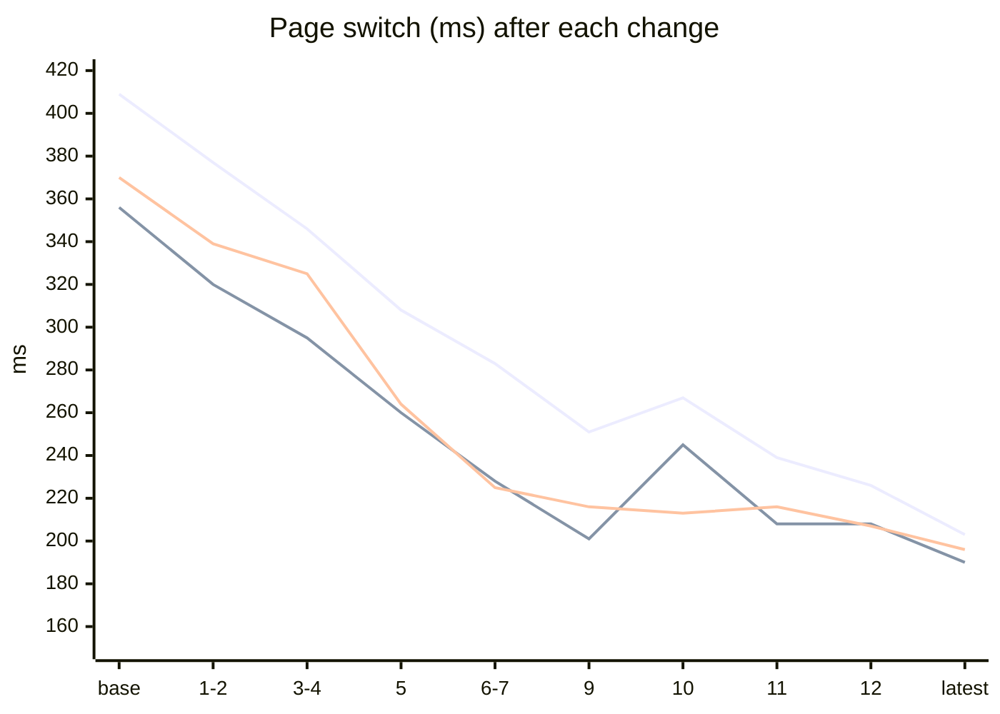
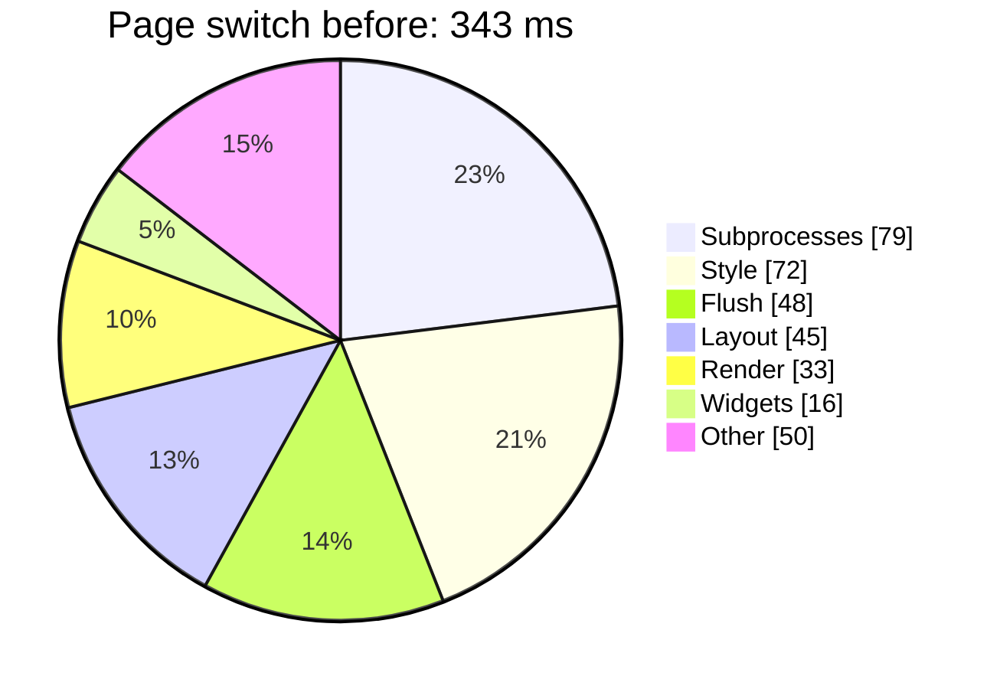
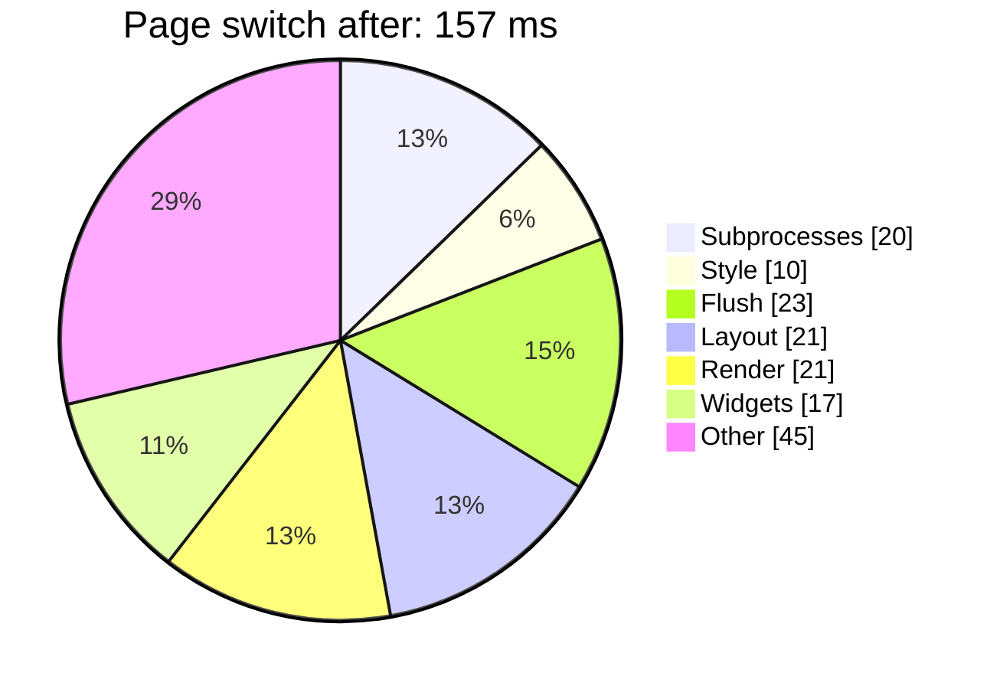
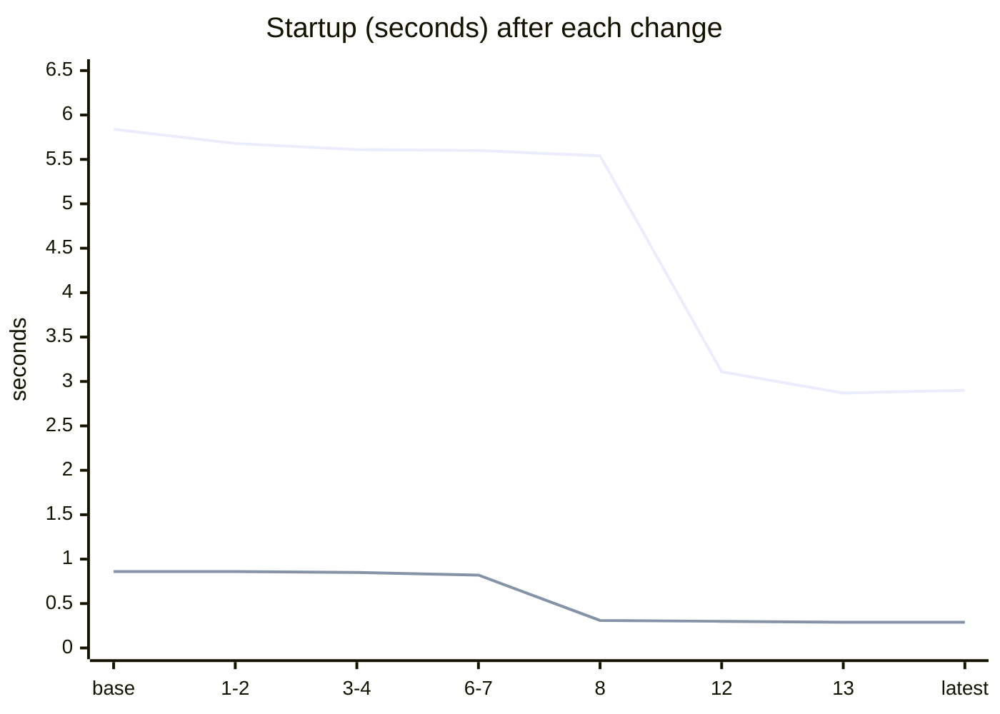

# Making a pure-bash TUI feel instant

A terminal UI written in nothing but bash has no compiled fast path to fall back on: every frame, every hover and every page switch is shell code, and every external program it calls costs a process. This page is the short version of a performance project that profiled the real D.A.B.T demo app from the outside, found where the time was going, and cut it roughly in half across the board: **page switches from about 410 ms to 200 ms, startup from 6 s to 3 s, and the warm start from 860 ms to 290 ms**.

It is written for readers who want the result and the lessons. The interactive [performance explorer](performance-explorer.html) lets you compare any two profiler runs, and the [detailed log](../concepts/performance-progress.md) has every change with its expected and measured effect.

## At a glance

Medians of the profiler's probe-measured latency, first deep run against the latest deep run, on a 150×45 terminal.

| Interaction | Before | After | Change | Budget |
|---|---|---|---|---|
| Page switch, mean over all pages | 409 ms | 203 ms | **−50%** | — |
| Page switch, first visit | 356 ms | 190 ms | **−47%** | 150 ms |
| Page switch, revisit | 370 ms | 196 ms | **−47%** | 100 ms |
| Command palette close | 143 ms | 52 ms | **−64%** | 100 ms |
| Wheel scroll | 64 ms | 17 ms | **−73%** | 60 ms |
| Idle repaints | 20.7 /s | 2.0 /s | **−90%** | 2 /s |
| Warm start | 857 ms | 287 ms | **−66%** | 1 s |
| Cold start (first launch) | 5.84 s | 2.90 s | **−50%** | 5 s |

Budgets are the "perceived instant" lines the profiler checks against. Everything except the page switches is now inside its budget; the page switches are the remaining gap, and they are dominated by a few heavy pages (see below).

```mermaid
xychart-beta
    title "Median latency (ms): before vs after"
    x-axis ["page first", "page revisit", "palette close", "wheel scroll"]
    y-axis "ms" 0 --> 400
    bar [356, 370, 143, 64]
    bar [190, 196, 52, 17]
```

*Pink: before. Blue: after.*

## The journey

Thirteen changes, each followed by a measurement. The page switch fell in steps; no single change did it.

*Pink: mean over all pages. Blue: first visit. Yellow: revisit. The bump at change 10 is the known first-visit run-to-run swing, not a regression.*

## Where the time went

The profiler runs the app twice: once untraced for honest latency, once with bash's `xtrace` to attribute time to functions and layers. For a page switch, the attributed time per layer looked like this:

Style and subprocess time almost vanished; what is left is the actual drawing work. That is where a further win would need a different approach (caching rows, not recomputing them).

## What we changed

| Theme | Change | Effect |
|---|---|---|
| **Fewer processes** | The pane renderer piped every coloured line through `awk`; it now slices in bash | Hover, click and scroll fork nothing; subprocess time per page switch halved |
| | One `stat` call for any number of files, and file reads without `cat` | Warm start 823 → 308 ms |
| | Page-build attribute reads, cache bookkeeping and path handling without `$(…)` | Cold start 5.5 → 2.9 s over two steps, 1,658 → 786 forks |
| | Killing a process tree on leaving the Terminal page slept 50 ms per process | 302 → 6 ms for a four-level tree |
| **Less waiting** | The main loop waited a full 50 ms poll before flushing a queued render | Scroll 58 → 18 ms; every page load about 40 ms |
| | The overlay redraw re-triggered itself every tick | Idle 20 → 2 frames a second |
| **Less repeated work** | Bordered panes rebuilt the same interior row for every row | About 20 ms off every full repaint |
| | Content fit scanned every widget once per pane, twice per render | Layout 42 → 26 ms per page switch |
| | Cached pages re-applied every widget's style on each visit | 25 ms per page switch |
| | On-visit code called `tui.render` a second time | Heaviest page: −90 ms |
| | Colour-code conversion recomputed per call | Memoised; style layer −85% together with the above |
| **Found by profiling** | Key bindings from markup were lost on cached pages | `alt+1…0` navigation works on a warm start |

## Which pages gained most

The per-page view shows why the median barely moved after the later changes: the gains landed on the heaviest pages, which sit above the median.

```mermaid
xychart-beta
    title "Page switch revisit per page (ms): before vs after"
    x-axis ["componen.", "docs", "scrolling", "monitor", "settings", "widgets", "terminal", "layout", "case st.", "home"]
    y-axis "ms" 0 --> 650
    bar [618, 532, 488, 472, 372, 364, 358, 307, 283, 288]
    bar [260, 244, 314, 274, 197, 189, 177, 145, 132, 149]
```

*Pink: before. Blue: after.*

## Startup

A first launch has to validate every page and build the page cache; every later launch loads it. The cold start halved by removing forks from that build. The warm start dropped by two thirds once the cache check stopped spawning a `stat` process per file.

*Pink: cold start. Blue: warm start.*

## Lessons

- **Measure from the outside, then from the inside.** Probes inside the app give trustworthy latency; a bash trace gives attribution but runs about three times slower. Scaling the trace back to untraced speed per scenario kept the attribution within about 6% of the probes.
- **The biggest wins were not where the profile first pointed.** The 50 ms wait in the input loop and a duplicate render inside page code each cost more than any single hot function.
- **Forks are cheaper than assumed, but they still add up.** Removing 872 forks saved about 230 ms: roughly a quarter of a millisecond each, not the millisecond we had guessed.
- **A median hides the heavy pages.** Page-code changes moved the mean and the heaviest pages by up to 25% while the median stayed put. Look at both.
- **Some wins are correctness bugs.** The profiler's "this key does nothing" finding led to key bindings that had silently disappeared on every cached page.
- **Keep the noise in view.** Run-to-run swings of up to 10% on first-visit medians and a bimodal resize timing meant that changes under about 3% were never reported as changes.

## How it was measured

The profiler drives the real demo in a hidden pseudo-terminal with a scripted user session (start, navigation, keys, mouse, scrolling, palette, themes, resize, idle, quit), five rounds for a deep run. Latency comes from probes around about twenty functions; attribution comes from a second, traced pass. It needs only bash 5 and Python 3: `tools/profiler/profile.sh`, with `--quick`, `--deep` and `--scenario` to choose what to measure.

## Explore the data

- [Performance explorer](performance-explorer.html): compare any two runs, follow one metric across every revision, see layers, hot functions and flame graphs.
- [Detailed log](../concepts/performance-progress.md): every change with its expected and real effect, plus the running comparison per revision.
