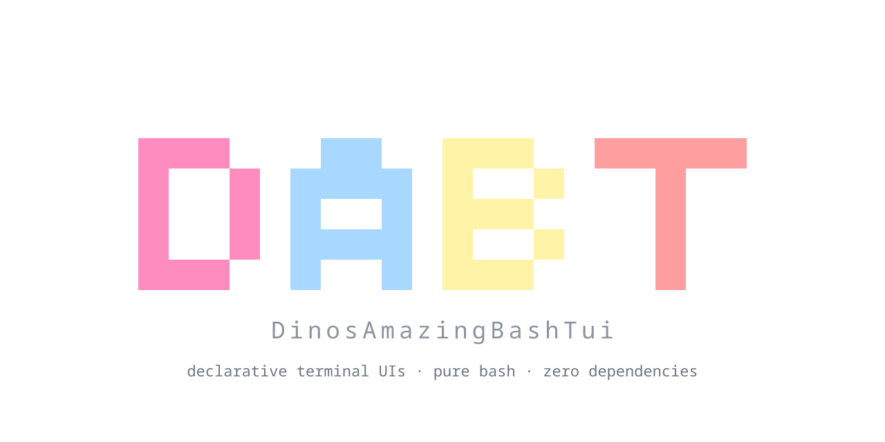

<div align="center">



<h1></h1>

**A step-by-step tutorial. No experience with terminal UIs needed - if you can write a bash function, you can do this.**

</div>

<h2 id="what-you-will-build"></h2>

A small **to-do list that runs inside your terminal**: type a task, press Enter, it appears in a list, pick one and remove it. Your tasks are saved, so they are still there next time.

```
┌ Tasks ───────────────────────────────────────────────────┐
│ My tasks                                                 │
│ 2 task(s)                                                │
└──────────────────────────────────────────────────────────┘
┌ New task ────────────────┐┌ Your tasks ───────────────────┐
│ Task: buy milk_          ││ buy milk                      │
│                          ││ call mum                      │
│ [ Add ]                  ││                               │
│                          ││                               │
│ [ Remove selected ]      ││                               │
│ [ Clear all ]            ││                               │
└──────────────────────────┘└───────────────────────────────┘
```

The finished app is in [`examples/first-app/`](../../examples/first-app/) - open it next to this page if you want to compare.

You need: **bash 5+**, and DABT either installed (`dabt --version` works) or as a checkout of this repository. That is all - no Python, no Node, no libraries.

<h2 id="the-big-ideas"></h2>

Read this part once. Everything after it is just applying it.

**A terminal UI is a grid of characters.** A terminal is a rectangle of cells, each holding one character with a color. A "TUI" (text user interface) draws boxes, buttons and lists into that grid, and reacts to keys and the mouse. Normally that means a lot of tricky cursor and escape-code work. DABT does all of it for you.

**A DABT app is like a small web page.** If you have seen HTML, CSS and JavaScript, you already know the shape:

| On the web | In DABT | It answers |
|---|---|---|
| HTML | a **`.xml` page** | *What is on the screen?* (boxes, labels, buttons) |
| CSS | a **`theme.css`** file | *How does it look?* (colors, bold, hover) |
| JavaScript | a **`_callbacks.sh`** file of bash functions | *What happens when I click?* |

You describe the screen in XML. You write bash functions for the behaviour. DABT connects them: when a button says `action="on_add"`, clicking it calls your bash function `on_add`.

**Four words to remember:**

- **Pane** - a rectangular area of the screen, usually with a border. Panes are split into smaller panes, like tiling windows.
- **Widget** - something inside a pane: a `label` (text), `button`, `input` (a text field), `list`, `checkbox`.
- **id** - the name you give a pane or widget so bash can find it (`inp_task`, `lst_tasks`).
- **Callback** - a bash function DABT calls for you when something happens.

<h2 id="step-1"></h2>

Make a folder with this shape:

```
tasks/
├── tasks.sh                 the entry script: starts the app
└── config/
    ├── home.xml             the page: what is on screen
    ├── home_callbacks.sh    the behaviour: bash functions
    └── theme.css            the look
```

```bash
mkdir -p tasks/config && cd tasks
```

Create **`tasks.sh`**. This is the only file you run; it finds DABT, tells it who you are, and starts your first page:

```bash
#!/usr/bin/env bash
APP_DIR="$(cd -P "$(dirname "${BASH_SOURCE[0]}")" && pwd -P)"

# find DABT: `dabt app run` sets TUI_ROOT; by hand we ask the dabt command
if [[ -z "${TUI_ROOT:-}" ]] && command -v dabt >/dev/null 2>&1; then
    _dabt="$(readlink -f "$(command -v dabt)")"; TUI_ROOT="$(cd -P "$(dirname "$_dabt")/.." && pwd -P)"
fi
[[ -r "${TUI_ROOT:-}/lib/tui.sh" ]] || { echo "tasks: DABT not found. Install it first." >&2; exit 1; }

TUI_APP_NAME="tasks"                       # your app's id (see below)
TUI_APP_TITLE="Tasks"; TUI_APP_DESC="A tiny to-do list"
source "$TUI_ROOT/lib/tui.sh"

tui.start "$APP_DIR/config/home.xml"       # start, show the page, run until the user quits
```

Three things are worth understanding here:

1. **`source .../tui.sh`** loads the framework into your script. After that line, all the `tui.*` functions exist.
2. **`TUI_APP_NAME`** is set *before* that line. It gives your app a private folder, `~/.config/DABT/apps/tasks/`, for its settings and data. (You will use it in step 7.)
3. **`tui.start FILE`** does everything: prepares the terminal, loads the page, runs the event loop, and - importantly - **puts your terminal back to normal** when the app quits, even if it crashes.

<h2 id="step-2"></h2>

Create **`config/home.xml`** with the smallest useful page:

```xml
<tui>
  <pane id="root" title="Tasks" border="single" hpad="1"/>
  <label id="lbl_title" pane="root" row="0" text="Hello, terminal!"/>
</tui>
```

Run it:

```bash
bash tasks.sh
```

You should see a box with a title and your text inside. Press **`q`** to quit. That is a complete DABT app.

What the XML says:

- `<pane id="root" .../>` - a pane named `root`. `border="single"` draws a thin box, `hpad="1"` keeps one space between the border and the content.
- `<label ... pane="root" row="0" .../>` - a text label placed **in** the pane `root`, on **row** 0 (the first line inside it).

> **Rules of the format** (it is a simple, line-based XML): one tag per line, attribute values in `"double quotes"`, `<!-- comments -->` on their own line.

<h2 id="step-3"></h2>

One box is boring. Let's split the screen. A pane can be **split** into children, either side by side (`split="h"`, *h*orizontal) or stacked (`split="v"`, *v*ertical). Each child gets a **weight** - its share of the space.

Replace the page with the real layout:

```xml
<tui>
  <pane id="root" split="v" border="none">
    <pane id="head" weight="20" title="Tasks" border="single" class="panel" hpad="1"/>
    <pane id="body" split="h" weight="80" border="none">
      <pane id="add"   weight="38" title="New task"   border="single" class="panel" hpad="1"/>
      <pane id="tasks" weight="62" title="Your tasks" border="single" class="panel" hpad="1"/>
    </pane>
  </pane>
</tui>
```

Read it like a tree:

```
root (stacked top-to-bottom)
├── head    20 parts of the height - the title strip
└── body    80 parts of the height, split side by side
    ├── add     38 parts of the width - the form
    └── tasks   62 parts of the width - the list
```

The weights are *relative*: `38` and `62` mean "about 38% and 62%". Resize your terminal and the boxes follow. `class="panel"` is a hook for styling in step 6.

<h2 id="step-4"></h2>

Now put widgets into the panes. Add these lines **inside `<tui>`, after the panes**:

```xml
  <label id="lbl_title" pane="head" row="0" text="My tasks" class="brand"/>
  <label id="lbl_count" pane="head" row="1" text="" class="muted_label"/>

  <input  id="inp_task"  pane="add" row="0" label="Task:" label_width="7" placeholder="what needs doing?" submit="on_add"/>
  <button id="btn_add"   pane="add" row="2" text="[ Add ]"             action="on_add"    class="success_button" align="fill"/>
  <button id="btn_done"  pane="add" row="4" text="[ Remove selected ]" action="on_remove" class="info_button"    align="fill"/>
  <button id="btn_clear" pane="add" row="5" text="[ Clear all ]"       action="on_clear"  class="danger_button"  align="fill"/>

  <list id="lst_tasks" pane="tasks" row="0"/>
```

Every widget has the same three ideas:

- **`id`** - its name. You will use `inp_task`, `lst_tasks`, `lbl_count` from bash.
- **`pane`** and **`row`** - *where*: in which pane, on which line.
- **`action=`** (buttons) / **`submit=`** (inputs) - *what to call*: the name of a bash function. `submit` fires when you press Enter inside the field.

Also add a footer line at the top of the page, which shows the keys that work (here: how to quit):

```xml
  <footer items="@tui.action.quit"/>
```

If you run the app now, you can already Tab between the widgets and click buttons with the mouse. They just do nothing yet - `on_add` does not exist. Time to write it.

<h2 id="step-5"></h2>

Create **`config/home_callbacks.sh`** and tell the page to load it. In `home.xml`, right after `<tui>`:

```xml
<tui on_visit="tasks_visit">
  <script src="home_callbacks.sh"/>
```

- `<script src=...>` **sources** that bash file, so its functions exist.
- `on_visit="tasks_visit"` says: *every time this page opens, call `tasks_visit`.* It is your "page loaded" event.

Now the callbacks. The pattern is always the same: **change your data, then redraw from your data.**

```bash
#!/usr/bin/env bash
declare -ga TASKS=()                       # the app's state: one array, one task per element

# put the array on the screen: the list widget and the counter
_tasks_show() {
    if (( ${#TASKS[@]} )); then tui.list.set lst_tasks "${TASKS[@]}"; else tui.list.clear lst_tasks; fi
    tui.update lbl_count "${#TASKS[@]} task(s)"
}

tasks_visit() {                            # the page opened
    _tasks_show
    tui.focus inp_task                     # put the cursor in the text field
}

on_add() {                                 # [ Add ] clicked, or Enter pressed in the field
    local text; text="$(tui.get inp_task)"                 # read the field
    if [[ -z "${text// }" ]]; then tui.notify "Type something first" warn 2; return; fi
    TASKS+=("$text")                                       # change the data
    _tasks_show                                            # redraw from the data
    tui.update inp_task ""                                 # empty the field again
    tui.notify "Added: $text" success 2                    # a small pop-up message
}

on_remove() {
    local i; i="$(tui.list.selected lst_tasks)"            # which row is highlighted? (-1 = none)
    (( i >= 0 )) || { tui.notify "Select a task first" warn 2; return; }
    unset 'TASKS[i]'; TASKS=("${TASKS[@]}")                # remove it, then close the gap in the array
    _tasks_show
}

on_clear() {                               # ask first: a confirmation dialog
    (( ${#TASKS[@]} )) && tui.confirm "Delete all ${#TASKS[@]} tasks?" do_clear \
        --danger --yes Delete --no Keep --title "Clear all"
}
do_clear() { TASKS=(); _tasks_show; }      # called only if the user chose "Delete"
```

The handful of `tui.*` functions you just met is most of what a small app needs:

| Function | Does |
|---|---|
| `tui.get ID` | read a widget's current value (what is typed in an input) |
| `tui.update ID VALUE` | change a widget's text and redraw it |
| `tui.list.set / .clear / .selected` | fill, empty, or ask a list which row is highlighted |
| `tui.focus ID` | move the keyboard cursor to a widget |
| `tui.notify MSG [info\|success\|warn\|error] [SECONDS]` | a toast message in the corner |
| `tui.confirm MSG CALLBACK ...` | a yes/no dialog; `CALLBACK` runs on *yes* |

Run it. Add a few tasks, select one (arrow keys in the list, or click), press **Remove selected**.

> **Golden rule of callbacks:** keep the *screen* in the XML and the *logic* in bash. Callbacks read widgets, change data, and update widgets. They never build layout. And they only call public `tui.*` functions - anything starting with `_tui.` is the framework's private business.

<h2 id="step-6"></h2>

The `class="..."` attributes you sprinkled around point at a stylesheet. Add it to the page (next to the `<script>` line):

```xml
  <theme src="theme.css"/>
```

Create **`config/theme.css`**:

```css
.panel        { fg: white; }
.panel:focus  { fg: #ffffff; bg: #2c3e50; }   /* the border while something inside has focus */
.brand        { fg: #ff8cbf; mods: bold; }
.muted_label  { fg: #888888; }

.success_button        { fg: black; bg: #33cc66; mods: bold; }
.success_button:hover  { fg: black; bg: #4ade80; mods: bold; }   /* mouse is over it */
.success_button:focus  { fg: black; bg: #66ff99; mods: bold; }   /* keyboard is on it */
.info_button           { fg: black; bg: #a8d8ff; mods: bold; }
.danger_button         { fg: white; bg: #b00020; mods: bold; }
```

It reads like CSS: `.name { fg: text-color; bg: background; mods: bold underline; }`. Colors are names (`red`, `white`) or `#RRGGBB`. The `:hover` and `:focus` versions apply while the mouse or the keyboard is on that widget. A class you do not style just looks plain, so you can start with none and add them one at a time.

<h2 id="step-7"></h2>

Right now the tasks vanish when you quit. Your app has a private folder for exactly this: **`$TUI_APP_CONF`** (that is `~/.config/DABT/apps/tasks/`, from the `TUI_APP_NAME` you set in step 1). Anything you write there survives updates and reinstalls of your app.

Add to the top of `home_callbacks.sh`:

```bash
TASKS_FILE="$TUI_APP_CONF/tasks.txt"
_tasks_save() { printf '%s\n' "${TASKS[@]}" > "$TASKS_FILE"; }
```

Load in `tasks_visit`, before `_tasks_show`:

```bash
    TASKS=(); [[ -r "$TASKS_FILE" ]] && mapfile -t TASKS < "$TASKS_FILE"
```

And call `_tasks_save` before `_tasks_show` in `on_add`, `on_remove` and `do_clear`. Add a task, quit, start again: it is still there.

<h2 id="step-8"></h2>

To install your app like a real program, add a small metadata file **`.dabt.metadata`** next to `tasks.sh`:

```
name        = tasks
title       = Tasks
description = A tiny to-do list
version     = 0.1.0
entry       = tasks.sh
own_dir     = yes
```

Then, from any folder:

```bash
dabt app install ./tasks        # copies it in - after a security scan of its files
dabt app run tasks              # start it
dabt app list                   # see what is installed
dabt app update tasks           # re-install from the same folder or git URL
dabt app remove tasks           # remove (your saved tasks stay unless you add --purge)
```

`dabt app install` **scans the code first** and shows you what it found - the same scan protects everyone who installs your app. You can also publish the folder as a git repository and install with `dabt app install https://github.com/you/tasks`.

<h2 id="recap"></h2>

| You wrote | What it is | Web equivalent |
|---|---|---|
| `tasks.sh` | sets `TUI_APP_NAME`, sources `tui.sh`, calls `tui.start` | the `<script>` that boots the site |
| `home.xml` | panes (`split`, `weight`, `border`) and widgets (`pane`, `row`, `id`) | HTML |
| `home_callbacks.sh` | bash functions named by `action=`, `submit=`, `on_visit=` | JavaScript event handlers |
| `theme.css` | `.class { fg; bg; mods }` plus `:hover` / `:focus` | CSS |
| `$TUI_APP_CONF` | your app's private folder for saved data | localStorage |
| `.dabt.metadata` | name, version, entry point | `package.json` |

The whole loop of a DABT app: **the user does something → DABT calls your function → you change your data → you update widgets.**

<h2 id="where-next"></h2>

- **More pages:** a `<button ... page="settings.xml"/>` opens another page. Shared parts (a menu) go in a fragment pulled in with `<include src="_nav.xml"/>`.
- **Live things:** `tui.every SECONDS FN` runs a function on a timer; `tui.clock`, `tui.watch` and `tui.exec` show clocks, command output and live processes.
- **Keys and the command bar:** `tui.bind ctrl+e on_export`, `tui.cmd.add` (the `ctrl+p` palette).
- **Extend any app with a plugin:** [Writing Your First Plugin](writing-your-first-plugin.md).
- **The technical guide** (lifecycle, rules, pitfalls, packaging): [../guide/writing-an-app.md](../guide/writing-an-app.md).
- **Every function:** [../api/reference.md](../api/reference.md). **Every tag:** [../guide/markup.md](../guide/markup.md). **The demo app to read:** [`share/demo/`](../../share/demo/).
